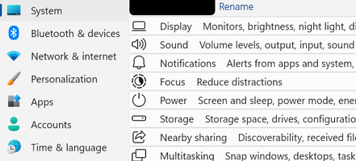
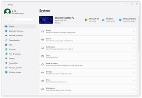
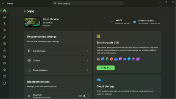

# The Windows 11 Settings styling guide

## Table of contents

* [Introduction](#introduction)
  * [Supported components](#supported-components)
  * [Finding targets](#finding-targets)
  * [Missing customizations](#missing-customizations)
  * [Contributing](#contributing)
* [Themes](#themes)
* [General](#general)
  * [2→1 liners](#2→1-liners)
  * [Content Region](#content-region)
  * [Path Header Grid](#path-header-grid)
* [Transforms](#transforms)
* [Colors](#colors)

## Introduction

This is a collection of commonly requested Settings app styling customizations
for Windows 11. It is intended to be used with the [Windows 11 Settings
Styler](https://windhawk.net/mods/windows-11-settings-styler) Windhawk mod.

If you're not familiar with Windhawk, here are the steps for installing the mod:

* Download Windhawk from [windhawk.net](https://windhawk.net/) and install it.
* Go to "Mods" in the upper right menu.
* Find and install the "Windows 11 Settings Styler" mod.

After installing the mod, open its Settings tab and adjust the styles according
to your preferences.

Some customizations are best adjusted with other Windhawk mods. Links to those
mods are provided where applicable.

**See also**: [The Windows 11 taskbar styling
guide](https://github.com/ramensoftware/windows-11-taskbar-styling-guide/blob/main/README.md),
[The Windows 11 start menu styling
guide](https://github.com/ramensoftware/windows-11-start-menu-styling-guide/blob/main/README.md),
[The Windows 11 notification center styling
guide](https://github.com/ramensoftware/windows-11-notification-center-styling-guide/blob/main/README.md).

### Finding targets

[How to find targets using UWPSpy](https://github.com/bbmaster123/FWFU/blob/main/Guides/uwpspy.md).

### Missing customizations

If you're looking for a customization that is not listed here, please [open an
issue](https://github.com/ramensoftware/windows-11-settings-styling-guide/issues/new).

### Contributing

If you have a Settings app styling customization or theme that you would like to
share, please submit a pull request.

## Themes

Themes are collections of styles that can be imported into the Windows 11
Settings Styler mod. The following themes are available:

| Link  | Screenshot
| ----- | ----------
| [Densy](Themes/Densy/README.md) | [](Themes/Densy/screenshot.png)
| [ClassicSearchBar](Themes/ClassicSearchBar/README.md) | [](Themes/ClassicSearchBar/screenshot.png)
| [StoreFrame11](Themes/StoreFrame11/README.md) | [](Themes/StoreFrame11/screenshot.png)

## General

_This document is a work in progress, contributions are welcome._

### 2→1 liners

Target:
```
ScrollContentPresenter > Border > Frame > ContentPresenter > SystemSettings.View.RootPage > Grid#RootPageGrid > Microsoft.UI.Xaml.Controls.NavigationView#PermanentNavigationView > Grid#RootGrid > Grid > SplitView#RootSplitView > Grid > Grid#ContentRoot > Border > Grid#ContentGrid > ContentPresenter#ContentPresenter > Frame#PermanentNavRootFrame > ContentPresenter > SystemSettings.View.CategoryPage > Grid > ScrollViewer > Border#Root > Grid > ScrollContentPresenter#ScrollContentPresenter > Grid > SystemSettings.View.AlignableContentControl > ContentPresenter > SystemSettings.View.SettingsListView#settingPagesList > ItemsPresenter > ItemsStackPanel > SystemSettings.View.SettingsListViewItem > Windows.UI.Xaml.Controls.Primitives.ListViewItemPresenter > SystemSettings.View.EntityItem > Grid > SystemSettings.View.ReservedWidthReflowingPanel > StackPanel
```
Style:
```
Orientation=1
```

Then you might want to add space between the 2 text elements, and match the text size/color

Target:
```
ItemsStackPanel > SystemSettings.View.SettingsListViewItem > Windows.UI.Xaml.Controls.Primitives.ListViewItemPresenter > SystemSettings.View.EntityItem > Grid > SystemSettings.View.ReservedWidthReflowingPanel > StackPanel > ContentPresenter#SubtitleContent
```
Style:
```
Margin:=15,0,0,0
FontSize:=14
Foreground:=#DD000000
```

…and revert the style for a different list (e.g., to avoid the app crashing ☺):

Target:
```
ItemsStackPanel > SystemSettings.View.SettingsListViewItem > Windows.UI.Xaml.Controls.Primitives.ListViewItemPresenter#ListViewItemPresenter > SystemSettings.View.EntityItem#EntityListItemControl
```
Style:
```
Orientation=0
```

> [!NOTE]
> Some lists (Apps → Installed apps) crash the Settings app in a 1-line style,
> so would require an override to revert to the 2-line style

### Content Region

To set a background to the content region

Target:
```
SplitView#RootSplitView > Grid > Grid#ContentRoot > Border > Grid#ContentGrid
```
Style:
```
Background=#80FF0830
```

### Path Header Grid

To change the path advancing direction and alignment

Target:
```
Grid#ContentRoot > Border > Grid#ContentGrid > ContentControl#HeaderContent
```
Style:
```
FlowDirection=1
```

## Transforms

See [the Taskbar styling guide section](https://github.com/ramensoftware/windows-11-taskbar-styling-guide#transforms)

## Colors

See [the Taskbar styling guide section](https://github.com/ramensoftware/windows-11-taskbar-styling-guide#colors)
