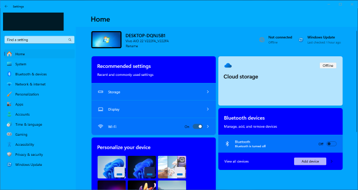

# Blue theme for Windows 11 Settings Styler

This theme makes the Settings app blue.

**Author**: [FireBlade](https://github.com/FireBlade211)



## Installation

To import the theme styles:

* Open the Windows 11 Settings Styler mod in Windhawk.
* Go to the "Settings" tab and select "Textual mode".
* Copy the content below to the text box and click "Save settings".

<details>
<summary>Content to import (click to expand)</summary>

```yaml
controlStyles:
  - target: Frame#PermanentNavRootFrame
    styles:
      - Background=#03A5FC
  - target: SystemSettings.View.EntityItem
    styles:
      - Background=#0373FC
      - Foreground=White
  - target: Microsoft.UI.Xaml.Controls.NavigationView#PermanentNavigationView
    styles:
      - Background=#03ADFC
      - Foreground=White
  - target: ContentPresenter
    styles:
      - Foreground=Black
  - target: ContentPresenter#SubtitleContent
    styles:
      - Foreground=White
  - target: StackPanel#BackgroundStackPanel
    styles:
      - Background=Blue
  - target: TextBlock#TitleContent
    styles:
      - Foreground=White
  - target: ContentPresenter#TitleContent
    styles:
      - Foreground=White
  - target: ContentPresenter#IconContentPresenter
    styles:
      - Foreground=White
  - target: Button#ContainerButton
    styles:
      - Background=Blue
  - target: SystemSettings.View.ReactNativeExperienceViewControl
    styles:
      - Background=Blue
  - target: SystemSettings.View.TwoSegmentsHeroUserControl#OneSegmentHeroEntityItemUserControl
    styles:
      - Background=DeepSkyBlue
  - target: SystemSettings.View.SettingsNavigationViewItem > Grid#NVIRootGrid > NavigationViewItemPresenter > Grid#LayoutRoot > Grid#PresenterContentRootGrid > Grid#ContentGrid > ContentPresenter > TextBlock
    styles:
      - Foreground=White
```
</details>
