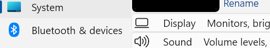
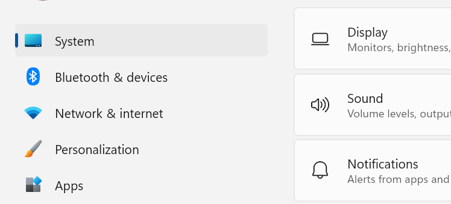
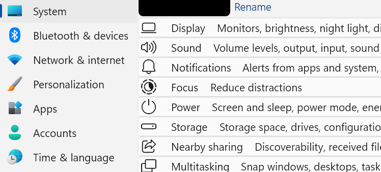
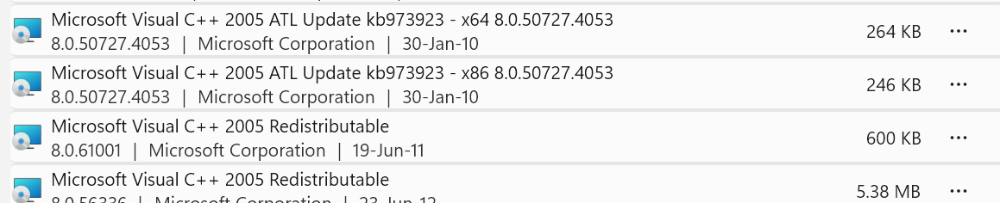
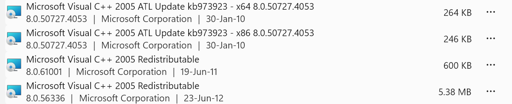

# Densy theme for Windows 11 Settings Styler

**Author**: [es](https://github.com/eugenesvk)

## Theme selection

The theme is integrated into the mod and can simply be selected from the mod's settings:

  - Open the Windows 11 Settings Styler mod in Windhawk
  - Go to the "Settings" tab
  - Select the theme and save the settings

## Notes

A dense theme eliminating some of the excessive/useless Settings App UI elements for better visibility at a smaller screen area "cost":
  - Removed a lot of extra whitespace
    - Before: 
    - After: 
  - Removed a few helpful ads
    - 
  - Removed some borders/separators for cleaner lists, e.g., installed app list:
    - 
    - 

### Suggested additional mods and settings

Use [Taskbar Styler](https://windhawk.net/mods/windows-11-taskbar-styler) to achieve a similarly dense effect in your taskbar with [BottomDensy](https://github.com/ramensoftware/windows-11-taskbar-styling-guide/tree/main/Themes/BottomDensy) theme:

### Known issues

  - descriptions in 1-line items are not vertically aligned , not sure whether it's possible to fix using XAML styling alone and these 2 grid child lines (name/description) have to be aware of the size of it's cousins, so would likely need a change in the whole grandparent structure (a table)
  - not all lines (especially those in sub-menus) have been restyled
  - some views (like "Apps > Installed apps") crash the Settings app if their orientation is changed to collapse 2 rows into 1 row of 2 columns, so they're left as is
  - a few lines have 3 rows that don't fit into the current height constraints; or 2 lines might have the subtitle line slightly cut off
