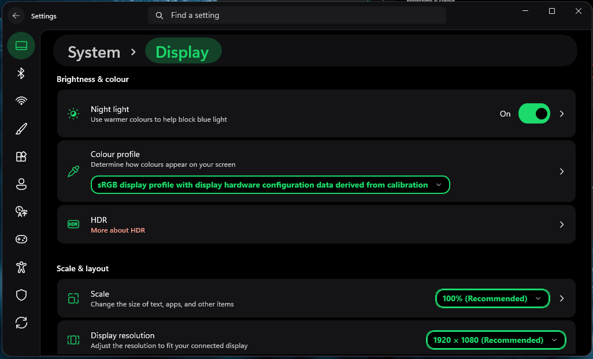
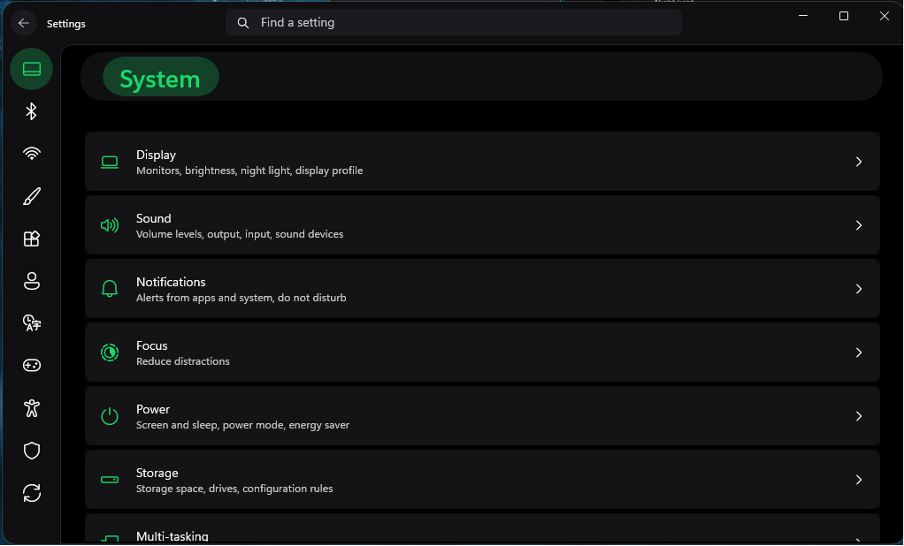
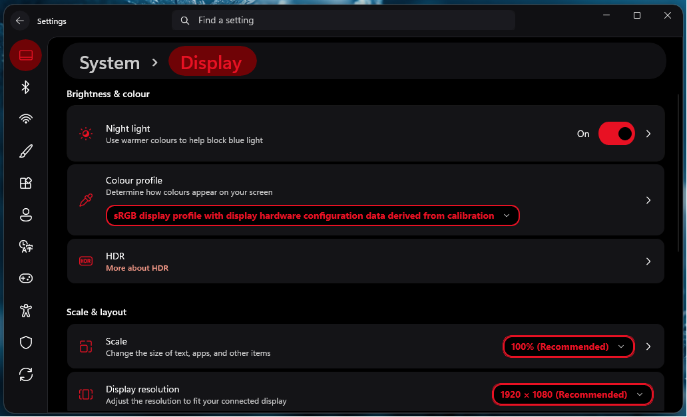
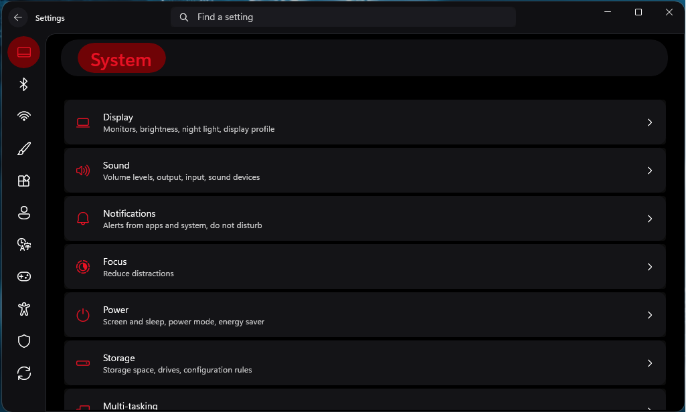

# Modirinth Settings Style for Windows 11 Settings App

Author: [wasiabbas4pk](https://github.com/wasiabbas4pk)

This theme makes the Windows 11 Settings app look like the Modrinth(Minecraft Launcher) app. It comes in two variants: OLED Green (Modrinth), which is the default look of Modrinth, and OLED Accent Color (Modrinth), where users can change the UI color by navigating to the Windows accent color settings!

# Modirinth Green Previews

This is preview of Modirinth-like Green colour matching OLED green theme of Modirinth Minecraft launcher app.






# Custom Ascent Colour Previews

The colour in this variant can be customized by navigating to Windows Settings > Personalization > Colours, and chosing a desirable colour.






# Theme selection

The theme is integrated into the mod and can be selected directly from the mod's settings:

* Open the Windows 11 Settings Styler mod in Windhawk.
* Go to the "Settings" tab.
* Select the theme and save the settings.

# Manual installation

The theme styles can also be imported manually. To do that, follow these steps:

* Open the Windows 11 Settings Styler mod in Windhawk.
* Go to the "Settings" tab and select "Textual mode".
* Copy the content below to the text box and click "Save settings".

## OLED Green (Modirinth) Configuration

<details>
<summary>Content to import (click to expand)</summary>

```yaml


styleConstants:
  - ''
controlStyles:
  - target: Border > Frame > ContentPresenter > SystemSettings.View.RootPage > Grid#RootPageGrid > Microsoft.UI.Xaml.Controls.NavigationView#PermanentNavigationView > Grid#RootGrid > Grid > SplitView#RootSplitView > Grid > Grid#ContentRoot > Border > Grid#ContentGrid > ContentPresenter#ContentPresenter
    styles:
      - Margin=2
  - target: Grid#ContentRoot > Border > Grid#ContentGrid > ContentControl#HeaderContent
    styles:
      - Margin=10,-38,0,5
  - target: SplitView#RootSplitView > Grid > Grid#PaneRoot > Border > Grid#PaneContentGrid > Grid#ItemsContainerGrid > Microsoft.UI.Xaml.Controls.ItemsRepeaterScrollHost > ScrollViewer#MenuItemsScrollViewer > Border#Root > Grid > ScrollContentPresenter#ScrollContentPresenter
    styles:
      - Margin=-12,8,0,0
  - target: TextBox#CommandSearchTextBox > Grid > Button#DeleteButton > Grid#ButtonLayoutGrid
    styles:
      - CornerRadius=$InRadius
      - MinHeight=32
  - target: SplitView#RootSplitView > Grid > Grid#PaneRoot > Border > Grid#PaneContentGrid > Grid#ItemsContainerGrid > Microsoft.UI.Xaml.Controls.ItemsRepeaterScrollHost > ScrollViewer#MenuItemsScrollViewer > Border#Root > Grid > ScrollContentPresenter#ScrollContentPresenter > Microsoft.UI.Xaml.Controls.ItemsRepeater#MenuItemsHost > SystemSettings.View.SettingsNavigationViewItem > Grid#NVIRootGrid > Microsoft.UI.Xaml.Controls.Primitives.NavigationViewItemPresenter#NavigationViewItemPresenter > Grid#LayoutRoot > Grid#PresenterContentRootGrid > Grid#ContentGrid > ContentPresenter#ContentPresenter > TextBlock
    styles:
      - Grid.Column=0
      - Visibility=Hidden
  - target: SplitView#RootSplitView > Grid > Grid#PaneRoot > Border > Grid#PaneContentGrid > Grid#ItemsContainerGrid > Microsoft.UI.Xaml.Controls.ItemsRepeaterScrollHost > ScrollViewer#MenuItemsScrollViewer > Border#Root > Grid > ScrollContentPresenter#ScrollContentPresenter > Microsoft.UI.Xaml.Controls.ItemsRepeater#MenuItemsHost > SystemSettings.View.SettingsNavigationViewItem
    styles:
      - MinHeight=48
      - MinWidth=65
      - ToolTipService.Placement=5
      - MaxWidth=65
  - target: Microsoft.UI.Xaml.Controls.NavigationView#PermanentNavigationView > Grid#RootGrid > Grid > SplitView#RootSplitView > Grid@DisplayModeStates > Grid#PaneRoot
    styles:
      - MaxWidth@OpenInlineLeft=65
      - Grid.ColumnSpan@OpenInlineLeft=1
      - Grid.ColumnSpan=>Span
  - target: SplitView#RootSplitView > Grid > Grid#ContentRoot > Border > Grid#ContentGrid
    styles:
      - 'CornerRadius={{Span > 1 ? 0 : $OutRadius}},0,0,0'
      - 'Margin={{Span > 1 ? 0 : 65}},48,0,0'
      - 'BorderThickness={{Span > 1 ? 0 : 1}},1,0,0'
  - target: Microsoft.UI.Xaml.Controls.NavigationView#PermanentNavigationView > Grid#RootGrid > Grid > SplitView#RootSplitView > Grid@DisplayModeStates > Grid#ContentRoot
    styles:
      - Grid.Column@OpenInlineLeft=0
      - Grid.ColumnSpan@OpenInlineLeft=3
  - target: Microsoft.UI.Xaml.Controls.NavigationView#PermanentNavigationView > Grid#RootGrid > Grid > Grid#ShadowCaster
    styles:
      - Grid.ColumnSpan=1
      - MaxWidth=65
  - target: SystemSettings.View.SettingsNavigationViewItem[1]
    styles:
      - Content=>t1
      - ToolTipService.ToolTip={{t1}}
  - target: SystemSettings.View.SettingsNavigationViewItem[2]
    styles:
      - Content=>t2
      - ToolTipService.ToolTip={{t2}}
  - target: SystemSettings.View.SettingsNavigationViewItem[3]
    styles:
      - Content=>t3
      - ToolTipService.ToolTip={{t3}}
  - target: SystemSettings.View.SettingsNavigationViewItem[4]
    styles:
      - Content=>t4
      - ToolTipService.ToolTip={{t4}}
  - target: SystemSettings.View.SettingsNavigationViewItem[5]
    styles:
      - Content=>t5
      - ToolTipService.ToolTip={{t5}}
  - target: SystemSettings.View.SettingsNavigationViewItem[6]
    styles:
      - Content=>t6
      - ToolTipService.ToolTip={{t6}}
  - target: SystemSettings.View.SettingsNavigationViewItem[7]
    styles:
      - Content=>t7
      - ToolTipService.ToolTip={{t7}}
  - target: SystemSettings.View.SettingsNavigationViewItem[8]
    styles:
      - Content=>t8
      - ToolTipService.ToolTip={{t8}}
  - target: SystemSettings.View.SettingsNavigationViewItem[9]
    styles:
      - Content=>t9
      - ToolTipService.ToolTip={{t9}}
  - target: SystemSettings.View.SettingsNavigationViewItem[10]
    styles:
      - Content=>t10
      - ToolTipService.ToolTip={{t10}}
  - target: SystemSettings.View.SettingsNavigationViewItem[11]
    styles:
      - Content=>t11
      - ToolTipService.ToolTip={{t11}}
  - target: SystemSettings.View.SettingsNavigationViewItem[12]
    styles:
      - Content=>t12
      - ToolTipService.ToolTip={{t12}}
  - target: SplitView#RootSplitView > Grid > Grid#PaneRoot > Border > Grid#PaneContentGrid > ContentControl#PaneCustomContentBorder > ContentPresenter > SystemSettings.View.SpacingStackPanel > SystemSettings.View.UserProfileControl#UserProfileControl > Button#UserProfileButton > ContentPresenter#ContentPresenter > Grid#UserProfileLayout > Grid[2]
    styles:
      - Visibility=1
      - Grid.Column=0
  - target: ContentControl#PaneCustomContentBorder > ContentPresenter > SystemSettings.View.SpacingStackPanel > SystemSettings.View.UserProfileControl#UserProfileControl > Button#UserProfileButton > ContentPresenter#ContentPresenter > Grid#UserProfileLayout > Grid[2] > TextBlock#UserName
    styles:
      - Text=>UserName
  - target: ContentControl#PaneCustomContentBorder > ContentPresenter > SystemSettings.View.SpacingStackPanel > SystemSettings.View.UserProfileControl#UserProfileControl > Button#UserProfileButton
    styles:
      - ToolTipService.ToolTip={{UserName}}
      - ToolTipService.Placement=10
      - Visibility=1
  - target: ContentControl#PaneCustomContentBorder > ContentPresenter > SystemSettings.View.SpacingStackPanel > SystemSettings.View.UserProfileControl#UserProfileControl > Button#UserProfileButton > ContentPresenter#ContentPresenter > Grid#UserProfileLayout > Grid#UserImageGrid > Image
    styles:
      - Width=30
      - Height=30   
  - target: SplitView#RootSplitView > Grid > Grid#PaneRoot > Border > Grid#PaneContentGrid > ContentControl#PaneCustomContentBorder > ContentPresenter > SystemSettings.View.SpacingStackPanel
    styles:
      - MaxHeight=48
      - MaxWidth=65
      - MinHeight=48
      - MinWidth=65
      - Visibility=1
  - target: SplitView#RootSplitView > Grid > Grid#PaneRoot > Border > Grid#PaneContentGrid > ContentControl#PaneCustomContentBorder > ContentPresenter > SystemSettings.View.SpacingStackPanel > SystemSettings.View.UserProfileControl#UserProfileControl > Button#UserProfileButton
    styles:
      - MinHeight=48
      - MaxHeight=48
      - Margin=3,3,3,-3
  - target: Windows.UI.Xaml.Shapes.Rectangle#ProgressBarIndicator
    styles:
      - RadiusX=3
      - RadiusY=3
      - Height=6
      - Fill:=<SolidColorBrush Color="{ThemeResource Accent}"/>
  - target: Windows.UI.Xaml.Controls.Border#DeterminateRoot
    styles:
      - CornerRadius=3
      - Height=6
  - target: Windows.UI.Xaml.Controls.ProgressBar
    styles:
      - Height=6
  - target: Windows.UI.Xaml.Controls.StackPanel#TopBreakdownBar > Windows.UI.Xaml.Controls.ProgressBar > Windows.UI.Xaml.Controls.Grid > Windows.UI.Xaml.Controls.Border#DeterminateRoot > Windows.UI.Xaml.Shapes.Rectangle#ProgressBarIndicator
    styles:
      - Height=16
  - target: Windows.UI.Xaml.Controls.StackPanel#TopBreakdownBar > Windows.UI.Xaml.Controls.ProgressBar > Windows.UI.Xaml.Controls.Grid > Windows.UI.Xaml.Controls.Border#DeterminateRoot
    styles:
      - Height=16
  - target: Windows.UI.Xaml.Controls.StackPanel#TopBreakdownBar > Windows.UI.Xaml.Controls.ProgressBar
    styles:
      - Height=16  
  - target: CheckBox > Grid#RootGrid@CombinedStates > Grid > Rectangle#NormalRectangle
    styles:
      - StrokeThickness=1
      - Stroke=#27292E
      - Fill@UncheckedNormal=black
      - Fill@UncheckedPointerOver=black
      - Fill@UncheckedPointerOverSelected=black
      - Fill@CheckedNormal=#1BD96A
      - Fill@CheckedPointerOver=#1BD96A
      - Fill@CheckedPointerOverSelected=#1BD96A
      - RadiusX=6
      - RadiusY=6
  - target: SystemSettings.View.AlignableContentControl > ContentPresenter > Grid > SystemSettings.View.AlignableContentControl > ContentPresenter > SystemSettings.View.WatermarkTextBox > Grid > Border#BorderElement
    styles:
      - Background=#1A1A1F
      - CornerRadius=12
      - BorderThickness=0 
  - target: SystemSettings.View.ReservedWidthReflowingPanel > ContentPresenter#InlineContentPresenter > SystemSettings.View.HighContrastThemesCombobox
    styles:
      - BorderBrush=#1BD96A
      - BorderThickness=3
      - Background=Black
      - Foreground=#1BD96A
      - CornerRadius=12 
  - target: SystemSettings.View.ReservedWidthReflowingPanel > ContentPresenter#InlineContentPresenter > SystemSettings.View.HighContrastThemesCombobox > Grid#LayoutRoot > ContentPresenter#ContentPresenter > TextBlock
    styles:
      - FontWeight=Bold
      - FontSize=14
      - FontFamily=Segoe UI
  - target: HyperlinkButton > ContentPresenter#ContentPresenter
    styles:
      - Foreground=#1BD96A
  - target: ProgressBar > Grid > Border#DeterminateRoot > Rectangle#ProgressBarIndicator
    styles:
      - Fill=#1BD96A
  - target: SystemSettings.View.ReservedWidthReflowingPanel > ContentPresenter#InlineContentPresenter > Button > ContentPresenter#ContentPresenter
    styles:
      - BorderBrush=#1BD96A
      - BorderThickness=3
      - Background=Black
      - Foreground=#1BD96A
      - CornerRadius=12 
  - target: ContentPresenter#InlineContentPresenter > Button > ContentPresenter#ContentPresenter
    styles:
      - BorderBrush=#1BD96A
      - BorderThickness=3
      - Background=Black
      - Foreground=#1BD96A
      - CornerRadius=12 

  - target: SystemSettings.View.ReservedWidthReflowingPanel#ReflowingPanel > StackPanel > ContentPresenter#TitleContent > StackPanel > RadioButton > Grid#RootGrid > Grid > Windows.UI.Xaml.Shapes.Ellipse#CheckOuterEllipse
    styles:
      - Fill=#1BD96A
      - StrokeThickness=0
  - target: SystemSettings.View.ReservedWidthReflowingPanel > ContentPresenter#InlineContentPresenter > Grid > Slider > Grid > Grid#SliderContainer > Grid#HorizontalTemplate > Rectangle#HorizontalTrackRect
    styles:
      - Fill=black
      - Margin=0,0,5,0
      - StrokeThickness=0
  - target: SystemSettings.View.ReservedWidthReflowingPanel > ContentPresenter#InlineContentPresenter > Grid > Slider > Grid > Grid#SliderContainer > Grid#HorizontalTemplate > Rectangle#HorizontalDecreaseRect
    styles:
      - Fill=#1BD96A
      - StrokeThickness=0
  - target: SystemSettings.View.ReservedWidthReflowingPanel > ContentPresenter#InlineContentPresenter > Grid > Slider > Grid > Grid#SliderContainer > Grid#HorizontalTemplate > Windows.UI.Xaml.Controls.Primitives.Thumb#HorizontalThumb > Border > Windows.UI.Xaml.Shapes.Ellipse#SliderInnerThumb
    styles:
      - Fill=#1BD96A
      - Height=0
      - Width=0
  - target: SystemSettings.View.ReservedWidthReflowingPanel > ContentPresenter#InlineContentPresenter > Grid > Slider > Grid > Grid#SliderContainer > Grid#HorizontalTemplate > Windows.UI.Xaml.Controls.Primitives.Thumb#HorizontalThumb > Border
    styles:
      - Width=17
      - Height=17
      - Margin=-5,0,0,0
      - Background=#1BD96A
  - target: CheckBox > Grid#RootGrid@CombinedStates > Grid > Microsoft.UI.Xaml.Controls.AnimatedIcon#CheckGlyph
    styles:
      - Width=25
      - Height=25
      - Margin=-2,-1,0,0
  - target: Button#focusStartButton > Windows.UI.Xaml.Controls.ContentPresenter#ContentPresenter
    styles:
      - Background=#1BD96A
      - Foreground=Black
      - CornerRadius=12
  - target: SystemSettings.View.FocusEnableControl#FocusEnableControl > StackPanel > Button#focusStartButton > ContentPresenter#ContentPresenter > Grid > TextBlock#StartButtonText
    styles:
      - FontWeight=Bold
      - FontSize=14
      - FontFamily=Segoe UI
  - target: SystemSettings.View.FocusEnableControl#FocusEnableControl > StackPanel > Button#focusStopButton > ContentPresenter#ContentPresenter
    styles:
      - BorderBrush=#1BD96A
      - BorderThickness=3
      - Background=Black
      - Foreground=#1BD96A
      - CornerRadius=12
  - target: SystemSettings.View.FocusSessionControl > StackPanel > Grid > Button#focusSessionDecreaseButton > Grid > ContentPresenter#ContentPresenter
    styles:
      - BorderBrush=#1BD96A
      - BorderThickness=4
      - Background=Black
      - Foreground=#1BD96A
      - CornerRadius=8
  - target: SystemSettings.View.FocusSessionControl > StackPanel > Grid > Button#focusSessionIncreaseButton > Grid > ContentPresenter#ContentPresenter > FontIcon > Grid > TextBlock
    styles:
      - Padding=2,0,0,0
  - target: SystemSettings.View.FocusSessionControl > StackPanel > Grid > Button#focusSessionDecreaseButton > Grid > ContentPresenter#ContentPresenter > FontIcon > Grid > TextBlock
    styles:
      - Padding=2,0,0,0
  - target: SystemSettings.View.FocusSessionControl > StackPanel > Grid > Grid > TextBlock#focusSessionDurationTextBlock
    styles:
      - FontWeight=Bold
      - FontSize=14
      - FontFamily=Segoe UI
      - Background=#1BD96A
  - target: SystemSettings.View.FocusSessionControl > StackPanel > Grid > Button#focusSessionIncreaseButton > Grid > ContentPresenter#ContentPresenter
    styles:
      - BorderBrush=#1BD96A
      - BorderThickness=4
      - Background=Black
      - Foreground=#1BD96A
      - CornerRadius=8
  - target: SystemSettings.View.FocusEnableControl#FocusEnableControl > StackPanel > Button#focusStopButton > ContentPresenter#ContentPresenter > Grid > TextBlock#StopButtonText
    styles:
      - FontWeight=Bold
      - FontSize=14
      - FontFamily=Segoe UI
  - target: ScrollViewer > ScrollContentPresenter > Border > Frame > ContentPresenter > SystemSettings.View.RootPage > Grid#RootPageGrid > Microsoft.UI.Xaml.Controls.NavigationView#PermanentNavigationView > Grid#RootGrid > Grid > SplitView#RootSplitView > Grid > Grid#ContentRoot > Border > Grid#ContentGrid > ContentPresenter#ContentPresenter > Frame#PermanentNavRootFrame > ContentPresenter > SystemSettings.View.CategoryPage > Grid > ScrollViewer > Border#Root > Grid > ScrollContentPresenter#ScrollContentPresenter > Grid > SystemSettings.View.AlignableContentControl#heroContent > ContentPresenter > SystemSettings.View.AlignableContentControl > ItemsControl > ItemsPresenter > StackPanel > ContentPresenter > SystemSettings.View.AlignableContentControl > ContentPresenter > SystemSettings.View.TwoSegmentsHeroUserControl#DefaultOneSegmentHeroUserControl > Grid#LayoutRoot > Grid#LeftLayout > ContentPresenter > ItemsControl > ItemsPresenter > StackPanel > ContentPresenter > StackPanel > Button > ContentPresenter#ContentPresenter > TextBlock
    styles:
      - Foreground=#1BD96A
      - FontWeight=Bold
      - FontFamily=Segoe UI
  - target: ScrollViewer > ScrollContentPresenter > Border > Frame > ContentPresenter > SystemSettings.View.RootPage > Grid#RootPageGrid > Microsoft.UI.Xaml.Controls.NavigationView#PermanentNavigationView > Grid#RootGrid > Grid > SplitView#RootSplitView > Grid > Grid#ContentRoot > Border > Grid#ContentGrid > ContentPresenter#ContentPresenter > Frame#PermanentNavRootFrame > ContentPresenter > SystemSettings.View.L2Page#L2Page > Grid > Grid > SystemSettings.View.AlignableContentControl > ContentPresenter > Grid > SystemSettings.View.SettingsPageHost#pageContent > ScrollViewer#SettingsPageHostPanel > Border#Root > Grid > ScrollContentPresenter#ScrollContentPresenter > Grid#RootScrollableGrid > Grid > Grid > ContentControl > ContentPresenter > ItemsControl > ItemsPresenter > SystemSettings.View.SpacingStackPanel > ContentPresenter > SystemSettings.View.AlignableContentControl > SystemSettings.View.SpacingStackPanel > SystemSettings.View.ExpandItemsControl > ItemsPresenter > SystemSettings.View.SpacingStackPanel > ContentPresenter > StackPanel > SystemSettings.View.EntityItem > Grid > SystemSettings.View.ReservedWidthReflowingPanel > ContentPresenter#InlineContentPresenter > UserControl > StackPanel > Button#WindowsProtectedPrintButton > ContentPresenter#ContentPresenter > TextBlock
    styles:
      - Foreground=#1BD96A
      - FontSize=14
      - FontWeight=Bold
      - FontFamily=Segoe UI
  - target: ScrollViewer > ScrollContentPresenter > Border > Frame > ContentPresenter > SystemSettings.View.RootPage > Grid#RootPageGrid > Microsoft.UI.Xaml.Controls.NavigationView#PermanentNavigationView > Grid#RootGrid > Grid > SplitView#RootSplitView > Grid > Grid#ContentRoot > Border > Grid#ContentGrid > ContentPresenter#ContentPresenter > Frame#PermanentNavRootFrame > ContentPresenter > SystemSettings.View.L2Page#L2Page > Grid > Grid > SystemSettings.View.AlignableContentControl > ContentPresenter > Grid > SystemSettings.View.SettingsPageHost#pageContent > ScrollViewer#SettingsPageHostPanel > Border#Root > Grid > ScrollContentPresenter#ScrollContentPresenter > Grid#RootScrollableGrid > Grid > Grid > ContentControl > ContentPresenter > ItemsControl > ItemsPresenter > SystemSettings.View.SpacingStackPanel > ContentPresenter > SystemSettings.View.AlignableContentControl > SystemSettings.View.SpacingStackPanel > SystemSettings.View.ExpandItemsControl > ItemsPresenter > SystemSettings.View.SpacingStackPanel > ContentPresenter > StackPanel > SystemSettings.View.EntityItem > Grid > SystemSettings.View.ReservedWidthReflowingPanel > ContentPresenter#InlineContentPresenter > UserControl > StackPanel > Button#WindowsProtectedPrintButton > ContentPresenter#ContentPresenter
    styles:
      - Background=Black
      - BorderBrush=#1BD96A
      - BorderThickness=2
      - CornerRadius=12
  - target: SystemSettings.View.ReservedWidthReflowingPanel > ContentPresenter#InlineContentPresenter > Button > ContentPresenter#ContentPresenter
    styles:
      - Foreground=black
      - Background=#1BD96A
      - CornerRadius=12
  - target: SystemSettings.View.ReservedWidthReflowingPanel > ContentPresenter#InlineContentPresenter > Button > ContentPresenter#ContentPresenter > TextBlock
    styles:
      - Foreground=black
      - FontSize=14
      - FontWeight=Bold
      - FontFamily=Segoe UI
  - target: SystemSettings.View.StableComboBox > Grid#LayoutRoot > Border#Background
    styles:
      - Background=Black
      - BorderBrush=#1BD96A
      - BorderThickness=2
      - CornerRadius=12
  - target: SystemSettings.View.StableComboBox > Grid#LayoutRoot > ContentPresenter#ContentPresenter > TextBlock
    styles:
      - Foreground=#1BD96A
      - FontWeight=Bold
      - FontSize=14
      - FontFamily=Segoe UI
  - target: Windows.UI.Xaml.Controls.Grid#RootPageGrid
    styles:
      - Background=#101013
  - target: SystemSettings.View.RootPage
    styles:
      - Background=Transparent
  - target: ScrollViewer > ScrollContentPresenter > Border > Frame > ContentPresenter > SystemSettings.View.RootPage > Grid#RootPageGrid > Microsoft.UI.Xaml.Controls.NavigationView#PermanentNavigationView > Grid#RootGrid > Grid > SplitView#RootSplitView > Grid > Grid#ContentRoot > Border > Grid#ContentGrid > ContentPresenter#ContentPresenter > Frame#PermanentNavRootFrame > ContentPresenter > SystemSettings.View.FullScreenPage#FullScreenPage > Grid#MainGrid > SystemSettings.View.AlignableContentControl > ContentPresenter > Grid > SystemSettings.View.SettingsPageHost#pageContent > ScrollViewer#SettingsPageHostPanel > Border#Root > Grid > ScrollContentPresenter#ScrollContentPresenter > Grid#RootScrollableGrid > Grid > Grid > ContentControl > ContentPresenter > ItemsControl > ItemsPresenter > SystemSettings.View.SpacingStackPanel > ContentPresenter > SystemSettings.View.AlignableContentControl > SystemSettings.View.SpacingStackPanel > SystemSettings.View.ExpandItemsControl > ItemsPresenter > SystemSettings.View.SpacingStackPanel > ContentPresenter > StackPanel > SystemSettings.View.EntityItem > Grid > SystemSettings.View.ReservedWidthReflowingPanel > ContentPresenter#InlineContentPresenter > StackPanel > Microsoft.UI.Xaml.Controls.DropDownButton
    styles:
      - Background=Black
      - BorderBrush=#1BD96A
      - BorderThickness=2
      - CornerRadius=12
  - target: ScrollViewer > ScrollContentPresenter > Border > Frame > ContentPresenter > SystemSettings.View.RootPage > Grid#RootPageGrid > Microsoft.UI.Xaml.Controls.NavigationView#PermanentNavigationView > Grid#RootGrid > Grid > SplitView#RootSplitView > Grid > Grid#ContentRoot > Border > Grid#ContentGrid > ContentPresenter#ContentPresenter > Frame#PermanentNavRootFrame > ContentPresenter > SystemSettings.View.FullScreenPage#FullScreenPage > Grid#MainGrid > SystemSettings.View.AlignableContentControl > ContentPresenter > Grid > SystemSettings.View.SettingsPageHost#pageContent > ScrollViewer#SettingsPageHostPanel > Border#Root > Grid > ScrollContentPresenter#ScrollContentPresenter > Grid#RootScrollableGrid > Grid > Grid > ContentControl > ContentPresenter > ItemsControl > ItemsPresenter > SystemSettings.View.SpacingStackPanel > ContentPresenter > SystemSettings.View.AlignableContentControl > SystemSettings.View.SpacingStackPanel > SystemSettings.View.ExpandItemsControl > ItemsPresenter > SystemSettings.View.SpacingStackPanel > ContentPresenter > SystemSettings.View.EntityItem > Grid > SystemSettings.View.ReservedWidthReflowingPanel > ContentPresenter#InlineContentPresenter > Button > ContentPresenter#ContentPresenter > TextBlock
    styles:
      - Foreground=#1BD96A
      - FontWeight=Bold
      - FontSize=14
      - FontFamily=Segoe UI
  - target: ScrollViewer > ScrollContentPresenter > Border > Frame > ContentPresenter > SystemSettings.View.RootPage > Grid#RootPageGrid > Microsoft.UI.Xaml.Controls.NavigationView#PermanentNavigationView > Grid#RootGrid > Grid > SplitView#RootSplitView > Grid > Grid#ContentRoot > Border > Grid#ContentGrid > ContentPresenter#ContentPresenter > Frame#PermanentNavRootFrame > ContentPresenter > SystemSettings.View.FullScreenPage#FullScreenPage > Grid#MainGrid > SystemSettings.View.AlignableContentControl > ContentPresenter > Grid > SystemSettings.View.SettingsPageHost#pageContent > ScrollViewer#SettingsPageHostPanel > Border#Root > Grid > ScrollContentPresenter#ScrollContentPresenter > Grid#RootScrollableGrid > Grid > Grid > ContentControl > ContentPresenter > ItemsControl > ItemsPresenter > SystemSettings.View.SpacingStackPanel > ContentPresenter > SystemSettings.View.AlignableContentControl > SystemSettings.View.SpacingStackPanel > SystemSettings.View.ExpandItemsControl > ItemsPresenter > SystemSettings.View.SpacingStackPanel > ContentPresenter > StackPanel > SystemSettings.View.EntityItem > Grid > SystemSettings.View.ReservedWidthReflowingPanel > ContentPresenter#InlineContentPresenter > StackPanel > Microsoft.UI.Xaml.Controls.DropDownButton > Grid#RootGrid > ContentPresenter#ContentPresenter > TextBlock
    styles:
      - Foreground=#1BD96A
      - FontWeight=Bold
      - FontSize=14
      - FontFamily=Segoe UI
  - target: ScrollViewer > ScrollContentPresenter > Border > Frame > ContentPresenter > SystemSettings.View.RootPage > Grid#RootPageGrid > Microsoft.UI.Xaml.Controls.NavigationView#PermanentNavigationView > Grid#RootGrid > Grid > SplitView#RootSplitView > Grid > Grid#ContentRoot > Border > Grid#ContentGrid > ContentPresenter#ContentPresenter > Frame#PermanentNavRootFrame > ContentPresenter > SystemSettings.View.FullScreenPage#FullScreenPage > Grid#MainGrid > SystemSettings.View.AlignableContentControl > ContentPresenter > Grid > SystemSettings.View.SettingsPageHost#pageContent > ScrollViewer#SettingsPageHostPanel > Border#Root > Grid > ScrollContentPresenter#ScrollContentPresenter > Grid#RootScrollableGrid > Grid > Grid > ContentControl > ContentPresenter > ItemsControl > ItemsPresenter > SystemSettings.View.SpacingStackPanel > ContentPresenter > SystemSettings.View.AlignableContentControl > SystemSettings.View.SpacingStackPanel > SystemSettings.View.ExpandItemsControl > ItemsPresenter > SystemSettings.View.SpacingStackPanel > ContentPresenter > SystemSettings.View.EntityItem > Grid > SystemSettings.View.ReservedWidthReflowingPanel > ContentPresenter#InlineContentPresenter > Button > ContentPresenter#ContentPresenter
    styles:
      - Background=Black
      - BorderBrush=#1BD96A
      - BorderThickness=2
      - CornerRadius=12
  - target: ScrollViewer > ScrollContentPresenter > Border > Frame > ContentPresenter > SystemSettings.View.RootPage > Grid#RootPageGrid > Microsoft.UI.Xaml.Controls.NavigationView#PermanentNavigationView > Grid#RootGrid > Grid > SplitView#RootSplitView > Grid > Grid#ContentRoot > Border > Grid#ContentGrid > ContentPresenter#ContentPresenter > Frame#PermanentNavRootFrame > ContentPresenter > SystemSettings.View.FullScreenPage#FullScreenPage > Grid#MainGrid > SystemSettings.View.AlignableContentControl > ContentPresenter > Grid > SystemSettings.View.SettingsPageHost#pageContent > ScrollViewer#SettingsPageHostPanel > Border#Root > Grid > ScrollContentPresenter#ScrollContentPresenter > Grid#RootScrollableGrid > Grid > Grid > ContentControl > ContentPresenter > ItemsControl > ItemsPresenter > SystemSettings.View.SpacingStackPanel > ContentPresenter > SystemSettings.View.AlignableContentControl > SystemSettings.View.SpacingStackPanel > SystemSettings.View.ExpandItemsControl > ItemsPresenter > SystemSettings.View.SpacingStackPanel > ContentPresenter > StackPanel > SystemSettings.View.EntityItem > Grid > SystemSettings.View.ReservedWidthReflowingPanel > ContentPresenter#InlineContentPresenter > SystemSettings.View.StableComboBox > Grid#LayoutRoot > Border#Background
    styles:
      - Background=Black
      - BorderBrush=#1BD96A
      - BorderThickness=2
      - CornerRadius=12
  - target: ScrollViewer > ScrollContentPresenter > Border > Frame > ContentPresenter > SystemSettings.View.RootPage > Grid#RootPageGrid > Microsoft.UI.Xaml.Controls.NavigationView#PermanentNavigationView > Grid#RootGrid > Grid > SplitView#RootSplitView > Grid > Grid#ContentRoot > Border > Grid#ContentGrid > ContentPresenter#ContentPresenter > Frame#PermanentNavRootFrame > ContentPresenter > SystemSettings.View.FullScreenPage#FullScreenPage > Grid#MainGrid > SystemSettings.View.AlignableContentControl > ContentPresenter > Grid > SystemSettings.View.SettingsPageHost#pageContent > ScrollViewer#SettingsPageHostPanel > Border#Root > Grid > ScrollContentPresenter#ScrollContentPresenter > Grid#RootScrollableGrid > Grid > Grid > ContentControl > ContentPresenter > ItemsControl > ItemsPresenter > SystemSettings.View.SpacingStackPanel > ContentPresenter > SystemSettings.View.AlignableContentControl > SystemSettings.View.SpacingStackPanel > SystemSettings.View.ExpandItemsControl > ItemsPresenter > SystemSettings.View.SpacingStackPanel > ContentPresenter > StackPanel > SystemSettings.View.EntityItem > Grid > SystemSettings.View.ReservedWidthReflowingPanel > ContentPresenter#InlineContentPresenter > SystemSettings.View.StableComboBox > Grid#LayoutRoot > ContentPresenter#ContentPresenter > TextBlock
    styles:
      - Foreground=#1BD96A
      - FontWeight=Bold
      - FontSize=14
      - FontFamily=Segoe UI
  - target: ScrollViewer > ScrollContentPresenter > Border > Frame > ContentPresenter > SystemSettings.View.RootPage > Grid#RootPageGrid > Microsoft.UI.Xaml.Controls.NavigationView#PermanentNavigationView > Grid#RootGrid > Grid > SplitView#RootSplitView > Grid > Grid#ContentRoot > Border > Grid#ContentGrid > ContentPresenter#ContentPresenter > Frame#PermanentNavRootFrame > ContentPresenter > SystemSettings.View.L2Page#L2Page > Grid > Grid > SystemSettings.View.AlignableContentControl > ContentPresenter > Grid > SystemSettings.View.SettingsPageHost#pageContent > ScrollViewer#SettingsPageHostPanel > Border#Root > Grid > ScrollContentPresenter#ScrollContentPresenter > Grid#RootScrollableGrid > Grid > Grid > ContentControl > ContentPresenter > ItemsControl > ItemsPresenter > SystemSettings.View.SpacingStackPanel > ContentPresenter > SystemSettings.View.AlignableContentControl > SystemSettings.View.SpacingStackPanel > SystemSettings.View.ExpandItemsControl > ItemsPresenter > SystemSettings.View.SpacingStackPanel > ContentPresenter > SystemSettings.View.AlignableContentControl > SystemSettings.View.SpacingStackPanel > SystemSettings.View.ExpandItemsControl > ItemsPresenter > SystemSettings.View.SpacingStackPanel > ContentPresenter > SystemSettings.View.ButtonEntityItem > Button#ContainerButton > ContentPresenter#ContentPresenter > Grid > SystemSettings.View.ReservedWidthReflowingPanel#ReflowingPanel > ContentPresenter#InlineContentPresenter > SystemSettings.View.StableComboBox > Grid#LayoutRoot > Border#Background
    styles:
      - Background=Black
      - BorderBrush=#1BD96A
      - BorderThickness=2
      - CornerRadius=12
  - target: ScrollViewer > ScrollContentPresenter > Border > Frame > ContentPresenter > SystemSettings.View.RootPage > Grid#RootPageGrid > Microsoft.UI.Xaml.Controls.NavigationView#PermanentNavigationView > Grid#RootGrid > Grid > SplitView#RootSplitView > Grid > Grid#ContentRoot > Border > Grid#ContentGrid > ContentPresenter#ContentPresenter > Frame#PermanentNavRootFrame > ContentPresenter > SystemSettings.View.L2Page#L2Page > Grid > Grid > SystemSettings.View.AlignableContentControl > ContentPresenter > Grid > SystemSettings.View.SettingsPageHost#pageContent > ScrollViewer#SettingsPageHostPanel > Border#Root > Grid > ScrollContentPresenter#ScrollContentPresenter > Grid#RootScrollableGrid > Grid > Grid > ContentControl > ContentPresenter > ItemsControl > ItemsPresenter > SystemSettings.View.SpacingStackPanel > ContentPresenter > SystemSettings.View.AlignableContentControl > SystemSettings.View.SpacingStackPanel > SystemSettings.View.ExpandItemsControl > ItemsPresenter > SystemSettings.View.SpacingStackPanel > ContentPresenter > SystemSettings.View.EntityItem > Grid > SystemSettings.View.ReservedWidthReflowingPanel > ContentPresenter#InlineContentPresenter > SystemSettings.View.StableComboBox > Grid#LayoutRoot > ContentPresenter#ContentPresenter > TextBlock
    styles:
      - Foreground=#1BD96A
      - FontWeight=Bold
      - FontSize=14
      - FontFamily=Segoe UI
  - target: ScrollViewer > ScrollContentPresenter > Border > Frame > ContentPresenter > SystemSettings.View.RootPage > Grid#RootPageGrid > Microsoft.UI.Xaml.Controls.NavigationView#PermanentNavigationView > Grid#RootGrid > Grid > SplitView#RootSplitView > Grid > Grid#ContentRoot > Border > Grid#ContentGrid > ContentPresenter#ContentPresenter > Frame#PermanentNavRootFrame > ContentPresenter > SystemSettings.View.L2Page#L2Page > Grid > Grid > SystemSettings.View.AlignableContentControl > ContentPresenter > Grid > SystemSettings.View.SettingsPageHost#pageContent > ScrollViewer#SettingsPageHostPanel > Border#Root > Grid > ScrollContentPresenter#ScrollContentPresenter > Grid#RootScrollableGrid > Grid > Grid > ContentControl > ContentPresenter > ItemsControl > ItemsPresenter > SystemSettings.View.SpacingStackPanel > ContentPresenter > SystemSettings.View.AlignableContentControl > SystemSettings.View.SpacingStackPanel > SystemSettings.View.ExpandItemsControl > ItemsPresenter > SystemSettings.View.SpacingStackPanel > ContentPresenter > SystemSettings.View.ButtonEntityItem > Button#ContainerButton > ContentPresenter#ContentPresenter > Grid > SystemSettings.View.ReservedWidthReflowingPanel#ReflowingPanel > ContentPresenter#InlineContentPresenter > SystemSettings.View.StableComboBox > Grid#LayoutRoot > ContentPresenter#ContentPresenter > TextBlock
    styles:
      - Foreground=#1BD96A
      - FontWeight=Bold
      - FontSize=14
      - FontFamily=Segoe UI
  - target: ScrollViewer > ScrollContentPresenter > Border > Frame > ContentPresenter > SystemSettings.View.RootPage > Grid#RootPageGrid > Microsoft.UI.Xaml.Controls.NavigationView#PermanentNavigationView > Grid#RootGrid > Grid > SplitView#RootSplitView > Grid > Grid#ContentRoot > Border > Grid#ContentGrid > ContentPresenter#ContentPresenter > Frame#PermanentNavRootFrame > ContentPresenter > SystemSettings.View.L2Page#L2Page > Grid > Grid > SystemSettings.View.AlignableContentControl > ContentPresenter > Grid > SystemSettings.View.SettingsPageHost#pageContent > ScrollViewer#SettingsPageHostPanel > Border#Root > Grid > ScrollContentPresenter#ScrollContentPresenter > Grid#RootScrollableGrid > Grid > Grid > ContentControl > ContentPresenter > ItemsControl > ItemsPresenter > SystemSettings.View.SpacingStackPanel > ContentPresenter > SystemSettings.View.AlignableContentControl > SystemSettings.View.SpacingStackPanel > SystemSettings.View.ExpandItemsControl > ItemsPresenter > SystemSettings.View.SpacingStackPanel > ContentPresenter > SystemSettings.View.AlignableContentControl > SystemSettings.View.SpacingStackPanel > SystemSettings.View.ExpandItemsControl > ItemsPresenter > SystemSettings.View.SpacingStackPanel > ContentPresenter > SystemSettings.View.ButtonEntityItem > Button#ContainerButton > ContentPresenter#ContentPresenter > Grid > SystemSettings.View.ReservedWidthReflowingPanel#ReflowingPanel > ContentPresenter#InlineContentPresenter > SystemSettings.View.StableComboBox > Grid#LayoutRoot > ContentPresenter#ContentPresenter > TextBlock
    styles:
      - Foreground=#1BD96A
      - FontWeight=Bold
      - FontSize=14
      - FontFamily=Segoe UI
  - target: ScrollViewer > ScrollContentPresenter > Border > Frame > ContentPresenter > SystemSettings.View.RootPage > Grid#RootPageGrid > Microsoft.UI.Xaml.Controls.NavigationView#PermanentNavigationView > Grid#RootGrid > Grid > SplitView#RootSplitView > Grid > Grid#ContentRoot > Border > Grid#ContentGrid > ContentPresenter#ContentPresenter > Frame#PermanentNavRootFrame > ContentPresenter > SystemSettings.View.FullScreenPage#FullScreenPage > Grid#MainGrid > SystemSettings.View.AlignableContentControl > ContentPresenter > Grid > SystemSettings.View.SettingsPageHost#pageContent > ScrollViewer#SettingsPageHostPanel > Border#Root > Grid > ScrollContentPresenter#ScrollContentPresenter > Grid#RootScrollableGrid > Grid > Grid > ContentControl > ContentPresenter > ItemsControl > ItemsPresenter > SystemSettings.View.SpacingStackPanel > ContentPresenter > SystemSettings.View.AlignableContentControl > SystemSettings.View.SpacingStackPanel > SystemSettings.View.ExpandItemsControl > ItemsPresenter > SystemSettings.View.SpacingStackPanel > ContentPresenter > SystemSettings.View.AlignableContentControl > SystemSettings.View.SpacingStackPanel > SystemSettings.View.ExpandItemsControl > ItemsPresenter > SystemSettings.View.SpacingStackPanel > ContentPresenter > SystemSettings.View.EntityItem > Grid > SystemSettings.View.ReservedWidthReflowingPanel > ContentPresenter#InlineContentPresenter > StackPanel > Button#ClassicAppButton > ContentPresenter#ContentPresenter
    styles:
      - Foreground=#1BD96A
      - Background=Black
      - BorderBrush=#1BD96A
      - BorderThickness=2
      - CornerRadius=12
  - target: ScrollViewer > ScrollContentPresenter > Border > Frame > ContentPresenter > SystemSettings.View.RootPage > Grid#RootPageGrid > Microsoft.UI.Xaml.Controls.NavigationView#PermanentNavigationView > Grid#RootGrid > Grid > SplitView#RootSplitView > Grid > Grid#ContentRoot > Border > Grid#ContentGrid > ContentPresenter#ContentPresenter > Frame#PermanentNavRootFrame > ContentPresenter > SystemSettings.View.FullScreenPage#FullScreenPage > Grid#MainGrid > SystemSettings.View.AlignableContentControl > ContentPresenter > Grid > SystemSettings.View.SettingsPageHost#pageContent > ScrollViewer#SettingsPageHostPanel > Border#Root > Grid > ScrollContentPresenter#ScrollContentPresenter > Grid#RootScrollableGrid > Grid > Grid > ContentControl > ContentPresenter > ItemsControl > ItemsPresenter > SystemSettings.View.SpacingStackPanel > ContentPresenter > SystemSettings.View.AlignableContentControl > SystemSettings.View.SpacingStackPanel > SystemSettings.View.ExpandItemsControl > ItemsPresenter > SystemSettings.View.SpacingStackPanel > ContentPresenter > SystemSettings.View.AlignableContentControl > SystemSettings.View.SpacingStackPanel > SystemSettings.View.ExpandItemsControl > ItemsPresenter > SystemSettings.View.SpacingStackPanel > ContentPresenter > SystemSettings.View.EntityItem > Grid > SystemSettings.View.ReservedWidthReflowingPanel > ContentPresenter#InlineContentPresenter > StackPanel > Button#ClassicAppButton > ContentPresenter#ContentPresenter > TextBlock
    styles:
      - FontWeight=bold
  - target: SystemSettings.View.SettingsListView#DevicesHeroControlList > Border > ScrollViewer#ScrollViewer > Border#Root > Grid > ScrollContentPresenter#ScrollContentPresenter > ItemsPresenter > StackPanel > SystemSettings.View.SettingsListViewItem > Windows.UI.Xaml.Controls.Primitives.ListViewItemPresenter#Root > ContentControl > ContentPresenter > UserControl > Button#DevicesHeroControlButton > ContentPresenter#ContentPresenter@CommonStates
    styles:
      - Background@Normal:=#040b07
      - Background@PointerOver:=#06150d
      - Background@Pressed:=#04150c
      - Background@Disabled:=#010b04
      - BorderThickness=2
      - BorderBrush@Normal:=#0c190f
      - BorderBrush@PointerOver:=#0c190f
      - BorderBrush@Pressed:=#0c190f
      - BorderBrush@Disabled:=#000000
      - CornerRadius=14
      - Margin=3
  - target: ScrollViewer > ScrollContentPresenter > Border > Frame > ContentPresenter > SystemSettings.View.RootPage > Grid#RootPageGrid > Microsoft.UI.Xaml.Controls.NavigationView#PermanentNavigationView > Grid#RootGrid > Grid > SplitView#RootSplitView > Grid > Grid#ContentRoot > Border > Grid#ContentGrid > ContentPresenter#ContentPresenter > Frame#PermanentNavRootFrame > ContentPresenter > SystemSettings.View.CategoryPage > Grid > ScrollViewer > Border#Root > Grid > ScrollContentPresenter#ScrollContentPresenter > Grid > SystemSettings.View.AlignableContentControl#heroContent > ContentPresenter > SystemSettings.View.AlignableContentControl > ItemsControl > ItemsPresenter > StackPanel > ContentPresenter > SystemSettings.View.AlignableContentControl > ContentPresenter > SystemSettings.View.TwoSegmentsHeroUserControl#DefaultOneSegmentHeroUserControl > Grid#LayoutRoot > Grid#LeftLayout > ContentPresenter > ItemsControl > ItemsPresenter > StackPanel > ContentPresenter > StackPanel > SystemSettings.View.DevicesHeroControl > Grid > Button > ContentPresenter#ContentPresenter
    styles:
      - Background:=#040b07
      - Margin=3
      - CornerRadius=14
      - BorderBrush:=#0c190f
      - BorderThickness=2
  - target: ScrollViewer > ScrollContentPresenter > Border > Frame > ContentPresenter > SystemSettings.View.RootPage > Grid#RootPageGrid > Microsoft.UI.Xaml.Controls.NavigationView#PermanentNavigationView > Grid#RootGrid > Grid > SplitView#RootSplitView > Grid > Grid#ContentRoot > Border > Grid#ContentGrid > ContentPresenter#ContentPresenter > Frame#PermanentNavRootFrame > ContentPresenter > SystemSettings.View.FullScreenPage#FullScreenPage > Grid#MainGrid > SystemSettings.View.AlignableContentControl > ContentPresenter > Grid > SystemSettings.View.SettingsPageHost#pageContent > ScrollViewer#SettingsPageHostPanel > Border#Root > Grid > ScrollContentPresenter#ScrollContentPresenter > Grid#RootScrollableGrid > Grid > Grid > ContentControl > ContentPresenter > ItemsControl > ItemsPresenter > SystemSettings.View.SpacingStackPanel > ContentPresenter > SystemSettings.View.AlignableContentControl > SystemSettings.View.SpacingStackPanel > SystemSettings.View.ExpandItemsControl > ItemsPresenter > SystemSettings.View.SpacingStackPanel > ContentPresenter > SystemSettings.View.AlignableContentControl > SystemSettings.View.SpacingStackPanel > SystemSettings.View.ExpandItemsControl > ItemsPresenter > SystemSettings.View.SpacingStackPanel > ContentPresenter > SystemSettings.View.EntityItem > Grid > SystemSettings.View.ReservedWidthReflowingPanel > ContentPresenter#InlineContentPresenter > StackPanel > Button#ModernAppButton > ContentPresenter#ContentPresenter
    styles:
      - Foreground=#1BD96A
      - Background=Black
      - BorderBrush=#1BD96A
      - BorderThickness=2
      - CornerRadius=12
  - target: ScrollViewer > ScrollContentPresenter > Border > Frame > ContentPresenter > SystemSettings.View.RootPage > Grid#RootPageGrid > Microsoft.UI.Xaml.Controls.NavigationView#PermanentNavigationView > Grid#RootGrid > Grid > SplitView#RootSplitView > Grid > Grid#ContentRoot > Border > Grid#ContentGrid > ContentPresenter#ContentPresenter > Frame#PermanentNavRootFrame > ContentPresenter > SystemSettings.View.FullScreenPage#FullScreenPage > Grid#MainGrid > SystemSettings.View.AlignableContentControl > ContentPresenter > Grid > SystemSettings.View.SettingsPageHost#pageContent > ScrollViewer#SettingsPageHostPanel > Border#Root > Grid > ScrollContentPresenter#ScrollContentPresenter > Grid#RootScrollableGrid > Grid > Grid > ContentControl > ContentPresenter > ItemsControl > ItemsPresenter > SystemSettings.View.SpacingStackPanel > ContentPresenter > SystemSettings.View.AlignableContentControl > SystemSettings.View.SpacingStackPanel > SystemSettings.View.ExpandItemsControl > ItemsPresenter > SystemSettings.View.SpacingStackPanel > ContentPresenter > SystemSettings.View.AlignableContentControl > SystemSettings.View.SpacingStackPanel > SystemSettings.View.ExpandItemsControl > ItemsPresenter > SystemSettings.View.SpacingStackPanel > ContentPresenter > SystemSettings.View.EntityItem > Grid > SystemSettings.View.ReservedWidthReflowingPanel > ContentPresenter#InlineContentPresenter > StackPanel > Button#ModernAppButton > ContentPresenter#ContentPresenter > TextBlock
    styles:
      - FontWeight=bold
  - target: ScrollViewer > ScrollContentPresenter > Border > Frame > ContentPresenter > SystemSettings.View.RootPage > Grid#RootPageGrid > Microsoft.UI.Xaml.Controls.NavigationView#PermanentNavigationView > Grid#RootGrid > Grid > SplitView#RootSplitView > Grid > Grid#ContentRoot > Border > Grid#ContentGrid > ContentPresenter#ContentPresenter > Frame#PermanentNavRootFrame > ContentPresenter > SystemSettings.View.L2Page#L2Page > Grid > Grid > SystemSettings.View.AlignableContentControl > ContentPresenter > Grid > SystemSettings.View.SettingsPageHost#pageContent > ScrollViewer#SettingsPageHostPanel > Border#Root > Grid > ScrollContentPresenter#ScrollContentPresenter > Grid#RootScrollableGrid > Grid > Grid > ContentControl > ContentPresenter > ItemsControl > ItemsPresenter > SystemSettings.View.SpacingStackPanel > ContentPresenter > SystemSettings.View.AlignableContentControl > SystemSettings.View.SpacingStackPanel > SystemSettings.View.ExpandItemsControl > ItemsPresenter > SystemSettings.View.SpacingStackPanel > ContentPresenter > SystemSettings.View.SettingsListItemsRepeater > ScrollViewer#SettingsListScrollViewer > Border#Root > Grid > ScrollContentPresenter#ScrollContentPresenter > Microsoft.UI.Xaml.Controls.ItemsRepeater#ItemsRepeater > SystemSettings.View.SettingsExpander > Grid > ContentPresenter#RevealedContent > ContentControl > ContentPresenter > SystemSettings.View.SpacingStackPanel > SystemSettings.View.EntityItem#DeviceRemoveButtonContent > Grid > SystemSettings.View.ReservedWidthReflowingPanel > ContentPresenter#InlineContentPresenter > Button > ContentPresenter#ContentPresenter
    styles:
      - Foreground=#1BD96A
      - BorderBrush=#1BD96A
      - BorderThickness=2
      - CornerRadius=12
  - target: ScrollViewer > ScrollContentPresenter > Border > Frame > ContentPresenter > SystemSettings.View.RootPage > Grid#RootPageGrid > Microsoft.UI.Xaml.Controls.NavigationView#PermanentNavigationView > Grid#RootGrid > Grid > SplitView#RootSplitView > Grid > Grid#ContentRoot > Border > Grid#ContentGrid > ContentPresenter#ContentPresenter > Frame#PermanentNavRootFrame > ContentPresenter > SystemSettings.View.L2Page#L2Page > Grid > Grid > SystemSettings.View.AlignableContentControl > ContentPresenter > Grid > SystemSettings.View.SettingsPageHost#pageContent > ScrollViewer#SettingsPageHostPanel > Border#Root > Grid > ScrollContentPresenter#ScrollContentPresenter > Grid#RootScrollableGrid > Grid > Grid > ContentControl > ContentPresenter > ItemsControl > ItemsPresenter > SystemSettings.View.SpacingStackPanel > ContentPresenter > SystemSettings.View.AlignableContentControl > SystemSettings.View.SpacingStackPanel > SystemSettings.View.ExpandItemsControl > ItemsPresenter > SystemSettings.View.SpacingStackPanel > ContentPresenter > SystemSettings.View.ButtonEntityItem > Button#ContainerButton > ContentPresenter#ContentPresenter > Grid > SystemSettings.View.ReservedWidthReflowingPanel#ReflowingPanel > ContentPresenter#InlineContentPresenter > SystemSettings.View.StableComboBox > Grid#LayoutRoot
    styles:
      - BorderBrush=#1BD96A
      - BorderThickness=1
      - CornerRadius=12
  - target: ScrollViewer > ScrollContentPresenter > Border > Frame > ContentPresenter > SystemSettings.View.RootPage > Grid#RootPageGrid > Microsoft.UI.Xaml.Controls.NavigationView#PermanentNavigationView > Grid#RootGrid > Grid > SplitView#RootSplitView > Grid > Grid#ContentRoot > Border > Grid#ContentGrid > ContentPresenter#ContentPresenter > Frame#PermanentNavRootFrame > ContentPresenter > SystemSettings.View.L2Page#L2Page > Grid > Grid > SystemSettings.View.AlignableContentControl > ContentPresenter > Grid > SystemSettings.View.SettingsPageHost#pageContent > ScrollViewer#SettingsPageHostPanel > Border#Root > Grid > ScrollContentPresenter#ScrollContentPresenter > Grid#RootScrollableGrid > Grid > Grid > ContentControl > ContentPresenter > ItemsControl > ItemsPresenter > SystemSettings.View.SpacingStackPanel > ContentPresenter > SystemSettings.View.AlignableContentControl > SystemSettings.View.SpacingStackPanel > SystemSettings.View.ExpandItemsControl > ItemsPresenter > SystemSettings.View.SpacingStackPanel > ContentPresenter > SystemSettings.View.ButtonEntityItem > Button#ContainerButton > ContentPresenter#ContentPresenter > Grid > SystemSettings.View.ReservedWidthReflowingPanel#ReflowingPanel > ContentPresenter#InlineContentPresenter > SystemSettings.View.StableComboBox > Grid#LayoutRoot > TextBlock
    styles:
      - FontWeight=bold
  - target: ScrollViewer > ScrollContentPresenter > Border > Frame > ContentPresenter > SystemSettings.View.RootPage > Grid#RootPageGrid > Microsoft.UI.Xaml.Controls.NavigationView#PermanentNavigationView > Grid#RootGrid > Grid > SplitView#RootSplitView > Grid > Grid#ContentRoot > Border > Grid#ContentGrid > ContentPresenter#ContentPresenter > Frame#PermanentNavRootFrame > ContentPresenter > SystemSettings.View.L2Page#L2Page > Grid > Grid > SystemSettings.View.AlignableContentControl > ContentPresenter > Grid > SystemSettings.View.SettingsPageHost#pageContent > ScrollViewer#SettingsPageHostPanel > Border#Root > Grid > ScrollContentPresenter#ScrollContentPresenter > Grid#RootScrollableGrid > Grid > Grid > ContentControl > ContentPresenter > ItemsControl > ItemsPresenter > SystemSettings.View.SpacingStackPanel > ContentPresenter > SystemSettings.View.AlignableContentControl > SystemSettings.View.SpacingStackPanel > SystemSettings.View.ExpandItemsControl > ItemsPresenter > SystemSettings.View.SpacingStackPanel > ContentPresenter > SystemSettings.View.EntityItem > Grid > SystemSettings.View.ReservedWidthReflowingPanel > ContentPresenter#InlineContentPresenter > SystemSettings.View.StableComboBox > Grid#LayoutRoot
    styles:
      - BorderBrush=#1BD96A
      - BorderThickness=2
      - CornerRadius=12
  - target: ScrollViewer > ScrollContentPresenter > Border > Frame > ContentPresenter > SystemSettings.View.RootPage > Grid#RootPageGrid > Microsoft.UI.Xaml.Controls.NavigationView#PermanentNavigationView > Grid#RootGrid > Grid > SplitView#RootSplitView > Grid > Grid#ContentRoot > Border > Grid#ContentGrid > ContentPresenter#ContentPresenter > Frame#PermanentNavRootFrame > ContentPresenter > SystemSettings.View.L2Page#L2Page > Grid > Grid > SystemSettings.View.AlignableContentControl > ContentPresenter > Grid > SystemSettings.View.SettingsPageHost#pageContent > ScrollViewer#SettingsPageHostPanel > Border#Root > Grid > ScrollContentPresenter#ScrollContentPresenter > Grid#RootScrollableGrid > Grid > Grid > ContentControl > ContentPresenter > ItemsControl > ItemsPresenter > SystemSettings.View.SpacingStackPanel > ContentPresenter > SystemSettings.View.AlignableContentControl > SystemSettings.View.SpacingStackPanel > SystemSettings.View.ExpandItemsControl > ItemsPresenter > SystemSettings.View.SpacingStackPanel > ContentPresenter > SystemSettings.View.EntityItem > Grid > SystemSettings.View.ReservedWidthReflowingPanel > ContentPresenter#InlineContentPresenter > SystemSettings.View.StableComboBox > Grid#LayoutRoot > TextBlock
    styles:
      - FontWeight=bold
  - target: ScrollViewer > ScrollContentPresenter > Border > Frame > ContentPresenter > SystemSettings.View.RootPage > Grid#RootPageGrid > Microsoft.UI.Xaml.Controls.NavigationView#PermanentNavigationView > Grid#RootGrid > Grid > SplitView#RootSplitView > Grid > Grid#ContentRoot > Border > Grid#ContentGrid > ContentPresenter#ContentPresenter > Frame#PermanentNavRootFrame > ContentPresenter > SystemSettings.View.L2Page#L2Page > Grid > Grid > SystemSettings.View.AlignableContentControl > ContentPresenter > Grid > SystemSettings.View.SettingsPageHost#pageContent > ScrollViewer#SettingsPageHostPanel > Border#Root > Grid > ScrollContentPresenter#ScrollContentPresenter > Grid#RootScrollableGrid > Grid > Grid > ContentControl > ContentPresenter > ItemsControl > ItemsPresenter > SystemSettings.View.SpacingStackPanel > ContentPresenter > SystemSettings.View.AlignableContentControl > SystemSettings.View.SpacingStackPanel > SystemSettings.View.ExpandItemsControl > ItemsPresenter > SystemSettings.View.SpacingStackPanel > ContentPresenter > SystemSettings.View.EntityItem > Grid > SystemSettings.View.ReservedWidthReflowingPanel > ContentPresenter#InlineContentPresenter > SystemSettings.View.StableComboBox > Grid#LayoutRoot
    styles:
      - BorderBrush=#1BD96A
      - BorderThickness=1
      - CornerRadius=12
  - target: Windows.UI.Xaml.Shapes.Rectangle#OuterBorder
    styles:
      - Fill=#1B1B20
      - Height=33
      - Width=55
      - RadiusX=15
      - RadiusY=20
  - target: Windows.UI.Xaml.Shapes.Rectangle#SwitchKnobOff
    styles:
      - Height=18
      - Width=18
      - RadiusX=25
      - RadiusY=25
      - Margin=5,0,-5,0
  - target: Windows.UI.Xaml.Controls.Border#SwitchKnobOn
    styles:
      - Height=20
      - Width=20
      - CornerRadius=25
      - Margin=10,0,-10,0
  - target: Windows.UI.Xaml.Shapes.Rectangle#SwitchKnobBounds
    styles:
      - Fill=#1BD96A
      - Height=35
      - Width=55
      - RadiusX=15
      - RadiusY=20
  - target: SplitView#RootSplitView > Grid > Grid#ContentRoot > Border > Grid#ContentGrid
    styles:
      - Background=#000000
      - CornerRadius=14,0,0,0
      - BorderBrush=#25262B
      - BorderThickness=1
  - target: Microsoft.UI.Xaml.Controls.NavigationView#PermanentNavigationView
    styles:
      - Background=#000000
      - Foreground=White
  - target: SystemSettings.View.EntityItem
    styles:
      - Background=#141417
      - Foreground=White
      - CornerRadius=12
  - target: SystemSettings.View.L2Page#L2Page > Grid > Grid > SystemSettings.View.AlignableContentControl > ContentPresenter > Grid > SystemSettings.View.SettingsPageHost#pageContent > ScrollViewer#SettingsPageHostPanel > Border#Root > Grid > ScrollContentPresenter#ScrollContentPresenter > Grid#RootScrollableGrid > Grid > Grid > ContentControl > ContentPresenter > ItemsControl > ItemsPresenter > SystemSettings.View.SpacingStackPanel > ContentPresenter > SystemSettings.View.AlignableContentControl > SystemSettings.View.SpacingStackPanel > SystemSettings.View.ExpandItemsControl > ItemsPresenter > SystemSettings.View.SpacingStackPanel > ContentPresenter > SystemSettings.View.SettingsListItemsRepeater > ScrollViewer#SettingsListScrollViewer > Border#Root > Grid > ScrollContentPresenter#ScrollContentPresenter > Microsoft.UI.Xaml.Controls.ItemsRepeater#ItemsRepeater > SystemSettings.View.SettingsExpander > Grid > SystemSettings.View.ExpanderToggleButton#ContainerButton > ContentPresenter#ContentPresenter > Grid > ContentPresenter > SystemSettings.View.EntityItem#EntityExpandableListItem > Grid > SystemSettings.View.ReservedWidthReflowingPanel > ContentPresenter#InlineContentPresenter > StackPanel > Button > ContentPresenter#ContentPresenter
    styles:
      - BorderBrush=#1BD96A
      - Width=150
      - Foreground=#1BD96A
      - BorderThickness=2
      - CornerRadius=10
  - target: ScrollViewer > ScrollContentPresenter > Border > Frame > ContentPresenter > SystemSettings.View.RootPage > Grid#RootPageGrid > Microsoft.UI.Xaml.Controls.NavigationView#PermanentNavigationView > Grid#RootGrid > Grid > SplitView#RootSplitView > Grid > Grid#ContentRoot > Border > Grid#ContentGrid > ContentPresenter#ContentPresenter > Frame#PermanentNavRootFrame > ContentPresenter > SystemSettings.View.CategoryPage > Grid > ScrollViewer > Border#Root > Grid > ScrollContentPresenter#ScrollContentPresenter > Grid > SystemSettings.View.AlignableContentControl#heroContent > ContentPresenter > SystemSettings.View.AlignableContentControl > ItemsControl > ItemsPresenter > StackPanel > ContentPresenter > SystemSettings.View.AlignableContentControl > ContentPresenter > SystemSettings.View.TwoSegmentsHeroUserControl#DefaultOneSegmentHeroUserControl > Grid#LayoutRoot > Grid#LeftLayout > ContentPresenter > ItemsControl > ItemsPresenter > StackPanel > ContentPresenter > StackPanel > Button > ContentPresenter#ContentPresenter
    styles:
      - Background=#141417
      - Width=150
      - BorderBrush=#1BD96A
      - BorderThickness=2
      - CornerRadius=10
  - target: SystemSettings.View.L2Page#L2Page > Grid > Grid > SystemSettings.View.AlignableContentControl > ContentPresenter > Grid > SystemSettings.View.SettingsPageHost#pageContent > ScrollViewer#SettingsPageHostPanel > Border#Root > Grid > ScrollContentPresenter#ScrollContentPresenter > Grid#RootScrollableGrid > Grid > Grid > ContentControl > ContentPresenter > ItemsControl > ItemsPresenter > SystemSettings.View.SpacingStackPanel > ContentPresenter > SystemSettings.View.AlignableContentControl > SystemSettings.View.SpacingStackPanel > SystemSettings.View.ExpandItemsControl > ItemsPresenter > SystemSettings.View.SpacingStackPanel > ContentPresenter > SystemSettings.View.ButtonEntityItem > Button#ContainerButton > ContentPresenter#ContentPresenter
    styles:
      - Background=#141417
      - Background@PointerOver=#141417
      - CornerRadius=12
  - target: SystemSettings.View.L2Page#L2Page > Grid > Grid > SystemSettings.View.AlignableContentControl > ContentPresenter > Grid > SystemSettings.View.SettingsPageHost#pageContent > ScrollViewer#SettingsPageHostPanel > Border#Root > Grid > ScrollContentPresenter#ScrollContentPresenter > Grid#RootScrollableGrid > Grid > Grid > ContentControl > ContentPresenter > ItemsControl > ItemsPresenter > SystemSettings.View.SpacingStackPanel > ContentPresenter > SystemSettings.View.AlignableContentControl > SystemSettings.View.SpacingStackPanel > SystemSettings.View.ExpandItemsControl > ItemsPresenter > SystemSettings.View.SpacingStackPanel > ContentPresenter > SystemSettings.View.AlignableContentControl > SystemSettings.View.SpacingStackPanel > SystemSettings.View.ExpandItemsControl > ItemsPresenter > SystemSettings.View.SpacingStackPanel > ContentPresenter > SystemSettings.View.ButtonEntityItem > Button#ContainerButton > ContentPresenter#ContentPresenter
    styles:
      - Background=#141417
      - Background@PointerOver=#141417
      - CornerRadius=12
  - target: SystemSettings.View.L2Page#L2Page > Grid > Grid > SystemSettings.View.AlignableContentControl > ContentPresenter > Grid > SystemSettings.View.SettingsPageHost#pageContent > ScrollViewer#SettingsPageHostPanel > Border#Root > Grid > ScrollContentPresenter#ScrollContentPresenter > Grid#RootScrollableGrid > Grid > Grid > ContentControl > ContentPresenter > ItemsControl > ItemsPresenter > SystemSettings.View.SpacingStackPanel > ContentPresenter > SystemSettings.View.AlignableContentControl > SystemSettings.View.SpacingStackPanel > SystemSettings.View.ExpandItemsControl > ItemsPresenter > SystemSettings.View.SpacingStackPanel > ContentPresenter > StackPanel > ContentPresenter > SystemSettings.View.ButtonEntityItem > Button#ContainerButton > ContentPresenter#ContentPresenter
    styles:
      - Background=#141417
      - Background@PointerOver=#141417
      - CornerRadius=12
  - target: StackPanel#BackgroundStackPanel
    styles:
      - Background=#1A1A1F
      - CornerRadius=12
  - target: Rectangle#SelectionIndicator
    styles:
      - Height=0
  - target: SystemSettings.View.SettingsNavigationViewItem[Content=Home] > Grid#NVIRootGrid > Microsoft.UI.Xaml.Controls.Primitives.NavigationViewItemPresenter#NavigationViewItemPresenter > Grid#LayoutRoot@PointerStates > Grid#PresenterContentRootGrid > Grid#ContentGrid > Border#IconColumn > Viewbox#IconBox > Border > ContentPresenter#Icon
    styles:
      - Content@Normal:=
      - Content@PointerOver:=
      - Content@Pressed:=
      - Content@Selected:=
      - Content@PointerOverSelected:=
      - Content@PressedSelected:=
      - Foreground@Selected=#1BD96A
      - Foreground@PointerOverSelected=#1BD96A
      - Foreground@PressedSelected=#1BD96A
      - Foreground=#FFFFFF
  - target: SystemSettings.View.SettingsNavigationViewItem[Content=System] > Grid#NVIRootGrid > Microsoft.UI.Xaml.Controls.Primitives.NavigationViewItemPresenter#NavigationViewItemPresenter > Grid#LayoutRoot@PointerStates > Grid#PresenterContentRootGrid > Grid#ContentGrid > Border#IconColumn > Viewbox#IconBox > Border > ContentPresenter#Icon
    styles:
      - Content@Normal:=
      - Content@PointerOver:=
      - Content@Pressed:=
      - Content@Selected:=
      - Content@PointerOverSelected:=
      - Content@PressedSelected:=
      - Foreground@Selected=#1BD96A
      - Foreground@PointerOverSelected=#1BD96A
      - Foreground@PressedSelected=#1BD96A
      - Foreground=#FFFFFF
  - target: SystemSettings.View.SettingsNavigationViewItem[Content=Bluetooth & devices] > Grid#NVIRootGrid > Microsoft.UI.Xaml.Controls.Primitives.NavigationViewItemPresenter#NavigationViewItemPresenter > Grid#LayoutRoot@PointerStates > Grid#PresenterContentRootGrid > Grid#ContentGrid > Border#IconColumn > Viewbox#IconBox > Border > ContentPresenter#Icon
    styles:
      - Content@Normal:=
      - Content@PointerOver:=
      - Content@Pressed:=
      - Content@Selected:=
      - Content@PointerOverSelected:=
      - Content@PressedSelected:=
      - Foreground@Selected=#1BD96A
      - Foreground@PointerOverSelected=#1BD96A
      - Foreground@PressedSelected=#1BD96A
      - Foreground=#FFFFFF
  - target: SystemSettings.View.SettingsNavigationViewItem[3] > Grid#NVIRootGrid > Microsoft.UI.Xaml.Controls.Primitives.NavigationViewItemPresenter#NavigationViewItemPresenter > Grid#LayoutRoot@PointerStates > Grid#PresenterContentRootGrid > Grid#ContentGrid > Border#IconColumn > Viewbox#IconBox > Border > ContentPresenter#Icon
    styles:
      - Content@Normal:=
      - Content@PointerOver:=
      - Content@Pressed:=
      - Content@Selected:=
      - Content@PointerOverSelected:=
      - Content@PressedSelected:=
      - Foreground@Selected=#1BD96A
      - Foreground@PointerOverSelected=#1BD96A
      - Foreground@PressedSelected=#1BD96A
      - Foreground=#FFFFFF
  - target: SystemSettings.View.SettingsNavigationViewItem[4] > Grid#NVIRootGrid > Microsoft.UI.Xaml.Controls.Primitives.NavigationViewItemPresenter#NavigationViewItemPresenter > Grid#LayoutRoot@PointerStates > Grid#PresenterContentRootGrid > Grid#ContentGrid > Border#IconColumn > Viewbox#IconBox > Border > ContentPresenter#Icon
    styles:
      - Content@Normal:=
      - Content@PointerOver:=
      - Content@Pressed:=
      - Content@Selected:=
      - Content@PointerOverSelected:=
      - Content@PressedSelected:=
      - Foreground@Selected=#1BD96A
      - Foreground@PointerOverSelected=#1BD96A
      - Foreground@PressedSelected=#1BD96A
      - Foreground=#FFFFFF
  - target: SystemSettings.View.SettingsNavigationViewItem[5] > Grid#NVIRootGrid > Microsoft.UI.Xaml.Controls.Primitives.NavigationViewItemPresenter#NavigationViewItemPresenter > Grid#LayoutRoot@PointerStates > Grid#PresenterContentRootGrid > Grid#ContentGrid > Border#IconColumn > Viewbox#IconBox > Border > ContentPresenter#Icon
    styles:
      - Content@Normal:=
      - Content@PointerOver:=
      - Content@Pressed:=
      - Content@Selected:=
      - Content@PointerOverSelected:=
      - Content@PressedSelected:=
      - Foreground@Selected=#1BD96A
      - Foreground@PointerOverSelected=#1BD96A
      - Foreground@PressedSelected=#1BD96A
      - Foreground=#FFFFFF
  - target: SystemSettings.View.SettingsNavigationViewItem[6] > Grid#NVIRootGrid > Microsoft.UI.Xaml.Controls.Primitives.NavigationViewItemPresenter#NavigationViewItemPresenter > Grid#LayoutRoot@PointerStates > Grid#PresenterContentRootGrid > Grid#ContentGrid > Border#IconColumn > Viewbox#IconBox > Border > ContentPresenter#Icon
    styles:
      - Content@Normal:=
      - Content@PointerOver:=
      - Content@Pressed:=
      - Content@Selected:=
      - Content@PointerOverSelected:=
      - Content@PressedSelected:=
      - Foreground@Selected=#1BD96A
      - Foreground@PointerOverSelected=#1BD96A
      - Foreground@PressedSelected=#1BD96A
      - Foreground=#FFFFFF
  - target: SystemSettings.View.SettingsNavigationViewItem[7] > Grid#NVIRootGrid > Microsoft.UI.Xaml.Controls.Primitives.NavigationViewItemPresenter#NavigationViewItemPresenter > Grid#LayoutRoot@PointerStates > Grid#PresenterContentRootGrid > Grid#ContentGrid > Border#IconColumn > Viewbox#IconBox > Border > ContentPresenter#Icon
    styles:
      - Content@Normal:=
      - Content@PointerOver:=
      - Content@Pressed:=
      - Content@Selected:=
      - Content@PointerOverSelected:=
      - Content@PressedSelected:=
      - Foreground@Selected=#1BD96A
      - Foreground@PointerOverSelected=#1BD96A
      - Foreground@PressedSelected=#1BD96A
      - Foreground=#FFFFFF
  - target: SystemSettings.View.SettingsNavigationViewItem[8] > Grid#NVIRootGrid > Microsoft.UI.Xaml.Controls.Primitives.NavigationViewItemPresenter#NavigationViewItemPresenter > Grid#LayoutRoot@PointerStates > Grid#PresenterContentRootGrid > Grid#ContentGrid > Border#IconColumn > Viewbox#IconBox > Border > ContentPresenter#Icon
    styles:
      - Content@Normal:=
      - Content@PointerOver:=
      - Content@Pressed:=
      - Content@Selected:=
      - Content@PointerOverSelected:=
      - Content@PressedSelected:=
      - Foreground@Selected=#1BD96A
      - Foreground@PointerOverSelected=#1BD96A
      - Foreground@PressedSelected=#1BD96A
      - Foreground=#FFFFFF
  - target: SystemSettings.View.SettingsNavigationViewItem[9] > Grid#NVIRootGrid > Microsoft.UI.Xaml.Controls.Primitives.NavigationViewItemPresenter#NavigationViewItemPresenter > Grid#LayoutRoot@PointerStates > Grid#PresenterContentRootGrid > Grid#ContentGrid > Border#IconColumn > Viewbox#IconBox > Border > ContentPresenter#Icon
    styles:
      - Content@Normal:=
      - Content@PointerOver:=
      - Content@Pressed:=
      - Content@Selected:=
      - Content@PointerOverSelected:=
      - Content@PressedSelected:=
      - Foreground@Selected=#1BD96A
      - Foreground@PointerOverSelected=#1BD96A
      - Foreground@PressedSelected=#1BD96A
      - Foreground=#FFFFFF
  - target: SystemSettings.View.SettingsNavigationViewItem[10] > Grid#NVIRootGrid > Microsoft.UI.Xaml.Controls.Primitives.NavigationViewItemPresenter#NavigationViewItemPresenter > Grid#LayoutRoot@PointerStates > Grid#PresenterContentRootGrid > Grid#ContentGrid > Border#IconColumn > Viewbox#IconBox > Border > ContentPresenter#Icon
    styles:
      - Content@Normal:=
      - Content@PointerOver:=
      - Content@Pressed:=
      - Content@Selected:=
      - Content@PointerOverSelected:=
      - Content@PressedSelected:=
      - Foreground@Selected=#1BD96A
      - Foreground@PointerOverSelected=#1BD96A
      - Foreground@PressedSelected=#1BD96A
      - Foreground=#FFFFFF
  - target: SystemSettings.View.SettingsNavigationViewItem[11] > Grid#NVIRootGrid > Microsoft.UI.Xaml.Controls.Primitives.NavigationViewItemPresenter#NavigationViewItemPresenter > Grid#LayoutRoot@PointerStates > Grid#PresenterContentRootGrid > Grid#ContentGrid > Border#IconColumn > Viewbox#IconBox > Border > ContentPresenter#Icon
    styles:
      - Content@Normal:=
      - Content@PointerOver:=
      - Content@Pressed:=
      - Content@Selected:=
      - Content@PointerOverSelected:=
      - Content@PressedSelected:=
      - Foreground@Selected=#1BD96A
      - Foreground@PointerOverSelected=#1BD96A
      - Foreground@PressedSelected=#1BD96A
      - Foreground=#FFFFFF
  - target: SystemSettings.View.SettingsNavigationViewItem[12] > Grid#NVIRootGrid > Microsoft.UI.Xaml.Controls.Primitives.NavigationViewItemPresenter#NavigationViewItemPresenter > Grid#LayoutRoot@PointerStates > Grid#PresenterContentRootGrid > Grid#ContentGrid > Border#IconColumn > Viewbox#IconBox > Border > ContentPresenter#Icon
    styles:
      - Content@Normal:=
      - Content@PointerOver:=
      - Content@Pressed:=
      - Content@Selected:=
      - Content@PointerOverSelected:=
      - Content@PressedSelected:=
      - Foreground@Selected=#1BD96A
      - Foreground@PointerOverSelected=#1BD96A
      - Foreground@PressedSelected=#1BD96A
      - Foreground=#FFFFFF
  - target: SystemSettings.View.SettingsNavigationViewItem > Grid#NVIRootGrid > Microsoft.UI.Xaml.Controls.Primitives.NavigationViewItemPresenter#NavigationViewItemPresenter > Grid#LayoutRoot > Grid#PresenterContentRootGrid > Grid#ContentGrid > ContentPresenter#ContentPresenter > TextBlock
    styles:
      - Padding=10,0,0,0
  - target: SystemSettings.View.SettingsNavigationViewItem > Grid#NVIRootGrid > Microsoft.UI.Xaml.Controls.Primitives.NavigationViewItemPresenter#NavigationViewItemPresenter > Grid#LayoutRoot@PointerStates > Grid#PresenterContentRootGrid > Grid#ContentGrid > Border#IconColumn > Viewbox#IconBox > Border > ContentPresenter#Icon
    styles:
      - FontFamily=Segoe Fluent Icons
      - FontSize=20
      - Margin=15,0,-2,0
  - target: ContentPresenter#IconContentPresenter
    styles:
      - Foreground:=#1BD96A
  - target: SystemSettings.View.SettingsNavigationViewItem > Grid#NVIRootGrid > Microsoft.UI.Xaml.Controls.Primitives.NavigationViewItemPresenter#NavigationViewItemPresenter > Grid#LayoutRoot@PointerStates
    styles:
      - Background@Normal=Transparent
      - Height=48
      - Margin=8,0,8,0
      - Padding= -4
      - Background@PointerOver=#1A1A1F
      - Background@Pressed:=#134229
      - Background@Selected:=#134229
      - Background@PointerOverSelected:=#134229
      - Background@PressedSelected:=#134229
      - CornerRadius@Normal=10
      - CornerRadius=30
  - target: SystemSettings.View.SettingsNavigationViewItem > Grid#NVIRootGrid > Microsoft.UI.Xaml.Controls.Primitives.NavigationViewItemPresenter#NavigationViewItemPresenter > Grid#LayoutRoot@PointerStates > Grid#PresenterContentRootGrid > Grid#ContentGrid > ContentPresenter#ContentPresenter > TextBlock
    styles:
      - Foreground@Normal=White
      - Foreground@PointerOver=White
      - Foreground@Pressed=White
      - Foreground@Selected:=#1BD96A
      - Foreground@PointerOverSelected:=#1BD96A
      - Foreground@PressedSelected:=#1BD96A
      - FontWeight=Bold
      - FontSize@Selected=16
      - FontSize@PointerOverSelected=16
  - target: SystemSettings.View.UserProfileControl#UserProfileControl
    styles:
      - Background=Transparent
  - target: Windows.UI.Xaml.Controls.Button#UserProfileButton
    styles:
      - Background=Transparent
  - target: Windows.UI.Xaml.Shapes.Rectangle#ThumbVisual
    styles:
      - // [Scroll Bar]
      - Fill=#1E1E1E
  - target: Windows.UI.Xaml.Controls.Button#NavigationViewBackButton > Windows.UI.Xaml.Controls.Grid#RootGrid
    styles:
      - // [Back button]
      - Background=#1A1A1F
      - CornerRadius=25
      - Height=30
      - Width=30
  - target: SystemSettings.View.AlignableContentControl#PermanentNavViewHeaderAlignControl > ContentPresenter
    styles:
      - Background=#101013
      - CornerRadius=25
      - Padding=25,5
  - target: SystemSettings.View.AlignableContentControl#PermanentNavViewHeaderAlignControl > ContentPresenter > Microsoft.UI.Xaml.Controls.BreadcrumbBar#PermanentNavigationViewBreadcrumbBar > Microsoft.UI.Xaml.Controls.ItemsRepeater#PART_ItemsRepeater > Microsoft.UI.Xaml.Controls.BreadcrumbBarItem > Grid#PART_LayoutRoot > ContentPresenter#PART_LastItemContentPresenter
    styles:
      - // [Path bar button]
      - Padding=20,0,20,0
      - Height=45
      - Background:=#134229
      - Foreground:=#1BD96A
      - CornerRadius=25
  - target: SystemSettings.View.SettingsExpander > Grid > SystemSettings.View.ExpanderToggleButton#ContainerButton > ContentPresenter#ContentPresenter
    styles:
      - Background=#141417
      - CornerRadius=12,12,12,12
      - Margin=0,2,0,0
  - target: Windows.UI.Xaml.Controls.StackPanel#SettingsCommandSearchBoxBackground
    styles:
      - Height=30
      - Background=#18181B
      - CornerRadius=6
  - target: Microsoft.UI.Xaml.Controls.NavigationView#PermanentNavigationView
    styles:
      - Background=#101013
  - target: ScrollViewer > ScrollContentPresenter > Border > Frame > ContentPresenter > SystemSettings.View.RootPage > Grid#RootPageGrid > Microsoft.UI.Xaml.Controls.NavigationView#PermanentNavigationView > Grid#RootGrid > Grid > SplitView#RootSplitView > Grid > Grid#ContentRoot > Border > Grid#ContentGrid > ContentPresenter#ContentPresenter > Frame#PermanentNavRootFrame > ContentPresenter > SystemSettings.View.L2Page#L2Page > Grid > Grid > SystemSettings.View.AlignableContentControl > ContentPresenter > Grid > SystemSettings.View.SettingsPageHost#pageContent > ScrollViewer#SettingsPageHostPanel > Border#Root > Grid > ScrollContentPresenter#ScrollContentPresenter > Grid#RootScrollableGrid > Grid > Grid > ContentControl > ContentPresenter > ItemsControl > ItemsPresenter > SystemSettings.View.SpacingStackPanel > ContentPresenter > SystemSettings.View.AlignableContentControl > SystemSettings.View.SpacingStackPanel > SystemSettings.View.ExpandItemsControl > ItemsPresenter > SystemSettings.View.SpacingStackPanel > ContentPresenter > SystemSettings.View.EntityItem > Grid > SystemSettings.View.ReservedWidthReflowingPanel > ContentPresenter#InlineContentPresenter > Button > ContentPresenter#ContentPresenter
    styles:
      - Foreground=Black
      - Background=#1BD96A
      - CornerRadius=12
  - target: ScrollViewer > ScrollContentPresenter > Border > Frame > ContentPresenter > SystemSettings.View.RootPage > Grid#RootPageGrid > Microsoft.UI.Xaml.Controls.NavigationView#PermanentNavigationView > Grid#RootGrid > Grid > SplitView#RootSplitView > Grid > Grid#ContentRoot > Border > Grid#ContentGrid > ContentPresenter#ContentPresenter > Frame#PermanentNavRootFrame > ContentPresenter > SystemSettings.View.L2Page#L2Page > Grid > Grid > SystemSettings.View.AlignableContentControl > ContentPresenter > Grid > SystemSettings.View.SettingsPageHost#pageContent > ScrollViewer#SettingsPageHostPanel > Border#Root > Grid > ScrollContentPresenter#ScrollContentPresenter > Grid#RootScrollableGrid > Grid > Grid > ContentControl > ContentPresenter > ItemsControl > ItemsPresenter > SystemSettings.View.SpacingStackPanel > ContentPresenter > SystemSettings.View.AlignableContentControl > SystemSettings.View.SpacingStackPanel > SystemSettings.View.ExpandItemsControl > ItemsPresenter > SystemSettings.View.SpacingStackPanel > ContentPresenter > SystemSettings.View.EntityItem > Grid > SystemSettings.View.ReservedWidthReflowingPanel > ContentPresenter#InlineContentPresenter > Button > ContentPresenter#ContentPresenter > TextBlock
    styles:
      - FontWeight=Bold
      - FontSize=14
      - FontFamily=Segoe UI
  - target: ScrollViewer > ScrollContentPresenter > Border > Frame > ContentPresenter > SystemSettings.View.RootPage > Grid#RootPageGrid > Microsoft.UI.Xaml.Controls.NavigationView#PermanentNavigationView > Grid#RootGrid > Grid > SplitView#RootSplitView > Grid > Grid#ContentRoot > Border > Grid#ContentGrid > ContentPresenter#ContentPresenter > Frame#PermanentNavRootFrame > ContentPresenter > SystemSettings.View.CategoryPage > Grid > ScrollViewer > Border#Root > Grid > ScrollContentPresenter#ScrollContentPresenter > Grid > SystemSettings.View.AlignableContentControl > ContentPresenter > SystemSettings.View.SettingsListView#settingPagesList > ItemsPresenter > ItemsStackPanel > SystemSettings.View.SettingsListViewItem > Windows.UI.Xaml.Controls.Primitives.ListViewItemPresenter > SystemSettings.View.EntityItem > Grid > SystemSettings.View.ReservedWidthReflowingPanel > ContentPresenter#InlineContentPresenter > Button > ContentPresenter#ContentPresenter
    styles:
      - Foreground=Black
      - Background=#1BD96A
      - CornerRadius=12
  - target: ScrollViewer > ScrollContentPresenter > Border > Frame > ContentPresenter > SystemSettings.View.RootPage > Grid#RootPageGrid > Microsoft.UI.Xaml.Controls.NavigationView#PermanentNavigationView > Grid#RootGrid > Grid > SplitView#RootSplitView > Grid > Grid#ContentRoot > Border > Grid#ContentGrid > ContentPresenter#ContentPresenter > Frame#PermanentNavRootFrame > ContentPresenter > SystemSettings.View.CategoryPage > Grid > ScrollViewer > Border#Root > Grid > ScrollContentPresenter#ScrollContentPresenter > Grid > SystemSettings.View.AlignableContentControl > ContentPresenter > SystemSettings.View.SettingsListView#settingPagesList > ItemsPresenter > ItemsStackPanel > SystemSettings.View.SettingsListViewItem > Windows.UI.Xaml.Controls.Primitives.ListViewItemPresenter > SystemSettings.View.EntityItem > Grid > SystemSettings.View.ReservedWidthReflowingPanel > ContentPresenter#InlineContentPresenter > Button > ContentPresenter#ContentPresenter > TextBlock
    styles:
      - FontWeight=Bold
      - FontSize=14
      - FontFamily=Segoe UI
  - target: ScrollViewer > ScrollContentPresenter > Border > Frame > ContentPresenter > SystemSettings.View.RootPage > Grid#RootPageGrid > Microsoft.UI.Xaml.Controls.NavigationView#PermanentNavigationView > Grid#RootGrid > Grid > SplitView#RootSplitView > Grid > Grid#ContentRoot > Border > Grid#ContentGrid > ContentPresenter#ContentPresenter > Frame#PermanentNavRootFrame > ContentPresenter > SystemSettings.View.L2Page#L2Page > Grid > Grid > SystemSettings.View.AlignableContentControl > ContentPresenter > Grid > SystemSettings.View.SettingsPageHost#pageContent > ScrollViewer#SettingsPageHostPanel > Border#Root > Grid > ScrollContentPresenter#ScrollContentPresenter > Grid#RootScrollableGrid > Grid > Grid > ContentControl > ContentPresenter > ItemsControl > SystemSettings.View.SpacingStackPanel > ContentPresenter > SystemSettings.View.AlignableContentControl > ContentPresenter > SystemSettings.View.TwoSegmentsHeroUserControl#OneSegmentHeroEntityItemUserControl > Grid#LayoutRoot > Grid#LeftLayout > ContentPresenter > SystemSettings.View.EntityItem > Grid > SystemSettings.View.ReservedWidthReflowingPanel > ContentPresenter#InlineContentPresenter > StackPanel > StackPanel > Button > ContentPresenter#ContentPresenter
    styles:
      - Foreground=Black
      - Background=#1BD96A
      - CornerRadius=12
  - target: ScrollViewer > ScrollContentPresenter > Border > Frame > ContentPresenter > SystemSettings.View.RootPage > Grid#RootPageGrid > Microsoft.UI.Xaml.Controls.NavigationView#PermanentNavigationView > Grid#RootGrid > Grid > SplitView#RootSplitView > Grid > Grid#ContentRoot > Border > Grid#ContentGrid > ContentPresenter#ContentPresenter > Frame#PermanentNavRootFrame > ContentPresenter > SystemSettings.View.L2Page#L2Page > Grid > Grid > SystemSettings.View.AlignableContentControl > ContentPresenter > Grid > SystemSettings.View.SettingsPageHost#pageContent > ScrollViewer#SettingsPageHostPanel > Border#Root > Grid > ScrollContentPresenter#ScrollContentPresenter > Grid#RootScrollableGrid > Grid > Grid > ContentControl > ContentPresenter > ItemsControl > ItemsPresenter > SystemSettings.View.SpacingStackPanel > ContentPresenter > SystemSettings.View.AlignableContentControl > ContentPresenter > SystemSettings.View.TwoSegmentsHeroUserControl#OneSegmentHeroEntityItemUserControl > Grid#LayoutRoot > Grid#LeftLayout > ContentPresenter > SystemSettings.View.EntityItem > Grid > SystemSettings.View.ReservedWidthReflowingPanel > ContentPresenter#InlineContentPresenter > StackPanel > StackPanel > Button
    styles:
      - Foreground=black
      - Background=#1BD96A
      - CornerRadius=12
      - FontSize=14
      - FontWeight=Bold
  - target: ToolTip
    styles:
      - Foreground=Black
      - Background=#1BD96A
      - CornerRadius=12
      - FontWeight=Bold
      - FontSize=14
      - FontFamily=Segoe UI
  - target: Windows.UI.Xaml.Controls.TextBox#CommandSearchTextBox
    styles:
      - Background=#1A1A1F
      - CornerRadius=12
      - Foreground=White
      - BorderThickness=0
themeResourceVariables:
  - ''


```
</details>

## OLED Green (System Ascent color) Configuration

<details>
<summary>Content to import (click to expand)</summary>

```yaml

controlStyles:
  - target: Border > Frame > ContentPresenter > SystemSettings.View.RootPage > Grid#RootPageGrid > Microsoft.UI.Xaml.Controls.NavigationView#PermanentNavigationView > Grid#RootGrid > Grid > SplitView#RootSplitView > Grid > Grid#ContentRoot > Border > Grid#ContentGrid > ContentPresenter#ContentPresenter
    styles:
      - Margin=2
  - target: Grid#ContentRoot > Border > Grid#ContentGrid > ContentControl#HeaderContent
    styles:
      - Margin=10,-38,0,5
  - target: SplitView#RootSplitView > Grid > Grid#PaneRoot > Border > Grid#PaneContentGrid > Grid#ItemsContainerGrid > Microsoft.UI.Xaml.Controls.ItemsRepeaterScrollHost > ScrollViewer#MenuItemsScrollViewer > Border#Root > Grid > ScrollContentPresenter#ScrollContentPresenter
    styles:
      - Margin=-12,8,0,0
  - target: TextBox#CommandSearchTextBox > Grid > Button#DeleteButton > Grid#ButtonLayoutGrid
    styles:
      - CornerRadius=
      - MinHeight=32
  - target: SplitView#RootSplitView > Grid > Grid#PaneRoot > Border > Grid#PaneContentGrid > Grid#ItemsContainerGrid > Microsoft.UI.Xaml.Controls.ItemsRepeaterScrollHost > ScrollViewer#MenuItemsScrollViewer > Border#Root > Grid > ScrollContentPresenter#ScrollContentPresenter > Microsoft.UI.Xaml.Controls.ItemsRepeater#MenuItemsHost > SystemSettings.View.SettingsNavigationViewItem > Grid#NVIRootGrid > Microsoft.UI.Xaml.Controls.Primitives.NavigationViewItemPresenter#NavigationViewItemPresenter > Grid#LayoutRoot > Grid#PresenterContentRootGrid > Grid#ContentGrid > ContentPresenter#ContentPresenter > TextBlock
    styles:
      - Grid.Column=0
      - Visibility=Hidden
  - target: SplitView#RootSplitView > Grid > Grid#PaneRoot > Border > Grid#PaneContentGrid > Grid#ItemsContainerGrid > Microsoft.UI.Xaml.Controls.ItemsRepeaterScrollHost > ScrollViewer#MenuItemsScrollViewer > Border#Root > Grid > ScrollContentPresenter#ScrollContentPresenter > Microsoft.UI.Xaml.Controls.ItemsRepeater#MenuItemsHost > SystemSettings.View.SettingsNavigationViewItem
    styles:
      - MinHeight=48
      - MinWidth=65
      - ToolTipService.Placement=5
      - MaxWidth=65
  - target: Microsoft.UI.Xaml.Controls.NavigationView#PermanentNavigationView > Grid#RootGrid > Grid > SplitView#RootSplitView > Grid@DisplayModeStates > Grid#PaneRoot
    styles:
      - MaxWidth@OpenInlineLeft=65
      - Grid.ColumnSpan@OpenInlineLeft=1
      - Grid.ColumnSpan=>Span
  - target: SplitView#RootSplitView > Grid > Grid#ContentRoot > Border > Grid#ContentGrid
    styles:
      - 'CornerRadius={{Span > 1 ? 0 : $OutRadius}},0,0,0'
      - 'Margin={{Span > 1 ? 0 : 65}},48,0,0'
      - 'BorderThickness={{Span > 1 ? 0 : 1}},1,0,0'
  - target: Microsoft.UI.Xaml.Controls.NavigationView#PermanentNavigationView > Grid#RootGrid > Grid > SplitView#RootSplitView > Grid@DisplayModeStates > Grid#ContentRoot
    styles:
      - Grid.Column@OpenInlineLeft=0
      - Grid.ColumnSpan@OpenInlineLeft=3
  - target: Microsoft.UI.Xaml.Controls.NavigationView#PermanentNavigationView > Grid#RootGrid > Grid > Grid#ShadowCaster
    styles:
      - Grid.ColumnSpan=1
      - MaxWidth=65
  - target: SystemSettings.View.SettingsNavigationViewItem[1]
    styles:
      - Content=>t1
      - ToolTipService.ToolTip={{t1}}
  - target: SystemSettings.View.SettingsNavigationViewItem[2]
    styles:
      - Content=>t2
      - ToolTipService.ToolTip={{t2}}
  - target: SystemSettings.View.SettingsNavigationViewItem[3]
    styles:
      - Content=>t3
      - ToolTipService.ToolTip={{t3}}
  - target: SystemSettings.View.SettingsNavigationViewItem[4]
    styles:
      - Content=>t4
      - ToolTipService.ToolTip={{t4}}
  - target: SystemSettings.View.SettingsNavigationViewItem[5]
    styles:
      - Content=>t5
      - ToolTipService.ToolTip={{t5}}
  - target: SystemSettings.View.SettingsNavigationViewItem[6]
    styles:
      - Content=>t6
      - ToolTipService.ToolTip={{t6}}
  - target: SystemSettings.View.SettingsNavigationViewItem[7]
    styles:
      - Content=>t7
      - ToolTipService.ToolTip={{t7}}
  - target: SystemSettings.View.SettingsNavigationViewItem[8]
    styles:
      - Content=>t8
      - ToolTipService.ToolTip={{t8}}
  - target: SystemSettings.View.SettingsNavigationViewItem[9]
    styles:
      - Content=>t9
      - ToolTipService.ToolTip={{t9}}
  - target: SystemSettings.View.SettingsNavigationViewItem[10]
    styles:
      - Content=>t10
      - ToolTipService.ToolTip={{t10}}
  - target: SystemSettings.View.SettingsNavigationViewItem[11]
    styles:
      - Content=>t11
      - ToolTipService.ToolTip={{t11}}
  - target: SystemSettings.View.SettingsNavigationViewItem[12]
    styles:
      - Content=>t12
      - ToolTipService.ToolTip={{t12}}
  - target: SplitView#RootSplitView > Grid > Grid#PaneRoot > Border > Grid#PaneContentGrid > ContentControl#PaneCustomContentBorder > ContentPresenter > SystemSettings.View.SpacingStackPanel > SystemSettings.View.UserProfileControl#UserProfileControl > Button#UserProfileButton > ContentPresenter#ContentPresenter > Grid#UserProfileLayout > Grid[2]
    styles:
      - Visibility=1
      - Grid.Column=0
  - target: ContentControl#PaneCustomContentBorder > ContentPresenter > SystemSettings.View.SpacingStackPanel > SystemSettings.View.UserProfileControl#UserProfileControl > Button#UserProfileButton > ContentPresenter#ContentPresenter > Grid#UserProfileLayout > Grid[2] > TextBlock#UserName
    styles:
      - Text=>UserName
  - target: ContentControl#PaneCustomContentBorder > ContentPresenter > SystemSettings.View.SpacingStackPanel > SystemSettings.View.UserProfileControl#UserProfileControl > Button#UserProfileButton
    styles:
      - ToolTipService.ToolTip={{UserName}}
      - ToolTipService.Placement=10
      - Visibility=1
  - target: ContentControl#PaneCustomContentBorder > ContentPresenter > SystemSettings.View.SpacingStackPanel > SystemSettings.View.UserProfileControl#UserProfileControl > Button#UserProfileButton > ContentPresenter#ContentPresenter > Grid#UserProfileLayout > Grid#UserImageGrid > Image
    styles:
      - Width=30
      - Height=30   
  - target: SplitView#RootSplitView > Grid > Grid#PaneRoot > Border > Grid#PaneContentGrid > ContentControl#PaneCustomContentBorder > ContentPresenter > SystemSettings.View.SpacingStackPanel
    styles:
      - MaxHeight=48
      - MaxWidth=65
      - MinHeight=48
      - MinWidth=65
      - Visibility=1
  - target: SplitView#RootSplitView > Grid > Grid#PaneRoot > Border > Grid#PaneContentGrid > ContentControl#PaneCustomContentBorder > ContentPresenter > SystemSettings.View.SpacingStackPanel > SystemSettings.View.UserProfileControl#UserProfileControl > Button#UserProfileButton
    styles:
      - MinHeight=48
      - MaxHeight=48
      - Margin=3,3,3,-3
  - target: Windows.UI.Xaml.Shapes.Rectangle#ProgressBarIndicator
    styles:
      - RadiusX=3
      - RadiusY=3
      - Height=6
      - Fill:=<SolidColorBrush Color="{ThemeResource Accent}"/>
  - target: Windows.UI.Xaml.Controls.Border#DeterminateRoot
    styles:
      - CornerRadius=3
      - Height=6
  - target: Windows.UI.Xaml.Controls.ProgressBar
    styles:
      - Height=6
  - target: Windows.UI.Xaml.Controls.StackPanel#TopBreakdownBar > Windows.UI.Xaml.Controls.ProgressBar > Windows.UI.Xaml.Controls.Grid > Windows.UI.Xaml.Controls.Border#DeterminateRoot > Windows.UI.Xaml.Shapes.Rectangle#ProgressBarIndicator
    styles:
      - Height=16
  - target: Windows.UI.Xaml.Controls.StackPanel#TopBreakdownBar > Windows.UI.Xaml.Controls.ProgressBar > Windows.UI.Xaml.Controls.Grid > Windows.UI.Xaml.Controls.Border#DeterminateRoot
    styles:
      - Height=16
  - target: Windows.UI.Xaml.Controls.StackPanel#TopBreakdownBar > Windows.UI.Xaml.Controls.ProgressBar
    styles:
      - Height=16  
  - target: CheckBox > Grid#RootGrid@CombinedStates > Grid > Rectangle#NormalRectangle
    styles:
      - StrokeThickness=1
      - Stroke=#27292E
      - Fill@UncheckedNormal=black
      - Fill@UncheckedPointerOver=black
      - Fill@UncheckedPointerOverSelected=black
      - Fill@CheckedNormal:=<SolidColorBrush Color="{ThemeResource SystemAccentColor}" />
      - Fill@CheckedPointerOver:=<SolidColorBrush Color="{ThemeResource SystemAccentColor}" />
      - Fill@CheckedPointerOverSelected:=<SolidColorBrush Color="{ThemeResource SystemAccentColor}" />
      - RadiusX=6
      - RadiusY=6
  - target: SystemSettings.View.AlignableContentControl > ContentPresenter > Grid > SystemSettings.View.AlignableContentControl > ContentPresenter > SystemSettings.View.WatermarkTextBox > Grid > Border#BorderElement
    styles:
      - Background=#1A1A1F
      - CornerRadius=12
      - BorderThickness=0 
  - target: SystemSettings.View.ReservedWidthReflowingPanel > ContentPresenter#InlineContentPresenter > SystemSettings.View.HighContrastThemesCombobox
    styles:
      - BorderBrush:=<SolidColorBrush Color="{ThemeResource SystemAccentColor}" />
      - BorderThickness=3
      - Background=Black
      - Foreground:=<SolidColorBrush Color="{ThemeResource SystemAccentColor}" />
      - CornerRadius=12 
  - target: SystemSettings.View.ReservedWidthReflowingPanel > ContentPresenter#InlineContentPresenter > SystemSettings.View.HighContrastThemesCombobox > Grid#LayoutRoot > ContentPresenter#ContentPresenter > TextBlock
    styles:
      - FontWeight=Bold
      - FontSize=14
      - FontFamily=Segoe UI
  - target: HyperlinkButton > ContentPresenter#ContentPresenter
    styles:
      - Foreground:=<SolidColorBrush Color="{ThemeResource SystemAccentColor}" />
  - target: ProgressBar > Grid > Border#DeterminateRoot > Rectangle#ProgressBarIndicator
    styles:
      - Fill:=<SolidColorBrush Color="{ThemeResource SystemAccentColor}" />
  - target: SystemSettings.View.ReservedWidthReflowingPanel > ContentPresenter#InlineContentPresenter > Button > ContentPresenter#ContentPresenter
    styles:
      - BorderBrush:=<SolidColorBrush Color="{ThemeResource SystemAccentColor}" />
      - BorderThickness=3
      - Background=Black
      - Foreground:=<SolidColorBrush Color="{ThemeResource SystemAccentColor}" />
      - CornerRadius=12 
  - target: ContentPresenter#InlineContentPresenter > Button > ContentPresenter#ContentPresenter
    styles:
      - BorderBrush:=<SolidColorBrush Color="{ThemeResource SystemAccentColor}" />
      - BorderThickness=3
      - Background=Black
      - Foreground:=<SolidColorBrush Color="{ThemeResource SystemAccentColor}" />
      - CornerRadius=12 

  - target: SystemSettings.View.ReservedWidthReflowingPanel#ReflowingPanel > StackPanel > ContentPresenter#TitleContent > StackPanel > RadioButton > Grid#RootGrid > Grid > Windows.UI.Xaml.Shapes.Ellipse#CheckOuterEllipse
    styles:
      - Fill:=<SolidColorBrush Color="{ThemeResource SystemAccentColor}" />
      - StrokeThickness=0
  - target: SystemSettings.View.ReservedWidthReflowingPanel > ContentPresenter#InlineContentPresenter > Grid > Slider > Grid > Grid#SliderContainer > Grid#HorizontalTemplate > Rectangle#HorizontalTrackRect
    styles:
      - Fill=black
      - Margin=0,0,5,0
      - StrokeThickness=0
  - target: SystemSettings.View.ReservedWidthReflowingPanel > ContentPresenter#InlineContentPresenter > Grid > Slider > Grid > Grid#SliderContainer > Grid#HorizontalTemplate > Rectangle#HorizontalDecreaseRect
    styles:
      - Fill:=<SolidColorBrush Color="{ThemeResource SystemAccentColor}" />
      - StrokeThickness=0
  - target: SystemSettings.View.ReservedWidthReflowingPanel > ContentPresenter#InlineContentPresenter > Grid > Slider > Grid > Grid#SliderContainer > Grid#HorizontalTemplate > Windows.UI.Xaml.Controls.Primitives.Thumb#HorizontalThumb > Border > Windows.UI.Xaml.Shapes.Ellipse#SliderInnerThumb
    styles:
      - Fill:=<SolidColorBrush Color="{ThemeResource SystemAccentColor}" />
      - Height=0
      - Width=0
  - target: SystemSettings.View.ReservedWidthReflowingPanel > ContentPresenter#InlineContentPresenter > Grid > Slider > Grid > Grid#SliderContainer > Grid#HorizontalTemplate > Windows.UI.Xaml.Controls.Primitives.Thumb#HorizontalThumb > Border
    styles:
      - Width=17
      - Height=17
      - Margin=-5,0,0,0
      - Background:=<SolidColorBrush Color="{ThemeResource SystemAccentColor}" />
  - target: CheckBox > Grid#RootGrid@CombinedStates > Grid > Microsoft.UI.Xaml.Controls.AnimatedIcon#CheckGlyph
    styles:
      - Width=25
      - Height=25
      - Margin=-2,-1,0,0
  - target: Button#focusStartButton > Windows.UI.Xaml.Controls.ContentPresenter#ContentPresenter
    styles:
      - Background:=<SolidColorBrush Color="{ThemeResource SystemAccentColor}" />
      - Foreground=Black
      - CornerRadius=12
  - target: SystemSettings.View.FocusEnableControl#FocusEnableControl > StackPanel > Button#focusStartButton > ContentPresenter#ContentPresenter > Grid > TextBlock#StartButtonText
    styles:
      - FontWeight=Bold
      - FontSize=14
      - FontFamily=Segoe UI
  - target: SystemSettings.View.FocusEnableControl#FocusEnableControl > StackPanel > Button#focusStopButton > ContentPresenter#ContentPresenter
    styles:
      - BorderBrush:=<SolidColorBrush Color="{ThemeResource SystemAccentColor}" />
      - BorderThickness=3
      - Background=Black
      - Foreground:=<SolidColorBrush Color="{ThemeResource SystemAccentColor}" />
      - CornerRadius=12
  - target: SystemSettings.View.FocusSessionControl > StackPanel > Grid > Button#focusSessionDecreaseButton > Grid > ContentPresenter#ContentPresenter
    styles:
      - BorderBrush:=<SolidColorBrush Color="{ThemeResource SystemAccentColor}" />
      - BorderThickness=4
      - Background=Black
      - Foreground:=<SolidColorBrush Color="{ThemeResource SystemAccentColor}" />
      - CornerRadius=8
  - target: SystemSettings.View.FocusSessionControl > StackPanel > Grid > Button#focusSessionIncreaseButton > Grid > ContentPresenter#ContentPresenter > FontIcon > Grid > TextBlock
    styles:
      - Padding=2,0,0,0
  - target: SystemSettings.View.FocusSessionControl > StackPanel > Grid > Button#focusSessionDecreaseButton > Grid > ContentPresenter#ContentPresenter > FontIcon > Grid > TextBlock
    styles:
      - Padding=2,0,0,0
  - target: SystemSettings.View.FocusSessionControl > StackPanel > Grid > Grid > TextBlock#focusSessionDurationTextBlock
    styles:
      - FontWeight=Bold
      - FontSize=14
      - FontFamily=Segoe UI
      - Background:=<SolidColorBrush Color="{ThemeResource SystemAccentColor}" />
  - target: SystemSettings.View.FocusSessionControl > StackPanel > Grid > Button#focusSessionIncreaseButton > Grid > ContentPresenter#ContentPresenter
    styles:
      - BorderBrush:=<SolidColorBrush Color="{ThemeResource SystemAccentColor}" />
      - BorderThickness=4
      - Background=Black
      - Foreground:=<SolidColorBrush Color="{ThemeResource SystemAccentColor}" />
      - CornerRadius=8
  - target: SystemSettings.View.FocusEnableControl#FocusEnableControl > StackPanel > Button#focusStopButton > ContentPresenter#ContentPresenter > Grid > TextBlock#StopButtonText
    styles:
      - FontWeight=Bold
      - FontSize=14
      - FontFamily=Segoe UI
  - target: ScrollViewer > ScrollContentPresenter > Border > Frame > ContentPresenter > SystemSettings.View.RootPage > Grid#RootPageGrid > Microsoft.UI.Xaml.Controls.NavigationView#PermanentNavigationView > Grid#RootGrid > Grid > SplitView#RootSplitView > Grid > Grid#ContentRoot > Border > Grid#ContentGrid > ContentPresenter#ContentPresenter > Frame#PermanentNavRootFrame > ContentPresenter > SystemSettings.View.CategoryPage > Grid > ScrollViewer > Border#Root > Grid > ScrollContentPresenter#ScrollContentPresenter > Grid > SystemSettings.View.AlignableContentControl#heroContent > ContentPresenter > SystemSettings.View.AlignableContentControl > ItemsControl > ItemsPresenter > StackPanel > ContentPresenter > SystemSettings.View.AlignableContentControl > ContentPresenter > SystemSettings.View.TwoSegmentsHeroUserControl#DefaultOneSegmentHeroUserControl > Grid#LayoutRoot > Grid#LeftLayout > ContentPresenter > ItemsControl > ItemsPresenter > StackPanel > ContentPresenter > StackPanel > Button > ContentPresenter#ContentPresenter > TextBlock
    styles:
      - Foreground:=<SolidColorBrush Color="{ThemeResource SystemAccentColor}" />
      - FontWeight=Bold
      - FontFamily=Segoe UI
  - target: ScrollViewer > ScrollContentPresenter > Border > Frame > ContentPresenter > SystemSettings.View.RootPage > Grid#RootPageGrid > Microsoft.UI.Xaml.Controls.NavigationView#PermanentNavigationView > Grid#RootGrid > Grid > SplitView#RootSplitView > Grid > Grid#ContentRoot > Border > Grid#ContentGrid > ContentPresenter#ContentPresenter > Frame#PermanentNavRootFrame > ContentPresenter > SystemSettings.View.L2Page#L2Page > Grid > Grid > SystemSettings.View.AlignableContentControl > ContentPresenter > Grid > SystemSettings.View.SettingsPageHost#pageContent > ScrollViewer#SettingsPageHostPanel > Border#Root > Grid > ScrollContentPresenter#ScrollContentPresenter > Grid#RootScrollableGrid > Grid > Grid > ContentControl > ContentPresenter > ItemsControl > ItemsPresenter > SystemSettings.View.SpacingStackPanel > ContentPresenter > SystemSettings.View.AlignableContentControl > SystemSettings.View.SpacingStackPanel > SystemSettings.View.ExpandItemsControl > ItemsPresenter > SystemSettings.View.SpacingStackPanel > ContentPresenter > StackPanel > SystemSettings.View.EntityItem > Grid > SystemSettings.View.ReservedWidthReflowingPanel > ContentPresenter#InlineContentPresenter > UserControl > StackPanel > Button#WindowsProtectedPrintButton > ContentPresenter#ContentPresenter > TextBlock
    styles:
      - Foreground:=<SolidColorBrush Color="{ThemeResource SystemAccentColor}" />
      - FontSize=14
      - FontWeight=Bold
      - FontFamily=Segoe UI
  - target: ScrollViewer > ScrollContentPresenter > Border > Frame > ContentPresenter > SystemSettings.View.RootPage > Grid#RootPageGrid > Microsoft.UI.Xaml.Controls.NavigationView#PermanentNavigationView > Grid#RootGrid > Grid > SplitView#RootSplitView > Grid > Grid#ContentRoot > Border > Grid#ContentGrid > ContentPresenter#ContentPresenter > Frame#PermanentNavRootFrame > ContentPresenter > SystemSettings.View.L2Page#L2Page > Grid > Grid > SystemSettings.View.AlignableContentControl > ContentPresenter > Grid > SystemSettings.View.SettingsPageHost#pageContent > ScrollViewer#SettingsPageHostPanel > Border#Root > Grid > ScrollContentPresenter#ScrollContentPresenter > Grid#RootScrollableGrid > Grid > Grid > ContentControl > ContentPresenter > ItemsControl > ItemsPresenter > SystemSettings.View.SpacingStackPanel > ContentPresenter > SystemSettings.View.AlignableContentControl > SystemSettings.View.SpacingStackPanel > SystemSettings.View.ExpandItemsControl > ItemsPresenter > SystemSettings.View.SpacingStackPanel > ContentPresenter > StackPanel > SystemSettings.View.EntityItem > Grid > SystemSettings.View.ReservedWidthReflowingPanel > ContentPresenter#InlineContentPresenter > UserControl > StackPanel > Button#WindowsProtectedPrintButton > ContentPresenter#ContentPresenter
    styles:
      - Background=Black
      - BorderBrush:=<SolidColorBrush Color="{ThemeResource SystemAccentColor}" />
      - BorderThickness=2
      - CornerRadius=12
  - target: SystemSettings.View.ReservedWidthReflowingPanel > ContentPresenter#InlineContentPresenter > Button > ContentPresenter#ContentPresenter
    styles:
      - Foreground=black
      - Background:=<SolidColorBrush Color="{ThemeResource SystemAccentColor}" />
      - CornerRadius=12
  - target: SystemSettings.View.ReservedWidthReflowingPanel > ContentPresenter#InlineContentPresenter > Button > ContentPresenter#ContentPresenter > TextBlock
    styles:
      - Foreground=black
      - FontSize=14
      - FontWeight=Bold
      - FontFamily=Segoe UI
  - target: SystemSettings.View.StableComboBox > Grid#LayoutRoot > Border#Background
    styles:
      - Background=Black
      - BorderBrush:=<SolidColorBrush Color="{ThemeResource SystemAccentColor}" />
      - BorderThickness=2
      - CornerRadius=12
  - target: SystemSettings.View.StableComboBox > Grid#LayoutRoot > ContentPresenter#ContentPresenter > TextBlock
    styles:
      - Foreground:=<SolidColorBrush Color="{ThemeResource SystemAccentColor}" />
      - FontWeight=Bold
      - FontSize=14
      - FontFamily=Segoe UI
  - target: Windows.UI.Xaml.Controls.Grid#RootPageGrid
    styles:
      - Background=#101013
  - target: SystemSettings.View.RootPage
    styles:
      - Background=Transparent
  - target: ScrollViewer > ScrollContentPresenter > Border > Frame > ContentPresenter > SystemSettings.View.RootPage > Grid#RootPageGrid > Microsoft.UI.Xaml.Controls.NavigationView#PermanentNavigationView > Grid#RootGrid > Grid > SplitView#RootSplitView > Grid > Grid#ContentRoot > Border > Grid#ContentGrid > ContentPresenter#ContentPresenter > Frame#PermanentNavRootFrame > ContentPresenter > SystemSettings.View.FullScreenPage#FullScreenPage > Grid#MainGrid > SystemSettings.View.AlignableContentControl > ContentPresenter > Grid > SystemSettings.View.SettingsPageHost#pageContent > ScrollViewer#SettingsPageHostPanel > Border#Root > Grid > ScrollContentPresenter#ScrollContentPresenter > Grid#RootScrollableGrid > Grid > Grid > ContentControl > ContentPresenter > ItemsControl > ItemsPresenter > SystemSettings.View.SpacingStackPanel > ContentPresenter > SystemSettings.View.AlignableContentControl > SystemSettings.View.SpacingStackPanel > SystemSettings.View.ExpandItemsControl > ItemsPresenter > SystemSettings.View.SpacingStackPanel > ContentPresenter > StackPanel > SystemSettings.View.EntityItem > Grid > SystemSettings.View.ReservedWidthReflowingPanel > ContentPresenter#InlineContentPresenter > StackPanel > Microsoft.UI.Xaml.Controls.DropDownButton
    styles:
      - Background=Black
      - BorderBrush:=<SolidColorBrush Color="{ThemeResource SystemAccentColor}" />
      - BorderThickness=2
      - CornerRadius=12
  - target: ScrollViewer > ScrollContentPresenter > Border > Frame > ContentPresenter > SystemSettings.View.RootPage > Grid#RootPageGrid > Microsoft.UI.Xaml.Controls.NavigationView#PermanentNavigationView > Grid#RootGrid > Grid > SplitView#RootSplitView > Grid > Grid#ContentRoot > Border > Grid#ContentGrid > ContentPresenter#ContentPresenter > Frame#PermanentNavRootFrame > ContentPresenter > SystemSettings.View.FullScreenPage#FullScreenPage > Grid#MainGrid > SystemSettings.View.AlignableContentControl > ContentPresenter > Grid > SystemSettings.View.SettingsPageHost#pageContent > ScrollViewer#SettingsPageHostPanel > Border#Root > Grid > ScrollContentPresenter#ScrollContentPresenter > Grid#RootScrollableGrid > Grid > Grid > ContentControl > ContentPresenter > ItemsControl > ItemsPresenter > SystemSettings.View.SpacingStackPanel > ContentPresenter > SystemSettings.View.AlignableContentControl > SystemSettings.View.SpacingStackPanel > SystemSettings.View.ExpandItemsControl > ItemsPresenter > SystemSettings.View.SpacingStackPanel > ContentPresenter > SystemSettings.View.EntityItem > Grid > SystemSettings.View.ReservedWidthReflowingPanel > ContentPresenter#InlineContentPresenter > Button > ContentPresenter#ContentPresenter > TextBlock
    styles:
      - Foreground:=<SolidColorBrush Color="{ThemeResource SystemAccentColor}" />
      - FontWeight=Bold
      - FontSize=14
      - FontFamily=Segoe UI
  - target: ScrollViewer > ScrollContentPresenter > Border > Frame > ContentPresenter > SystemSettings.View.RootPage > Grid#RootPageGrid > Microsoft.UI.Xaml.Controls.NavigationView#PermanentNavigationView > Grid#RootGrid > Grid > SplitView#RootSplitView > Grid > Grid#ContentRoot > Border > Grid#ContentGrid > ContentPresenter#ContentPresenter > Frame#PermanentNavRootFrame > ContentPresenter > SystemSettings.View.FullScreenPage#FullScreenPage > Grid#MainGrid > SystemSettings.View.AlignableContentControl > ContentPresenter > Grid > SystemSettings.View.SettingsPageHost#pageContent > ScrollViewer#SettingsPageHostPanel > Border#Root > Grid > ScrollContentPresenter#ScrollContentPresenter > Grid#RootScrollableGrid > Grid > Grid > ContentControl > ContentPresenter > ItemsControl > ItemsPresenter > SystemSettings.View.SpacingStackPanel > ContentPresenter > SystemSettings.View.AlignableContentControl > SystemSettings.View.SpacingStackPanel > SystemSettings.View.ExpandItemsControl > ItemsPresenter > SystemSettings.View.SpacingStackPanel > ContentPresenter > StackPanel > SystemSettings.View.EntityItem > Grid > SystemSettings.View.ReservedWidthReflowingPanel > ContentPresenter#InlineContentPresenter > StackPanel > Microsoft.UI.Xaml.Controls.DropDownButton > Grid#RootGrid > ContentPresenter#ContentPresenter > TextBlock
    styles:
      - Foreground:=<SolidColorBrush Color="{ThemeResource SystemAccentColor}" />
      - FontWeight=Bold
      - FontSize=14
      - FontFamily=Segoe UI
  - target: ScrollViewer > ScrollContentPresenter > Border > Frame > ContentPresenter > SystemSettings.View.RootPage > Grid#RootPageGrid > Microsoft.UI.Xaml.Controls.NavigationView#PermanentNavigationView > Grid#RootGrid > Grid > SplitView#RootSplitView > Grid > Grid#ContentRoot > Border > Grid#ContentGrid > ContentPresenter#ContentPresenter > Frame#PermanentNavRootFrame > ContentPresenter > SystemSettings.View.FullScreenPage#FullScreenPage > Grid#MainGrid > SystemSettings.View.AlignableContentControl > ContentPresenter > Grid > SystemSettings.View.SettingsPageHost#pageContent > ScrollViewer#SettingsPageHostPanel > Border#Root > Grid > ScrollContentPresenter#ScrollContentPresenter > Grid#RootScrollableGrid > Grid > Grid > ContentControl > ContentPresenter > ItemsControl > ItemsPresenter > SystemSettings.View.SpacingStackPanel > ContentPresenter > SystemSettings.View.AlignableContentControl > SystemSettings.View.SpacingStackPanel > SystemSettings.View.ExpandItemsControl > ItemsPresenter > SystemSettings.View.SpacingStackPanel > ContentPresenter > SystemSettings.View.EntityItem > Grid > SystemSettings.View.ReservedWidthReflowingPanel > ContentPresenter#InlineContentPresenter > Button > ContentPresenter#ContentPresenter
    styles:
      - Background=Black
      - BorderBrush:=<SolidColorBrush Color="{ThemeResource SystemAccentColor}" />
      - BorderThickness=2
      - CornerRadius=12
  - target: ScrollViewer > ScrollContentPresenter > Border > Frame > ContentPresenter > SystemSettings.View.RootPage > Grid#RootPageGrid > Microsoft.UI.Xaml.Controls.NavigationView#PermanentNavigationView > Grid#RootGrid > Grid > SplitView#RootSplitView > Grid > Grid#ContentRoot > Border > Grid#ContentGrid > ContentPresenter#ContentPresenter > Frame#PermanentNavRootFrame > ContentPresenter > SystemSettings.View.FullScreenPage#FullScreenPage > Grid#MainGrid > SystemSettings.View.AlignableContentControl > ContentPresenter > Grid > SystemSettings.View.SettingsPageHost#pageContent > ScrollViewer#SettingsPageHostPanel > Border#Root > Grid > ScrollContentPresenter#ScrollContentPresenter > Grid#RootScrollableGrid > Grid > Grid > ContentControl > ContentPresenter > ItemsControl > ItemsPresenter > SystemSettings.View.SpacingStackPanel > ContentPresenter > SystemSettings.View.AlignableContentControl > SystemSettings.View.SpacingStackPanel > SystemSettings.View.ExpandItemsControl > ItemsPresenter > SystemSettings.View.SpacingStackPanel > ContentPresenter > StackPanel > SystemSettings.View.EntityItem > Grid > SystemSettings.View.ReservedWidthReflowingPanel > ContentPresenter#InlineContentPresenter > SystemSettings.View.StableComboBox > Grid#LayoutRoot > Border#Background
    styles:
      - Background=Black
      - BorderBrush:=<SolidColorBrush Color="{ThemeResource SystemAccentColor}" />
      - BorderThickness=2
      - CornerRadius=12
  - target: ScrollViewer > ScrollContentPresenter > Border > Frame > ContentPresenter > SystemSettings.View.RootPage > Grid#RootPageGrid > Microsoft.UI.Xaml.Controls.NavigationView#PermanentNavigationView > Grid#RootGrid > Grid > SplitView#RootSplitView > Grid > Grid#ContentRoot > Border > Grid#ContentGrid > ContentPresenter#ContentPresenter > Frame#PermanentNavRootFrame > ContentPresenter > SystemSettings.View.FullScreenPage#FullScreenPage > Grid#MainGrid > SystemSettings.View.AlignableContentControl > ContentPresenter > Grid > SystemSettings.View.SettingsPageHost#pageContent > ScrollViewer#SettingsPageHostPanel > Border#Root > Grid > ScrollContentPresenter#ScrollContentPresenter > Grid#RootScrollableGrid > Grid > Grid > ContentControl > ContentPresenter > ItemsControl > ItemsPresenter > SystemSettings.View.SpacingStackPanel > ContentPresenter > SystemSettings.View.AlignableContentControl > SystemSettings.View.SpacingStackPanel > SystemSettings.View.ExpandItemsControl > ItemsPresenter > SystemSettings.View.SpacingStackPanel > ContentPresenter > StackPanel > SystemSettings.View.EntityItem > Grid > SystemSettings.View.ReservedWidthReflowingPanel > ContentPresenter#InlineContentPresenter > SystemSettings.View.StableComboBox > Grid#LayoutRoot > ContentPresenter#ContentPresenter > TextBlock
    styles:
      - Foreground:=<SolidColorBrush Color="{ThemeResource SystemAccentColor}" />
      - FontWeight=Bold
      - FontSize=14
      - FontFamily=Segoe UI
  - target: ScrollViewer > ScrollContentPresenter > Border > Frame > ContentPresenter > SystemSettings.View.RootPage > Grid#RootPageGrid > Microsoft.UI.Xaml.Controls.NavigationView#PermanentNavigationView > Grid#RootGrid > Grid > SplitView#RootSplitView > Grid > Grid#ContentRoot > Border > Grid#ContentGrid > ContentPresenter#ContentPresenter > Frame#PermanentNavRootFrame > ContentPresenter > SystemSettings.View.L2Page#L2Page > Grid > Grid > SystemSettings.View.AlignableContentControl > ContentPresenter > Grid > SystemSettings.View.SettingsPageHost#pageContent > ScrollViewer#SettingsPageHostPanel > Border#Root > Grid > ScrollContentPresenter#ScrollContentPresenter > Grid#RootScrollableGrid > Grid > Grid > ContentControl > ContentPresenter > ItemsControl > ItemsPresenter > SystemSettings.View.SpacingStackPanel > ContentPresenter > SystemSettings.View.AlignableContentControl > SystemSettings.View.SpacingStackPanel > SystemSettings.View.ExpandItemsControl > ItemsPresenter > SystemSettings.View.SpacingStackPanel > ContentPresenter > SystemSettings.View.AlignableContentControl > SystemSettings.View.SpacingStackPanel > SystemSettings.View.ExpandItemsControl > ItemsPresenter > SystemSettings.View.SpacingStackPanel > ContentPresenter > SystemSettings.View.ButtonEntityItem > Button#ContainerButton > ContentPresenter#ContentPresenter > Grid > SystemSettings.View.ReservedWidthReflowingPanel#ReflowingPanel > ContentPresenter#InlineContentPresenter > SystemSettings.View.StableComboBox > Grid#LayoutRoot > Border#Background
    styles:
      - Background=Black
      - BorderBrush:=<SolidColorBrush Color="{ThemeResource SystemAccentColor}" />
      - BorderThickness=2
      - CornerRadius=12
  - target: ScrollViewer > ScrollContentPresenter > Border > Frame > ContentPresenter > SystemSettings.View.RootPage > Grid#RootPageGrid > Microsoft.UI.Xaml.Controls.NavigationView#PermanentNavigationView > Grid#RootGrid > Grid > SplitView#RootSplitView > Grid > Grid#ContentRoot > Border > Grid#ContentGrid > ContentPresenter#ContentPresenter > Frame#PermanentNavRootFrame > ContentPresenter > SystemSettings.View.L2Page#L2Page > Grid > Grid > SystemSettings.View.AlignableContentControl > ContentPresenter > Grid > SystemSettings.View.SettingsPageHost#pageContent > ScrollViewer#SettingsPageHostPanel > Border#Root > Grid > ScrollContentPresenter#ScrollContentPresenter > Grid#RootScrollableGrid > Grid > Grid > ContentControl > ContentPresenter > ItemsControl > ItemsPresenter > SystemSettings.View.SpacingStackPanel > ContentPresenter > SystemSettings.View.AlignableContentControl > SystemSettings.View.SpacingStackPanel > SystemSettings.View.ExpandItemsControl > ItemsPresenter > SystemSettings.View.SpacingStackPanel > ContentPresenter > SystemSettings.View.EntityItem > Grid > SystemSettings.View.ReservedWidthReflowingPanel > ContentPresenter#InlineContentPresenter > SystemSettings.View.StableComboBox > Grid#LayoutRoot > ContentPresenter#ContentPresenter > TextBlock
    styles:
      - Foreground:=<SolidColorBrush Color="{ThemeResource SystemAccentColor}" />
      - FontWeight=Bold
      - FontSize=14
      - FontFamily=Segoe UI
  - target: ScrollViewer > ScrollContentPresenter > Border > Frame > ContentPresenter > SystemSettings.View.RootPage > Grid#RootPageGrid > Microsoft.UI.Xaml.Controls.NavigationView#PermanentNavigationView > Grid#RootGrid > Grid > SplitView#RootSplitView > Grid > Grid#ContentRoot > Border > Grid#ContentGrid > ContentPresenter#ContentPresenter > Frame#PermanentNavRootFrame > ContentPresenter > SystemSettings.View.L2Page#L2Page > Grid > Grid > SystemSettings.View.AlignableContentControl > ContentPresenter > Grid > SystemSettings.View.SettingsPageHost#pageContent > ScrollViewer#SettingsPageHostPanel > Border#Root > Grid > ScrollContentPresenter#ScrollContentPresenter > Grid#RootScrollableGrid > Grid > Grid > ContentControl > ContentPresenter > ItemsControl > ItemsPresenter > SystemSettings.View.SpacingStackPanel > ContentPresenter > SystemSettings.View.AlignableContentControl > SystemSettings.View.SpacingStackPanel > SystemSettings.View.ExpandItemsControl > ItemsPresenter > SystemSettings.View.SpacingStackPanel > ContentPresenter > SystemSettings.View.ButtonEntityItem > Button#ContainerButton > ContentPresenter#ContentPresenter > Grid > SystemSettings.View.ReservedWidthReflowingPanel#ReflowingPanel > ContentPresenter#InlineContentPresenter > SystemSettings.View.StableComboBox > Grid#LayoutRoot > ContentPresenter#ContentPresenter > TextBlock
    styles:
      - Foreground:=<SolidColorBrush Color="{ThemeResource SystemAccentColor}" />
      - FontWeight=Bold
      - FontSize=14
      - FontFamily=Segoe UI
  - target: ScrollViewer > ScrollContentPresenter > Border > Frame > ContentPresenter > SystemSettings.View.RootPage > Grid#RootPageGrid > Microsoft.UI.Xaml.Controls.NavigationView#PermanentNavigationView > Grid#RootGrid > Grid > SplitView#RootSplitView > Grid > Grid#ContentRoot > Border > Grid#ContentGrid > ContentPresenter#ContentPresenter > Frame#PermanentNavRootFrame > ContentPresenter > SystemSettings.View.L2Page#L2Page > Grid > Grid > SystemSettings.View.AlignableContentControl > ContentPresenter > Grid > SystemSettings.View.SettingsPageHost#pageContent > ScrollViewer#SettingsPageHostPanel > Border#Root > Grid > ScrollContentPresenter#ScrollContentPresenter > Grid#RootScrollableGrid > Grid > Grid > ContentControl > ContentPresenter > ItemsControl > ItemsPresenter > SystemSettings.View.SpacingStackPanel > ContentPresenter > SystemSettings.View.AlignableContentControl > SystemSettings.View.SpacingStackPanel > SystemSettings.View.ExpandItemsControl > ItemsPresenter > SystemSettings.View.SpacingStackPanel > ContentPresenter > SystemSettings.View.AlignableContentControl > SystemSettings.View.SpacingStackPanel > SystemSettings.View.ExpandItemsControl > ItemsPresenter > SystemSettings.View.SpacingStackPanel > ContentPresenter > SystemSettings.View.ButtonEntityItem > Button#ContainerButton > ContentPresenter#ContentPresenter > Grid > SystemSettings.View.ReservedWidthReflowingPanel#ReflowingPanel > ContentPresenter#InlineContentPresenter > SystemSettings.View.StableComboBox > Grid#LayoutRoot > ContentPresenter#ContentPresenter > TextBlock
    styles:
      - Foreground:=<SolidColorBrush Color="{ThemeResource SystemAccentColor}" />
      - FontWeight=Bold
      - FontSize=14
      - FontFamily=Segoe UI
  - target: ScrollViewer > ScrollContentPresenter > Border > Frame > ContentPresenter > SystemSettings.View.RootPage > Grid#RootPageGrid > Microsoft.UI.Xaml.Controls.NavigationView#PermanentNavigationView > Grid#RootGrid > Grid > SplitView#RootSplitView > Grid > Grid#ContentRoot > Border > Grid#ContentGrid > ContentPresenter#ContentPresenter > Frame#PermanentNavRootFrame > ContentPresenter > SystemSettings.View.FullScreenPage#FullScreenPage > Grid#MainGrid > SystemSettings.View.AlignableContentControl > ContentPresenter > Grid > SystemSettings.View.SettingsPageHost#pageContent > ScrollViewer#SettingsPageHostPanel > Border#Root > Grid > ScrollContentPresenter#ScrollContentPresenter > Grid#RootScrollableGrid > Grid > Grid > ContentControl > ContentPresenter > ItemsControl > ItemsPresenter > SystemSettings.View.SpacingStackPanel > ContentPresenter > SystemSettings.View.AlignableContentControl > SystemSettings.View.SpacingStackPanel > SystemSettings.View.ExpandItemsControl > ItemsPresenter > SystemSettings.View.SpacingStackPanel > ContentPresenter > SystemSettings.View.AlignableContentControl > SystemSettings.View.SpacingStackPanel > SystemSettings.View.ExpandItemsControl > ItemsPresenter > SystemSettings.View.SpacingStackPanel > ContentPresenter > SystemSettings.View.EntityItem > Grid > SystemSettings.View.ReservedWidthReflowingPanel > ContentPresenter#InlineContentPresenter > StackPanel > Button#ClassicAppButton > ContentPresenter#ContentPresenter
    styles:
      - Foreground:=<SolidColorBrush Color="{ThemeResource SystemAccentColor}" />
      - Background=Black
      - BorderBrush:=<SolidColorBrush Color="{ThemeResource SystemAccentColor}" />
      - BorderThickness=2
      - CornerRadius=12
  - target: ScrollViewer > ScrollContentPresenter > Border > Frame > ContentPresenter > SystemSettings.View.RootPage > Grid#RootPageGrid > Microsoft.UI.Xaml.Controls.NavigationView#PermanentNavigationView > Grid#RootGrid > Grid > SplitView#RootSplitView > Grid > Grid#ContentRoot > Border > Grid#ContentGrid > ContentPresenter#ContentPresenter > Frame#PermanentNavRootFrame > ContentPresenter > SystemSettings.View.FullScreenPage#FullScreenPage > Grid#MainGrid > SystemSettings.View.AlignableContentControl > ContentPresenter > Grid > SystemSettings.View.SettingsPageHost#pageContent > ScrollViewer#SettingsPageHostPanel > Border#Root > Grid > ScrollContentPresenter#ScrollContentPresenter > Grid#RootScrollableGrid > Grid > Grid > ContentControl > ContentPresenter > ItemsControl > ItemsPresenter > SystemSettings.View.SpacingStackPanel > ContentPresenter > SystemSettings.View.AlignableContentControl > SystemSettings.View.SpacingStackPanel > SystemSettings.View.ExpandItemsControl > ItemsPresenter > SystemSettings.View.SpacingStackPanel > ContentPresenter > SystemSettings.View.AlignableContentControl > SystemSettings.View.SpacingStackPanel > SystemSettings.View.ExpandItemsControl > ItemsPresenter > SystemSettings.View.SpacingStackPanel > ContentPresenter > SystemSettings.View.EntityItem > Grid > SystemSettings.View.ReservedWidthReflowingPanel > ContentPresenter#InlineContentPresenter > StackPanel > Button#ClassicAppButton > ContentPresenter#ContentPresenter > TextBlock
    styles:
      - FontWeight=bold
  - target: SystemSettings.View.SettingsListView#DevicesHeroControlList > Border > ScrollViewer#ScrollViewer > Border#Root > Grid > ScrollContentPresenter#ScrollContentPresenter > ItemsPresenter > StackPanel > SystemSettings.View.SettingsListViewItem > Windows.UI.Xaml.Controls.Primitives.ListViewItemPresenter#Root > ContentControl > ContentPresenter > UserControl > Button#DevicesHeroControlButton > ContentPresenter#ContentPresenter@CommonStates
    styles:
      - Background@Normal:=#040b07
      - Background@PointerOver:=#06150d
      - Background@Pressed:=#04150c
      - Background@Disabled:=#010b04
      - BorderThickness=2
      - BorderBrush@Normal:=#0c190f
      - BorderBrush@PointerOver:=#0c190f
      - BorderBrush@Pressed:=#0c190f
      - BorderBrush@Disabled:=#000000
      - CornerRadius=14
      - Margin=3
  - target: ScrollViewer > ScrollContentPresenter > Border > Frame > ContentPresenter > SystemSettings.View.RootPage > Grid#RootPageGrid > Microsoft.UI.Xaml.Controls.NavigationView#PermanentNavigationView > Grid#RootGrid > Grid > SplitView#RootSplitView > Grid > Grid#ContentRoot > Border > Grid#ContentGrid > ContentPresenter#ContentPresenter > Frame#PermanentNavRootFrame > ContentPresenter > SystemSettings.View.CategoryPage > Grid > ScrollViewer > Border#Root > Grid > ScrollContentPresenter#ScrollContentPresenter > Grid > SystemSettings.View.AlignableContentControl#heroContent > ContentPresenter > SystemSettings.View.AlignableContentControl > ItemsControl > ItemsPresenter > StackPanel > ContentPresenter > SystemSettings.View.AlignableContentControl > ContentPresenter > SystemSettings.View.TwoSegmentsHeroUserControl#DefaultOneSegmentHeroUserControl > Grid#LayoutRoot > Grid#LeftLayout > ContentPresenter > ItemsControl > ItemsPresenter > StackPanel > ContentPresenter > StackPanel > SystemSettings.View.DevicesHeroControl > Grid > Button > ContentPresenter#ContentPresenter
    styles:
      - Background:=#040b07
      - Margin=3
      - CornerRadius=14
      - BorderBrush:=#0c190f
      - BorderThickness=2
  - target: ScrollViewer > ScrollContentPresenter > Border > Frame > ContentPresenter > SystemSettings.View.RootPage > Grid#RootPageGrid > Microsoft.UI.Xaml.Controls.NavigationView#PermanentNavigationView > Grid#RootGrid > Grid > SplitView#RootSplitView > Grid > Grid#ContentRoot > Border > Grid#ContentGrid > ContentPresenter#ContentPresenter > Frame#PermanentNavRootFrame > ContentPresenter > SystemSettings.View.FullScreenPage#FullScreenPage > Grid#MainGrid > SystemSettings.View.AlignableContentControl > ContentPresenter > Grid > SystemSettings.View.SettingsPageHost#pageContent > ScrollViewer#SettingsPageHostPanel > Border#Root > Grid > ScrollContentPresenter#ScrollContentPresenter > Grid#RootScrollableGrid > Grid > Grid > ContentControl > ContentPresenter > ItemsControl > ItemsPresenter > SystemSettings.View.SpacingStackPanel > ContentPresenter > SystemSettings.View.AlignableContentControl > SystemSettings.View.SpacingStackPanel > SystemSettings.View.ExpandItemsControl > ItemsPresenter > SystemSettings.View.SpacingStackPanel > ContentPresenter > SystemSettings.View.AlignableContentControl > SystemSettings.View.SpacingStackPanel > SystemSettings.View.ExpandItemsControl > ItemsPresenter > SystemSettings.View.SpacingStackPanel > ContentPresenter > SystemSettings.View.EntityItem > Grid > SystemSettings.View.ReservedWidthReflowingPanel > ContentPresenter#InlineContentPresenter > StackPanel > Button#ModernAppButton > ContentPresenter#ContentPresenter
    styles:
      - Foreground:=<SolidColorBrush Color="{ThemeResource SystemAccentColor}" />
      - Background=Black
      - BorderBrush:=<SolidColorBrush Color="{ThemeResource SystemAccentColor}" />
      - BorderThickness=2
      - CornerRadius=12
  - target: ScrollViewer > ScrollContentPresenter > Border > Frame > ContentPresenter > SystemSettings.View.RootPage > Grid#RootPageGrid > Microsoft.UI.Xaml.Controls.NavigationView#PermanentNavigationView > Grid#RootGrid > Grid > SplitView#RootSplitView > Grid > Grid#ContentRoot > Border > Grid#ContentGrid > ContentPresenter#ContentPresenter > Frame#PermanentNavRootFrame > ContentPresenter > SystemSettings.View.FullScreenPage#FullScreenPage > Grid#MainGrid > SystemSettings.View.AlignableContentControl > ContentPresenter > Grid > SystemSettings.View.SettingsPageHost#pageContent > ScrollViewer#SettingsPageHostPanel > Border#Root > Grid > ScrollContentPresenter#ScrollContentPresenter > Grid#RootScrollableGrid > Grid > Grid > ContentControl > ContentPresenter > ItemsControl > ItemsPresenter > SystemSettings.View.SpacingStackPanel > ContentPresenter > SystemSettings.View.AlignableContentControl > SystemSettings.View.SpacingStackPanel > SystemSettings.View.ExpandItemsControl > ItemsPresenter > SystemSettings.View.SpacingStackPanel > ContentPresenter > SystemSettings.View.AlignableContentControl > SystemSettings.View.SpacingStackPanel > SystemSettings.View.ExpandItemsControl > ItemsPresenter > SystemSettings.View.SpacingStackPanel > ContentPresenter > SystemSettings.View.EntityItem > Grid > SystemSettings.View.ReservedWidthReflowingPanel > ContentPresenter#InlineContentPresenter > StackPanel > Button#ModernAppButton > ContentPresenter#ContentPresenter > TextBlock
    styles:
      - FontWeight=bold
  - target: ScrollViewer > ScrollContentPresenter > Border > Frame > ContentPresenter > SystemSettings.View.RootPage > Grid#RootPageGrid > Microsoft.UI.Xaml.Controls.NavigationView#PermanentNavigationView > Grid#RootGrid > Grid > SplitView#RootSplitView > Grid > Grid#ContentRoot > Border > Grid#ContentGrid > ContentPresenter#ContentPresenter > Frame#PermanentNavRootFrame > ContentPresenter > SystemSettings.View.L2Page#L2Page > Grid > Grid > SystemSettings.View.AlignableContentControl > ContentPresenter > Grid > SystemSettings.View.SettingsPageHost#pageContent > ScrollViewer#SettingsPageHostPanel > Border#Root > Grid > ScrollContentPresenter#ScrollContentPresenter > Grid#RootScrollableGrid > Grid > Grid > ContentControl > ContentPresenter > ItemsControl > ItemsPresenter > SystemSettings.View.SpacingStackPanel > ContentPresenter > SystemSettings.View.AlignableContentControl > SystemSettings.View.SpacingStackPanel > SystemSettings.View.ExpandItemsControl > ItemsPresenter > SystemSettings.View.SpacingStackPanel > ContentPresenter > SystemSettings.View.SettingsListItemsRepeater > ScrollViewer#SettingsListScrollViewer > Border#Root > Grid > ScrollContentPresenter#ScrollContentPresenter > Microsoft.UI.Xaml.Controls.ItemsRepeater#ItemsRepeater > SystemSettings.View.SettingsExpander > Grid > ContentPresenter#RevealedContent > ContentControl > ContentPresenter > SystemSettings.View.SpacingStackPanel > SystemSettings.View.EntityItem#DeviceRemoveButtonContent > Grid > SystemSettings.View.ReservedWidthReflowingPanel > ContentPresenter#InlineContentPresenter > Button > ContentPresenter#ContentPresenter
    styles:
      - Foreground:=<SolidColorBrush Color="{ThemeResource SystemAccentColor}" />
      - BorderBrush:=<SolidColorBrush Color="{ThemeResource SystemAccentColor}" />
      - BorderThickness=2
      - CornerRadius=12
  - target: ScrollViewer > ScrollContentPresenter > Border > Frame > ContentPresenter > SystemSettings.View.RootPage > Grid#RootPageGrid > Microsoft.UI.Xaml.Controls.NavigationView#PermanentNavigationView > Grid#RootGrid > Grid > SplitView#RootSplitView > Grid > Grid#ContentRoot > Border > Grid#ContentGrid > ContentPresenter#ContentPresenter > Frame#PermanentNavRootFrame > ContentPresenter > SystemSettings.View.L2Page#L2Page > Grid > Grid > SystemSettings.View.AlignableContentControl > ContentPresenter > Grid > SystemSettings.View.SettingsPageHost#pageContent > ScrollViewer#SettingsPageHostPanel > Border#Root > Grid > ScrollContentPresenter#ScrollContentPresenter > Grid#RootScrollableGrid > Grid > Grid > ContentControl > ContentPresenter > ItemsControl > ItemsPresenter > SystemSettings.View.SpacingStackPanel > ContentPresenter > SystemSettings.View.AlignableContentControl > SystemSettings.View.SpacingStackPanel > SystemSettings.View.ExpandItemsControl > ItemsPresenter > SystemSettings.View.SpacingStackPanel > ContentPresenter > SystemSettings.View.ButtonEntityItem > Button#ContainerButton > ContentPresenter#ContentPresenter > Grid > SystemSettings.View.ReservedWidthReflowingPanel#ReflowingPanel > ContentPresenter#InlineContentPresenter > SystemSettings.View.StableComboBox > Grid#LayoutRoot
    styles:
      - BorderBrush:=<SolidColorBrush Color="{ThemeResource SystemAccentColor}" />
      - BorderThickness=1
      - CornerRadius=12
  - target: ScrollViewer > ScrollContentPresenter > Border > Frame > ContentPresenter > SystemSettings.View.RootPage > Grid#RootPageGrid > Microsoft.UI.Xaml.Controls.NavigationView#PermanentNavigationView > Grid#RootGrid > Grid > SplitView#RootSplitView > Grid > Grid#ContentRoot > Border > Grid#ContentGrid > ContentPresenter#ContentPresenter > Frame#PermanentNavRootFrame > ContentPresenter > SystemSettings.View.L2Page#L2Page > Grid > Grid > SystemSettings.View.AlignableContentControl > ContentPresenter > Grid > SystemSettings.View.SettingsPageHost#pageContent > ScrollViewer#SettingsPageHostPanel > Border#Root > Grid > ScrollContentPresenter#ScrollContentPresenter > Grid#RootScrollableGrid > Grid > Grid > ContentControl > ContentPresenter > ItemsControl > ItemsPresenter > SystemSettings.View.SpacingStackPanel > ContentPresenter > SystemSettings.View.AlignableContentControl > SystemSettings.View.SpacingStackPanel > SystemSettings.View.ExpandItemsControl > ItemsPresenter > SystemSettings.View.SpacingStackPanel > ContentPresenter > SystemSettings.View.ButtonEntityItem > Button#ContainerButton > ContentPresenter#ContentPresenter > Grid > SystemSettings.View.ReservedWidthReflowingPanel#ReflowingPanel > ContentPresenter#InlineContentPresenter > SystemSettings.View.StableComboBox > Grid#LayoutRoot > TextBlock
    styles:
      - FontWeight=bold
  - target: ScrollViewer > ScrollContentPresenter > Border > Frame > ContentPresenter > SystemSettings.View.RootPage > Grid#RootPageGrid > Microsoft.UI.Xaml.Controls.NavigationView#PermanentNavigationView > Grid#RootGrid > Grid > SplitView#RootSplitView > Grid > Grid#ContentRoot > Border > Grid#ContentGrid > ContentPresenter#ContentPresenter > Frame#PermanentNavRootFrame > ContentPresenter > SystemSettings.View.L2Page#L2Page > Grid > Grid > SystemSettings.View.AlignableContentControl > ContentPresenter > Grid > SystemSettings.View.SettingsPageHost#pageContent > ScrollViewer#SettingsPageHostPanel > Border#Root > Grid > ScrollContentPresenter#ScrollContentPresenter > Grid#RootScrollableGrid > Grid > Grid > ContentControl > ContentPresenter > ItemsControl > ItemsPresenter > SystemSettings.View.SpacingStackPanel > ContentPresenter > SystemSettings.View.AlignableContentControl > SystemSettings.View.SpacingStackPanel > SystemSettings.View.ExpandItemsControl > ItemsPresenter > SystemSettings.View.SpacingStackPanel > ContentPresenter > SystemSettings.View.EntityItem > Grid > SystemSettings.View.ReservedWidthReflowingPanel > ContentPresenter#InlineContentPresenter > SystemSettings.View.StableComboBox > Grid#LayoutRoot
    styles:
      - BorderBrush:=<SolidColorBrush Color="{ThemeResource SystemAccentColor}" />
      - BorderThickness=2
      - CornerRadius=12
  - target: ScrollViewer > ScrollContentPresenter > Border > Frame > ContentPresenter > SystemSettings.View.RootPage > Grid#RootPageGrid > Microsoft.UI.Xaml.Controls.NavigationView#PermanentNavigationView > Grid#RootGrid > Grid > SplitView#RootSplitView > Grid > Grid#ContentRoot > Border > Grid#ContentGrid > ContentPresenter#ContentPresenter > Frame#PermanentNavRootFrame > ContentPresenter > SystemSettings.View.L2Page#L2Page > Grid > Grid > SystemSettings.View.AlignableContentControl > ContentPresenter > Grid > SystemSettings.View.SettingsPageHost#pageContent > ScrollViewer#SettingsPageHostPanel > Border#Root > Grid > ScrollContentPresenter#ScrollContentPresenter > Grid#RootScrollableGrid > Grid > Grid > ContentControl > ContentPresenter > ItemsControl > ItemsPresenter > SystemSettings.View.SpacingStackPanel > ContentPresenter > SystemSettings.View.AlignableContentControl > SystemSettings.View.SpacingStackPanel > SystemSettings.View.ExpandItemsControl > ItemsPresenter > SystemSettings.View.SpacingStackPanel > ContentPresenter > SystemSettings.View.EntityItem > Grid > SystemSettings.View.ReservedWidthReflowingPanel > ContentPresenter#InlineContentPresenter > SystemSettings.View.StableComboBox > Grid#LayoutRoot > TextBlock
    styles:
      - FontWeight=bold
  - target: ScrollViewer > ScrollContentPresenter > Border > Frame > ContentPresenter > SystemSettings.View.RootPage > Grid#RootPageGrid > Microsoft.UI.Xaml.Controls.NavigationView#PermanentNavigationView > Grid#RootGrid > Grid > SplitView#RootSplitView > Grid > Grid#ContentRoot > Border > Grid#ContentGrid > ContentPresenter#ContentPresenter > Frame#PermanentNavRootFrame > ContentPresenter > SystemSettings.View.L2Page#L2Page > Grid > Grid > SystemSettings.View.AlignableContentControl > ContentPresenter > Grid > SystemSettings.View.SettingsPageHost#pageContent > ScrollViewer#SettingsPageHostPanel > Border#Root > Grid > ScrollContentPresenter#ScrollContentPresenter > Grid#RootScrollableGrid > Grid > Grid > ContentControl > ContentPresenter > ItemsControl > ItemsPresenter > SystemSettings.View.SpacingStackPanel > ContentPresenter > SystemSettings.View.AlignableContentControl > SystemSettings.View.SpacingStackPanel > SystemSettings.View.ExpandItemsControl > ItemsPresenter > SystemSettings.View.SpacingStackPanel > ContentPresenter > SystemSettings.View.EntityItem > Grid > SystemSettings.View.ReservedWidthReflowingPanel > ContentPresenter#InlineContentPresenter > SystemSettings.View.StableComboBox > Grid#LayoutRoot
    styles:
      - BorderBrush:=<SolidColorBrush Color="{ThemeResource SystemAccentColor}" />
      - BorderThickness=1
      - CornerRadius=12
  - target: Windows.UI.Xaml.Shapes.Rectangle#OuterBorder
    styles:
      - Fill=#1B1B20
      - Height=33
      - Width=55
      - RadiusX=15
      - RadiusY=20
  - target: Windows.UI.Xaml.Shapes.Rectangle#SwitchKnobOff
    styles:
      - Height=18
      - Width=18
      - RadiusX=25
      - RadiusY=25
      - Margin=5,0,-5,0
  - target: Windows.UI.Xaml.Controls.Border#SwitchKnobOn
    styles:
      - Height=20
      - Width=20
      - CornerRadius=25
      - Margin=10,0,-10,0
  - target: Windows.UI.Xaml.Shapes.Rectangle#SwitchKnobBounds
    styles:
      - Fill:=<SolidColorBrush Color="{ThemeResource SystemAccentColor}" />
      - Height=35
      - Width=55
      - RadiusX=15
      - RadiusY=20
  - target: SplitView#RootSplitView > Grid > Grid#ContentRoot > Border > Grid#ContentGrid
    styles:
      - Background=#000000
      - CornerRadius=14,0,0,0
      - BorderBrush=#25262B
      - BorderThickness=1
  - target: Microsoft.UI.Xaml.Controls.NavigationView#PermanentNavigationView
    styles:
      - Background=#000000
      - Foreground=White
  - target: SystemSettings.View.EntityItem
    styles:
      - Background=#141417
      - Foreground=White
      - CornerRadius=12
  - target: SystemSettings.View.L2Page#L2Page > Grid > Grid > SystemSettings.View.AlignableContentControl > ContentPresenter > Grid > SystemSettings.View.SettingsPageHost#pageContent > ScrollViewer#SettingsPageHostPanel > Border#Root > Grid > ScrollContentPresenter#ScrollContentPresenter > Grid#RootScrollableGrid > Grid > Grid > ContentControl > ContentPresenter > ItemsControl > ItemsPresenter > SystemSettings.View.SpacingStackPanel > ContentPresenter > SystemSettings.View.AlignableContentControl > SystemSettings.View.SpacingStackPanel > SystemSettings.View.ExpandItemsControl > ItemsPresenter > SystemSettings.View.SpacingStackPanel > ContentPresenter > SystemSettings.View.SettingsListItemsRepeater > ScrollViewer#SettingsListScrollViewer > Border#Root > Grid > ScrollContentPresenter#ScrollContentPresenter > Microsoft.UI.Xaml.Controls.ItemsRepeater#ItemsRepeater > SystemSettings.View.SettingsExpander > Grid > SystemSettings.View.ExpanderToggleButton#ContainerButton > ContentPresenter#ContentPresenter > Grid > ContentPresenter > SystemSettings.View.EntityItem#EntityExpandableListItem > Grid > SystemSettings.View.ReservedWidthReflowingPanel > ContentPresenter#InlineContentPresenter > StackPanel > Button > ContentPresenter#ContentPresenter
    styles:
      - BorderBrush:=<SolidColorBrush Color="{ThemeResource SystemAccentColor}" />
      - Width=150
      - Foreground:=<SolidColorBrush Color="{ThemeResource SystemAccentColor}" />
      - BorderThickness=2
      - CornerRadius=10
  - target: ScrollViewer > ScrollContentPresenter > Border > Frame > ContentPresenter > SystemSettings.View.RootPage > Grid#RootPageGrid > Microsoft.UI.Xaml.Controls.NavigationView#PermanentNavigationView > Grid#RootGrid > Grid > SplitView#RootSplitView > Grid > Grid#ContentRoot > Border > Grid#ContentGrid > ContentPresenter#ContentPresenter > Frame#PermanentNavRootFrame > ContentPresenter > SystemSettings.View.CategoryPage > Grid > ScrollViewer > Border#Root > Grid > ScrollContentPresenter#ScrollContentPresenter > Grid > SystemSettings.View.AlignableContentControl#heroContent > ContentPresenter > SystemSettings.View.AlignableContentControl > ItemsControl > ItemsPresenter > StackPanel > ContentPresenter > SystemSettings.View.AlignableContentControl > ContentPresenter > SystemSettings.View.TwoSegmentsHeroUserControl#DefaultOneSegmentHeroUserControl > Grid#LayoutRoot > Grid#LeftLayout > ContentPresenter > ItemsControl > ItemsPresenter > StackPanel > ContentPresenter > StackPanel > Button > ContentPresenter#ContentPresenter
    styles:
      - Background=#141417
      - Width=150
      - BorderBrush:=<SolidColorBrush Color="{ThemeResource SystemAccentColor}" />
      - BorderThickness=2
      - CornerRadius=10
  - target: SystemSettings.View.L2Page#L2Page > Grid > Grid > SystemSettings.View.AlignableContentControl > ContentPresenter > Grid > SystemSettings.View.SettingsPageHost#pageContent > ScrollViewer#SettingsPageHostPanel > Border#Root > Grid > ScrollContentPresenter#ScrollContentPresenter > Grid#RootScrollableGrid > Grid > Grid > ContentControl > ContentPresenter > ItemsControl > ItemsPresenter > SystemSettings.View.SpacingStackPanel > ContentPresenter > SystemSettings.View.AlignableContentControl > SystemSettings.View.SpacingStackPanel > SystemSettings.View.ExpandItemsControl > ItemsPresenter > SystemSettings.View.SpacingStackPanel > ContentPresenter > SystemSettings.View.ButtonEntityItem > Button#ContainerButton > ContentPresenter#ContentPresenter
    styles:
      - Background=#141417
      - Background@PointerOver=#141417
      - CornerRadius=12
  - target: SystemSettings.View.L2Page#L2Page > Grid > Grid > SystemSettings.View.AlignableContentControl > ContentPresenter > Grid > SystemSettings.View.SettingsPageHost#pageContent > ScrollViewer#SettingsPageHostPanel > Border#Root > Grid > ScrollContentPresenter#ScrollContentPresenter > Grid#RootScrollableGrid > Grid > Grid > ContentControl > ContentPresenter > ItemsControl > ItemsPresenter > SystemSettings.View.SpacingStackPanel > ContentPresenter > SystemSettings.View.AlignableContentControl > SystemSettings.View.SpacingStackPanel > SystemSettings.View.ExpandItemsControl > ItemsPresenter > SystemSettings.View.SpacingStackPanel > ContentPresenter > SystemSettings.View.AlignableContentControl > SystemSettings.View.SpacingStackPanel > SystemSettings.View.ExpandItemsControl > ItemsPresenter > SystemSettings.View.SpacingStackPanel > ContentPresenter > SystemSettings.View.ButtonEntityItem > Button#ContainerButton > ContentPresenter#ContentPresenter
    styles:
      - Background=#141417
      - Background@PointerOver=#141417
      - CornerRadius=12
  - target: SystemSettings.View.L2Page#L2Page > Grid > Grid > SystemSettings.View.AlignableContentControl > ContentPresenter > Grid > SystemSettings.View.SettingsPageHost#pageContent > ScrollViewer#SettingsPageHostPanel > Border#Root > Grid > ScrollContentPresenter#ScrollContentPresenter > Grid#RootScrollableGrid > Grid > Grid > ContentControl > ContentPresenter > ItemsControl > ItemsPresenter > SystemSettings.View.SpacingStackPanel > ContentPresenter > SystemSettings.View.AlignableContentControl > SystemSettings.View.SpacingStackPanel > SystemSettings.View.ExpandItemsControl > ItemsPresenter > SystemSettings.View.SpacingStackPanel > ContentPresenter > StackPanel > ContentPresenter > SystemSettings.View.ButtonEntityItem > Button#ContainerButton > ContentPresenter#ContentPresenter
    styles:
      - Background=#141417
      - Background@PointerOver=#141417
      - CornerRadius=12
  - target: StackPanel#BackgroundStackPanel
    styles:
      - Background=#1A1A1F
      - CornerRadius=12
  - target: Rectangle#SelectionIndicator
    styles:
      - Height=0
  - target: SystemSettings.View.SettingsNavigationViewItem[Content=Home] > Grid#NVIRootGrid > Microsoft.UI.Xaml.Controls.Primitives.NavigationViewItemPresenter#NavigationViewItemPresenter > Grid#LayoutRoot@PointerStates > Grid#PresenterContentRootGrid > Grid#ContentGrid > Border#IconColumn > Viewbox#IconBox > Border > ContentPresenter#Icon
    styles:
      - Content@Normal:=
      - Content@PointerOver:=
      - Content@Pressed:=
      - Content@Selected:=
      - Content@PointerOverSelected:=
      - Content@PressedSelected:=
      - Foreground@Selected:=<SolidColorBrush Color="{ThemeResource SystemAccentColor}" />
      - Foreground@PointerOverSelected:=<SolidColorBrush Color="{ThemeResource SystemAccentColor}" />
      - Foreground@PressedSelected:=<SolidColorBrush Color="{ThemeResource SystemAccentColor}" />
      - Foreground=#FFFFFF
  - target: SystemSettings.View.SettingsNavigationViewItem[Content=System] > Grid#NVIRootGrid > Microsoft.UI.Xaml.Controls.Primitives.NavigationViewItemPresenter#NavigationViewItemPresenter > Grid#LayoutRoot@PointerStates > Grid#PresenterContentRootGrid > Grid#ContentGrid > Border#IconColumn > Viewbox#IconBox > Border > ContentPresenter#Icon
    styles:
      - Content@Normal:=
      - Content@PointerOver:=
      - Content@Pressed:=
      - Content@Selected:=
      - Content@PointerOverSelected:=
      - Content@PressedSelected:=
      - Foreground@Selected:=<SolidColorBrush Color="{ThemeResource SystemAccentColor}" />
      - Foreground@PointerOverSelected:=<SolidColorBrush Color="{ThemeResource SystemAccentColor}" />
      - Foreground@PressedSelected:=<SolidColorBrush Color="{ThemeResource SystemAccentColor}" />
      - Foreground=#FFFFFF
  - target: SystemSettings.View.SettingsNavigationViewItem[Content=Bluetooth & devices] > Grid#NVIRootGrid > Microsoft.UI.Xaml.Controls.Primitives.NavigationViewItemPresenter#NavigationViewItemPresenter > Grid#LayoutRoot@PointerStates > Grid#PresenterContentRootGrid > Grid#ContentGrid > Border#IconColumn > Viewbox#IconBox > Border > ContentPresenter#Icon
    styles:
      - Content@Normal:=
      - Content@PointerOver:=
      - Content@Pressed:=
      - Content@Selected:=
      - Content@PointerOverSelected:=
      - Content@PressedSelected:=
      - Foreground@Selected:=<SolidColorBrush Color="{ThemeResource SystemAccentColor}" />
      - Foreground@PointerOverSelected:=<SolidColorBrush Color="{ThemeResource SystemAccentColor}" />
      - Foreground@PressedSelected:=<SolidColorBrush Color="{ThemeResource SystemAccentColor}" />
      - Foreground=#FFFFFF
  - target: SystemSettings.View.SettingsNavigationViewItem[3] > Grid#NVIRootGrid > Microsoft.UI.Xaml.Controls.Primitives.NavigationViewItemPresenter#NavigationViewItemPresenter > Grid#LayoutRoot@PointerStates > Grid#PresenterContentRootGrid > Grid#ContentGrid > Border#IconColumn > Viewbox#IconBox > Border > ContentPresenter#Icon
    styles:
      - Content@Normal:=
      - Content@PointerOver:=
      - Content@Pressed:=
      - Content@Selected:=
      - Content@PointerOverSelected:=
      - Content@PressedSelected:=
      - Foreground@Selected:=<SolidColorBrush Color="{ThemeResource SystemAccentColor}" />
      - Foreground@PointerOverSelected:=<SolidColorBrush Color="{ThemeResource SystemAccentColor}" />
      - Foreground@PressedSelected:=<SolidColorBrush Color="{ThemeResource SystemAccentColor}" />
      - Foreground=#FFFFFF
  - target: SystemSettings.View.SettingsNavigationViewItem[4] > Grid#NVIRootGrid > Microsoft.UI.Xaml.Controls.Primitives.NavigationViewItemPresenter#NavigationViewItemPresenter > Grid#LayoutRoot@PointerStates > Grid#PresenterContentRootGrid > Grid#ContentGrid > Border#IconColumn > Viewbox#IconBox > Border > ContentPresenter#Icon
    styles:
      - Content@Normal:=
      - Content@PointerOver:=
      - Content@Pressed:=
      - Content@Selected:=
      - Content@PointerOverSelected:=
      - Content@PressedSelected:=
      - Foreground@Selected:=<SolidColorBrush Color="{ThemeResource SystemAccentColor}" />
      - Foreground@PointerOverSelected:=<SolidColorBrush Color="{ThemeResource SystemAccentColor}" />
      - Foreground@PressedSelected:=<SolidColorBrush Color="{ThemeResource SystemAccentColor}" />
      - Foreground=#FFFFFF
  - target: SystemSettings.View.SettingsNavigationViewItem[5] > Grid#NVIRootGrid > Microsoft.UI.Xaml.Controls.Primitives.NavigationViewItemPresenter#NavigationViewItemPresenter > Grid#LayoutRoot@PointerStates > Grid#PresenterContentRootGrid > Grid#ContentGrid > Border#IconColumn > Viewbox#IconBox > Border > ContentPresenter#Icon
    styles:
      - Content@Normal:=
      - Content@PointerOver:=
      - Content@Pressed:=
      - Content@Selected:=
      - Content@PointerOverSelected:=
      - Content@PressedSelected:=
      - Foreground@Selected:=<SolidColorBrush Color="{ThemeResource SystemAccentColor}" />
      - Foreground@PointerOverSelected:=<SolidColorBrush Color="{ThemeResource SystemAccentColor}" />
      - Foreground@PressedSelected:=<SolidColorBrush Color="{ThemeResource SystemAccentColor}" />
      - Foreground=#FFFFFF
  - target: SystemSettings.View.SettingsNavigationViewItem[6] > Grid#NVIRootGrid > Microsoft.UI.Xaml.Controls.Primitives.NavigationViewItemPresenter#NavigationViewItemPresenter > Grid#LayoutRoot@PointerStates > Grid#PresenterContentRootGrid > Grid#ContentGrid > Border#IconColumn > Viewbox#IconBox > Border > ContentPresenter#Icon
    styles:
      - Content@Normal:=
      - Content@PointerOver:=
      - Content@Pressed:=
      - Content@Selected:=
      - Content@PointerOverSelected:=
      - Content@PressedSelected:=
      - Foreground@Selected:=<SolidColorBrush Color="{ThemeResource SystemAccentColor}" />
      - Foreground@PointerOverSelected:=<SolidColorBrush Color="{ThemeResource SystemAccentColor}" />
      - Foreground@PressedSelected:=<SolidColorBrush Color="{ThemeResource SystemAccentColor}" />
      - Foreground=#FFFFFF
  - target: SystemSettings.View.SettingsNavigationViewItem[7] > Grid#NVIRootGrid > Microsoft.UI.Xaml.Controls.Primitives.NavigationViewItemPresenter#NavigationViewItemPresenter > Grid#LayoutRoot@PointerStates > Grid#PresenterContentRootGrid > Grid#ContentGrid > Border#IconColumn > Viewbox#IconBox > Border > ContentPresenter#Icon
    styles:
      - Content@Normal:=
      - Content@PointerOver:=
      - Content@Pressed:=
      - Content@Selected:=
      - Content@PointerOverSelected:=
      - Content@PressedSelected:=
      - Foreground@Selected:=<SolidColorBrush Color="{ThemeResource SystemAccentColor}" />
      - Foreground@PointerOverSelected:=<SolidColorBrush Color="{ThemeResource SystemAccentColor}" />
      - Foreground@PressedSelected:=<SolidColorBrush Color="{ThemeResource SystemAccentColor}" />
      - Foreground=#FFFFFF
  - target: SystemSettings.View.SettingsNavigationViewItem[8] > Grid#NVIRootGrid > Microsoft.UI.Xaml.Controls.Primitives.NavigationViewItemPresenter#NavigationViewItemPresenter > Grid#LayoutRoot@PointerStates > Grid#PresenterContentRootGrid > Grid#ContentGrid > Border#IconColumn > Viewbox#IconBox > Border > ContentPresenter#Icon
    styles:
      - Content@Normal:=
      - Content@PointerOver:=
      - Content@Pressed:=
      - Content@Selected:=
      - Content@PointerOverSelected:=
      - Content@PressedSelected:=
      - Foreground@Selected:=<SolidColorBrush Color="{ThemeResource SystemAccentColor}" />
      - Foreground@PointerOverSelected:=<SolidColorBrush Color="{ThemeResource SystemAccentColor}" />
      - Foreground@PressedSelected:=<SolidColorBrush Color="{ThemeResource SystemAccentColor}" />
      - Foreground=#FFFFFF
  - target: SystemSettings.View.SettingsNavigationViewItem[9] > Grid#NVIRootGrid > Microsoft.UI.Xaml.Controls.Primitives.NavigationViewItemPresenter#NavigationViewItemPresenter > Grid#LayoutRoot@PointerStates > Grid#PresenterContentRootGrid > Grid#ContentGrid > Border#IconColumn > Viewbox#IconBox > Border > ContentPresenter#Icon
    styles:
      - Content@Normal:=
      - Content@PointerOver:=
      - Content@Pressed:=
      - Content@Selected:=
      - Content@PointerOverSelected:=
      - Content@PressedSelected:=
      - Foreground@Selected:=<SolidColorBrush Color="{ThemeResource SystemAccentColor}" />
      - Foreground@PointerOverSelected:=<SolidColorBrush Color="{ThemeResource SystemAccentColor}" />
      - Foreground@PressedSelected:=<SolidColorBrush Color="{ThemeResource SystemAccentColor}" />
      - Foreground=#FFFFFF
  - target: SystemSettings.View.SettingsNavigationViewItem[10] > Grid#NVIRootGrid > Microsoft.UI.Xaml.Controls.Primitives.NavigationViewItemPresenter#NavigationViewItemPresenter > Grid#LayoutRoot@PointerStates > Grid#PresenterContentRootGrid > Grid#ContentGrid > Border#IconColumn > Viewbox#IconBox > Border > ContentPresenter#Icon
    styles:
      - Content@Normal:=
      - Content@PointerOver:=
      - Content@Pressed:=
      - Content@Selected:=
      - Content@PointerOverSelected:=
      - Content@PressedSelected:=
      - Foreground@Selected:=<SolidColorBrush Color="{ThemeResource SystemAccentColor}" />
      - Foreground@PointerOverSelected:=<SolidColorBrush Color="{ThemeResource SystemAccentColor}" />
      - Foreground@PressedSelected:=<SolidColorBrush Color="{ThemeResource SystemAccentColor}" />
      - Foreground=#FFFFFF
  - target: SystemSettings.View.SettingsNavigationViewItem[11] > Grid#NVIRootGrid > Microsoft.UI.Xaml.Controls.Primitives.NavigationViewItemPresenter#NavigationViewItemPresenter > Grid#LayoutRoot@PointerStates > Grid#PresenterContentRootGrid > Grid#ContentGrid > Border#IconColumn > Viewbox#IconBox > Border > ContentPresenter#Icon
    styles:
      - Content@Normal:=
      - Content@PointerOver:=
      - Content@Pressed:=
      - Content@Selected:=
      - Content@PointerOverSelected:=
      - Content@PressedSelected:=
      - Foreground@Selected:=<SolidColorBrush Color="{ThemeResource SystemAccentColor}" />
      - Foreground@PointerOverSelected:=<SolidColorBrush Color="{ThemeResource SystemAccentColor}" />
      - Foreground@PressedSelected:=<SolidColorBrush Color="{ThemeResource SystemAccentColor}" />
      - Foreground=#FFFFFF
  - target: SystemSettings.View.SettingsNavigationViewItem[12] > Grid#NVIRootGrid > Microsoft.UI.Xaml.Controls.Primitives.NavigationViewItemPresenter#NavigationViewItemPresenter > Grid#LayoutRoot@PointerStates > Grid#PresenterContentRootGrid > Grid#ContentGrid > Border#IconColumn > Viewbox#IconBox > Border > ContentPresenter#Icon
    styles:
      - Content@Normal:=
      - Content@PointerOver:=
      - Content@Pressed:=
      - Content@Selected:=
      - Content@PointerOverSelected:=
      - Content@PressedSelected:=
      - Foreground@Selected:=<SolidColorBrush Color="{ThemeResource SystemAccentColor}" />
      - Foreground@PointerOverSelected:=<SolidColorBrush Color="{ThemeResource SystemAccentColor}" />
      - Foreground@PressedSelected:=<SolidColorBrush Color="{ThemeResource SystemAccentColor}" />
      - Foreground=#FFFFFF
  - target: SystemSettings.View.SettingsNavigationViewItem > Grid#NVIRootGrid > Microsoft.UI.Xaml.Controls.Primitives.NavigationViewItemPresenter#NavigationViewItemPresenter > Grid#LayoutRoot > Grid#PresenterContentRootGrid > Grid#ContentGrid > ContentPresenter#ContentPresenter > TextBlock
    styles:
      - Padding=10,0,0,0
  - target: SystemSettings.View.SettingsNavigationViewItem > Grid#NVIRootGrid > Microsoft.UI.Xaml.Controls.Primitives.NavigationViewItemPresenter#NavigationViewItemPresenter > Grid#LayoutRoot@PointerStates > Grid#PresenterContentRootGrid > Grid#ContentGrid > Border#IconColumn > Viewbox#IconBox > Border > ContentPresenter#Icon
    styles:
      - FontFamily=Segoe Fluent Icons
      - FontSize=20
      - Margin=15,0,-2,0
  - target: ContentPresenter#IconContentPresenter
    styles:
      - Foreground:=<SolidColorBrush Color="{ThemeResource SystemAccentColor}" />
  - target: SystemSettings.View.SettingsNavigationViewItem > Grid#NVIRootGrid > Microsoft.UI.Xaml.Controls.Primitives.NavigationViewItemPresenter#NavigationViewItemPresenter > Grid#LayoutRoot@PointerStates
    styles:
      - Background@Normal=Transparent
      - Height=48
      - Margin=8,0,8,0
      - Padding= -4
      - Background@PointerOver=#1A1A1F
      - Background@Pressed:=<SolidColorBrush Color="{ThemeResource SystemAccentColorDark3}" />
      - Background@Selected:=<SolidColorBrush Color="{ThemeResource SystemAccentColorDark3}" />
      - Background@PointerOverSelected:=<SolidColorBrush Color="{ThemeResource SystemAccentColorDark3}" />
      - Background@PressedSelected:=<SolidColorBrush Color="{ThemeResource SystemAccentColorDark3}" />
      - CornerRadius@Normal=10
      - CornerRadius=30
  - target: SystemSettings.View.SettingsNavigationViewItem > Grid#NVIRootGrid > Microsoft.UI.Xaml.Controls.Primitives.NavigationViewItemPresenter#NavigationViewItemPresenter > Grid#LayoutRoot@PointerStates > Grid#PresenterContentRootGrid > Grid#ContentGrid > ContentPresenter#ContentPresenter > TextBlock
    styles:
      - Foreground@Normal=White
      - Foreground@PointerOver=White
      - Foreground@Pressed=White
      - Foreground@Selected:=<SolidColorBrush Color="{ThemeResource SystemAccentColor}" />
      - Foreground@PointerOverSelected:=<SolidColorBrush Color="{ThemeResource SystemAccentColor}" />
      - Foreground@PressedSelected:=<SolidColorBrush Color="{ThemeResource SystemAccentColor}" />
      - FontWeight=Bold
      - FontSize@Selected=16
      - FontSize@PointerOverSelected=16
  - target: SystemSettings.View.UserProfileControl#UserProfileControl
    styles:
      - Background=Transparent
  - target: Windows.UI.Xaml.Controls.Button#UserProfileButton
    styles:
      - Background=Transparent
  - target: Windows.UI.Xaml.Shapes.Rectangle#ThumbVisual
    styles:
      - // [Scroll Bar]
      - Fill=#1E1E1E
  - target: Windows.UI.Xaml.Controls.Button#NavigationViewBackButton > Windows.UI.Xaml.Controls.Grid#RootGrid
    styles:
      - // [Back button]
      - Background=#1A1A1F
      - CornerRadius=25
      - Height=30
      - Width=30
  - target: SystemSettings.View.AlignableContentControl#PermanentNavViewHeaderAlignControl > ContentPresenter
    styles:
      - Background=#101013
      - CornerRadius=25
      - Padding=25,5
  - target: SystemSettings.View.AlignableContentControl#PermanentNavViewHeaderAlignControl > ContentPresenter > Microsoft.UI.Xaml.Controls.BreadcrumbBar#PermanentNavigationViewBreadcrumbBar > Microsoft.UI.Xaml.Controls.ItemsRepeater#PART_ItemsRepeater > Microsoft.UI.Xaml.Controls.BreadcrumbBarItem > Grid#PART_LayoutRoot > ContentPresenter#PART_LastItemContentPresenter
    styles:
      - // [Path bar button]
      - Padding=20,0,20,0
      - Height=45
      - Background:=<SolidColorBrush Color="{ThemeResource SystemAccentColorDark3}" />
      - Foreground:=<SolidColorBrush Color="{ThemeResource SystemAccentColor}" />
      - CornerRadius=25
  - target: SystemSettings.View.SettingsExpander > Grid > SystemSettings.View.ExpanderToggleButton#ContainerButton > ContentPresenter#ContentPresenter
    styles:
      - Background=#141417
      - CornerRadius=12,12,12,12
      - Margin=0,2,0,0
  - target: Windows.UI.Xaml.Controls.StackPanel#SettingsCommandSearchBoxBackground
    styles:
      - Height=30
      - Background=#18181B
      - CornerRadius=6
  - target: Microsoft.UI.Xaml.Controls.NavigationView#PermanentNavigationView
    styles:
      - Background=#101013
  - target: ScrollViewer > ScrollContentPresenter > Border > Frame > ContentPresenter > SystemSettings.View.RootPage > Grid#RootPageGrid > Microsoft.UI.Xaml.Controls.NavigationView#PermanentNavigationView > Grid#RootGrid > Grid > SplitView#RootSplitView > Grid > Grid#ContentRoot > Border > Grid#ContentGrid > ContentPresenter#ContentPresenter > Frame#PermanentNavRootFrame > ContentPresenter > SystemSettings.View.L2Page#L2Page > Grid > Grid > SystemSettings.View.AlignableContentControl > ContentPresenter > Grid > SystemSettings.View.SettingsPageHost#pageContent > ScrollViewer#SettingsPageHostPanel > Border#Root > Grid > ScrollContentPresenter#ScrollContentPresenter > Grid#RootScrollableGrid > Grid > Grid > ContentControl > ContentPresenter > ItemsControl > ItemsPresenter > SystemSettings.View.SpacingStackPanel > ContentPresenter > SystemSettings.View.AlignableContentControl > SystemSettings.View.SpacingStackPanel > SystemSettings.View.ExpandItemsControl > ItemsPresenter > SystemSettings.View.SpacingStackPanel > ContentPresenter > SystemSettings.View.EntityItem > Grid > SystemSettings.View.ReservedWidthReflowingPanel > ContentPresenter#InlineContentPresenter > Button > ContentPresenter#ContentPresenter
    styles:
      - Foreground=Black
      - Background:=<SolidColorBrush Color="{ThemeResource SystemAccentColor}" />
      - CornerRadius=12
  - target: ScrollViewer > ScrollContentPresenter > Border > Frame > ContentPresenter > SystemSettings.View.RootPage > Grid#RootPageGrid > Microsoft.UI.Xaml.Controls.NavigationView#PermanentNavigationView > Grid#RootGrid > Grid > SplitView#RootSplitView > Grid > Grid#ContentRoot > Border > Grid#ContentGrid > ContentPresenter#ContentPresenter > Frame#PermanentNavRootFrame > ContentPresenter > SystemSettings.View.L2Page#L2Page > Grid > Grid > SystemSettings.View.AlignableContentControl > ContentPresenter > Grid > SystemSettings.View.SettingsPageHost#pageContent > ScrollViewer#SettingsPageHostPanel > Border#Root > Grid > ScrollContentPresenter#ScrollContentPresenter > Grid#RootScrollableGrid > Grid > Grid > ContentControl > ContentPresenter > ItemsControl > ItemsPresenter > SystemSettings.View.SpacingStackPanel > ContentPresenter > SystemSettings.View.AlignableContentControl > SystemSettings.View.SpacingStackPanel > SystemSettings.View.ExpandItemsControl > ItemsPresenter > SystemSettings.View.SpacingStackPanel > ContentPresenter > SystemSettings.View.EntityItem > Grid > SystemSettings.View.ReservedWidthReflowingPanel > ContentPresenter#InlineContentPresenter > Button > ContentPresenter#ContentPresenter > TextBlock
    styles:
      - FontWeight=Bold
      - FontSize=14
      - FontFamily=Segoe UI
  - target: ScrollViewer > ScrollContentPresenter > Border > Frame > ContentPresenter > SystemSettings.View.RootPage > Grid#RootPageGrid > Microsoft.UI.Xaml.Controls.NavigationView#PermanentNavigationView > Grid#RootGrid > Grid > SplitView#RootSplitView > Grid > Grid#ContentRoot > Border > Grid#ContentGrid > ContentPresenter#ContentPresenter > Frame#PermanentNavRootFrame > ContentPresenter > SystemSettings.View.CategoryPage > Grid > ScrollViewer > Border#Root > Grid > ScrollContentPresenter#ScrollContentPresenter > Grid > SystemSettings.View.AlignableContentControl > ContentPresenter > SystemSettings.View.SettingsListView#settingPagesList > ItemsPresenter > ItemsStackPanel > SystemSettings.View.SettingsListViewItem > Windows.UI.Xaml.Controls.Primitives.ListViewItemPresenter > SystemSettings.View.EntityItem > Grid > SystemSettings.View.ReservedWidthReflowingPanel > ContentPresenter#InlineContentPresenter > Button > ContentPresenter#ContentPresenter
    styles:
      - Foreground=Black
      - Background:=<SolidColorBrush Color="{ThemeResource SystemAccentColor}" />
      - CornerRadius=12
  - target: ScrollViewer > ScrollContentPresenter > Border > Frame > ContentPresenter > SystemSettings.View.RootPage > Grid#RootPageGrid > Microsoft.UI.Xaml.Controls.NavigationView#PermanentNavigationView > Grid#RootGrid > Grid > SplitView#RootSplitView > Grid > Grid#ContentRoot > Border > Grid#ContentGrid > ContentPresenter#ContentPresenter > Frame#PermanentNavRootFrame > ContentPresenter > SystemSettings.View.CategoryPage > Grid > ScrollViewer > Border#Root > Grid > ScrollContentPresenter#ScrollContentPresenter > Grid > SystemSettings.View.AlignableContentControl > ContentPresenter > SystemSettings.View.SettingsListView#settingPagesList > ItemsPresenter > ItemsStackPanel > SystemSettings.View.SettingsListViewItem > Windows.UI.Xaml.Controls.Primitives.ListViewItemPresenter > SystemSettings.View.EntityItem > Grid > SystemSettings.View.ReservedWidthReflowingPanel > ContentPresenter#InlineContentPresenter > Button > ContentPresenter#ContentPresenter > TextBlock
    styles:
      - FontWeight=Bold
      - FontSize=14
      - FontFamily=Segoe UI
  - target: ScrollViewer > ScrollContentPresenter > Border > Frame > ContentPresenter > SystemSettings.View.RootPage > Grid#RootPageGrid > Microsoft.UI.Xaml.Controls.NavigationView#PermanentNavigationView > Grid#RootGrid > Grid > SplitView#RootSplitView > Grid > Grid#ContentRoot > Border > Grid#ContentGrid > ContentPresenter#ContentPresenter > Frame#PermanentNavRootFrame > ContentPresenter > SystemSettings.View.L2Page#L2Page > Grid > Grid > SystemSettings.View.AlignableContentControl > ContentPresenter > Grid > SystemSettings.View.SettingsPageHost#pageContent > ScrollViewer#SettingsPageHostPanel > Border#Root > Grid > ScrollContentPresenter#ScrollContentPresenter > Grid#RootScrollableGrid > Grid > Grid > ContentControl > ContentPresenter > ItemsControl > SystemSettings.View.SpacingStackPanel > ContentPresenter > SystemSettings.View.AlignableContentControl > ContentPresenter > SystemSettings.View.TwoSegmentsHeroUserControl#OneSegmentHeroEntityItemUserControl > Grid#LayoutRoot > Grid#LeftLayout > ContentPresenter > SystemSettings.View.EntityItem > Grid > SystemSettings.View.ReservedWidthReflowingPanel > ContentPresenter#InlineContentPresenter > StackPanel > StackPanel > Button > ContentPresenter#ContentPresenter
    styles:
      - Foreground=Black
      - Background:=<SolidColorBrush Color="{ThemeResource SystemAccentColor}" />
      - CornerRadius=12
  - target: ScrollViewer > ScrollContentPresenter > Border > Frame > ContentPresenter > SystemSettings.View.RootPage > Grid#RootPageGrid > Microsoft.UI.Xaml.Controls.NavigationView#PermanentNavigationView > Grid#RootGrid > Grid > SplitView#RootSplitView > Grid > Grid#ContentRoot > Border > Grid#ContentGrid > ContentPresenter#ContentPresenter > Frame#PermanentNavRootFrame > ContentPresenter > SystemSettings.View.L2Page#L2Page > Grid > Grid > SystemSettings.View.AlignableContentControl > ContentPresenter > Grid > SystemSettings.View.SettingsPageHost#pageContent > ScrollViewer#SettingsPageHostPanel > Border#Root > Grid > ScrollContentPresenter#ScrollContentPresenter > Grid#RootScrollableGrid > Grid > Grid > ContentControl > ContentPresenter > ItemsControl > ItemsPresenter > SystemSettings.View.SpacingStackPanel > ContentPresenter > SystemSettings.View.AlignableContentControl > ContentPresenter > SystemSettings.View.TwoSegmentsHeroUserControl#OneSegmentHeroEntityItemUserControl > Grid#LayoutRoot > Grid#LeftLayout > ContentPresenter > SystemSettings.View.EntityItem > Grid > SystemSettings.View.ReservedWidthReflowingPanel > ContentPresenter#InlineContentPresenter > StackPanel > StackPanel > Button
    styles:
      - Foreground=black
      - Background:=<SolidColorBrush Color="{ThemeResource SystemAccentColor}" />
      - CornerRadius=12
      - FontSize=14
      - FontWeight=Bold
  - target: ToolTip
    styles:
      - Foreground=Black
      - Background:=<SolidColorBrush Color="{ThemeResource SystemAccentColor}" />
      - CornerRadius=12
      - FontWeight=Bold
      - FontSize=14
      - FontFamily=Segoe UI
  - target: Windows.UI.Xaml.Controls.TextBox#CommandSearchTextBox
    styles:
      - Background=#1A1A1F
      - CornerRadius=12
      - Foreground=White
      - BorderThickness=0
themeResourceVariables:
  - ''

```
</details>
