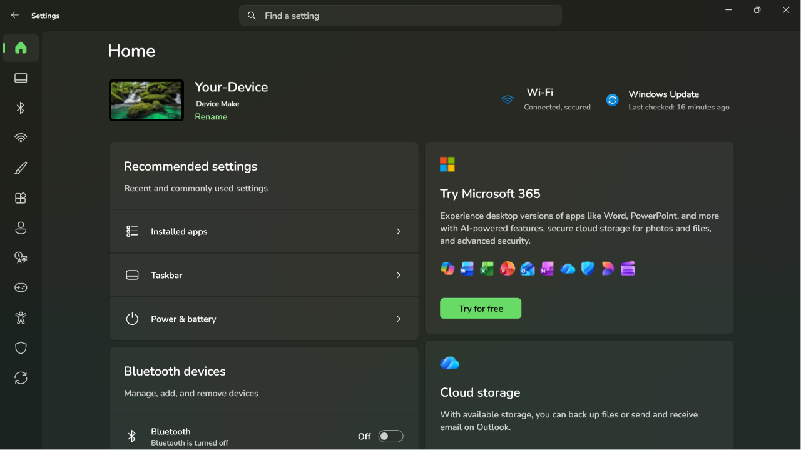
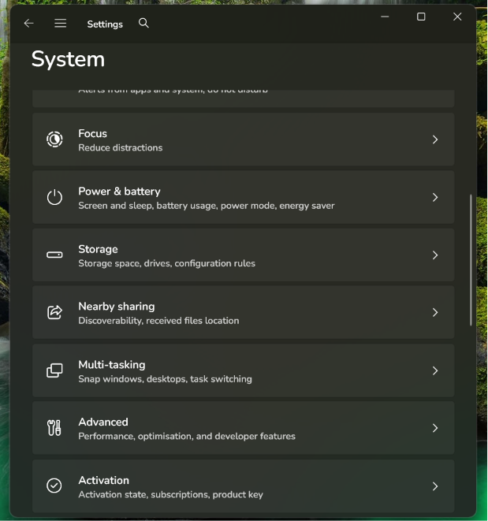
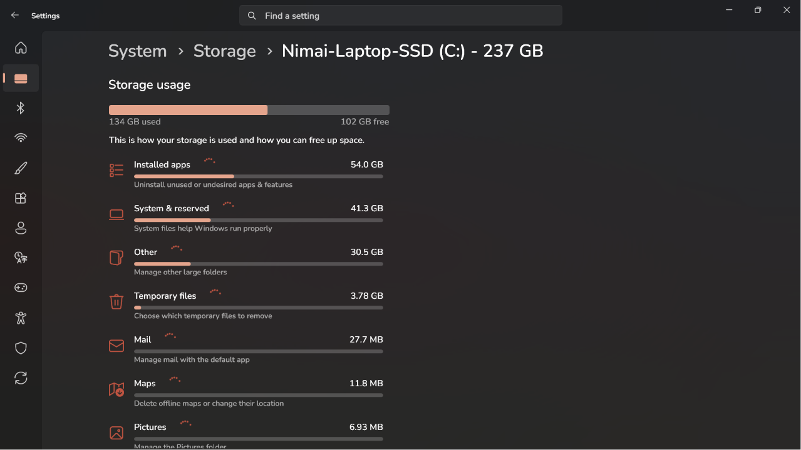
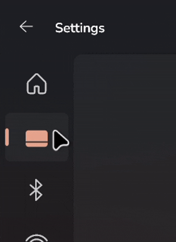

# StoreFrame11 theme for Windows 11 Settings Styler

This theme makes the Settings window use a frame that matches the Microsoft Store.

**Author**: [Nimai-HK](https://github.com/Nimai-HK)
#


<table style="width:100%;">
  <tr>
    <td style="height:20%; text-align:center;"></td>
    <td style="height:20%; text-align:center;"></td>
    <td style="height:100%; text-align:center;"></td>
  </tr>
</table>

## Features
- Uses Microsoft Store frame style for sidebar items.
- Squares the search bar.
- Adds Accenting, tooltips and glyphs to sidebar list items.
- Works in both Light and Dark Modes.
- Partially modernizes the detailed storage breakdown page from its Windows 10 era styling.
- Maintains the default behaviour of autohide sidebar overlay on smaller window sizes and screens.

## Theme selection

The theme is integrated into the mod and can be selected directly from the mod's
settings:

* Open the Windows 11 Settings Styler mod in Windhawk.
* Go to the "Settings" tab.
* Select the theme and save the settings.

## Manual installation

The theme styles can also be imported manually. To do that, follow these steps:

* Open the Windows 11 Settings Styler mod in Windhawk.
* Go to the "Settings" tab and select "Textual mode".
* Copy the content below to the text box and click "Save settings".

<details>
<summary>Content to import (click to expand)</summary>

```yaml
styleConstants:
  - OutRadius=8
  - InRadius=4
  - BgBorder=<SolidColorBrush Color="{ThemeResource Border}" />
  - BgOverlay=<SolidColorBrush Color="{ThemeResource Overlay}" />
  - 'Apps=<Viewbox Width="20" Height="20" Stretch="Uniform"><PathIcon Data="M17,6.5C17,6.8 16.9,7.1 16.7,7.3L14,10C13.8,10.2 13.6,10.3 13.3,10.3C13,10.3 12.8,10.2 12.6,10L9.9,7.3C9.7,7.1 9.6,6.8 9.6,6.5C9.6,6.2 9.7,5.9 9.9,5.7L12.6,3C12.8,2.8 13,2.7 13.3,2.7C13.6,2.7 13.8,2.8 14,3L16.7,5.7C16.9,5.9 17,6.2 17,6.5Z M8.5,10.5L8.5,4.5C8.5,4.2 8.4,4 8.2,3.9C8,3.8 7.8,3.7 7.5,3.7L3.5,3.7C3.2,3.7 3,3.8 2.9,3.9C2.8,4 2.7,4.2 2.7,4.5L2.7,10.5Z M11.5,10.5L9.7,8.7L9.7,10.5Z M8.5,17.3L8.5,11.5L2.7,11.5L2.7,16.8C2.7,17.1 2.8,17.3 2.9,17.4C3,17.5 3.2,17.6 3.5,17.6Z M16,12.2C16,12 15.9,11.8 15.7,11.7C15.6,11.6 15.4,11.5 15.2,11.5L9.7,11.5L9.7,17.3L15.2,17.3C15.4,17.3 15.6,17.2 15.7,17.1C15.9,17 16,16.8 16,16.6Z" VerticalAlignment="Center" HorizontalAlignment="Center" /></Viewbox>'
  - 'Games=<Viewbox Width="23" Height="20" Stretch="Fill"><PathIcon Data="F1 M7.5 4C4.46243 4 2 6.46243 2 9.5C2 12.5376 4.46243 15 7.5 15H12.5C15.5376 15 18 12.5376 18 9.5C18 6.46243 15.5376 4 12.5 4H7.5ZM6 7.5C6 7.22386 6.22386 7 6.5 7C6.77614 7 7 7.22386 7 7.5V9H8.5C8.77614 9 9 9.22386 9 9.5C9 9.77614 8.77614 10 8.5 10H7V11.5C7 11.7761 6.77614 12 6.5 12C6.22386 12 6 11.7761 6 11.5V10H4.5C4.22386 10 4 9.77614 4 9.5C4 9.22386 4.22386 9 4.5 9H6V7.5ZM15 8C15 8.55228 14.5523 9 14 9C13.4477 9 13 8.55228 13 8C13 7.44772 13.4477 7 14 7C14.5523 7 15 7.44772 15 8ZM12 12C11.4477 12 11 11.5523 11 11C11 10.4477 11.4477 10 12 10C12.5523 10 13 10.4477 13 11C13 11.5523 12.5523 12 12 12Z" VerticalAlignment="Center" HorizontalAlignment="Center"/></Viewbox>'
  - 'System=<Viewbox Width="20" Height="20" Stretch="Uniform"><PathIcon Data="M20,20z M0,0z M19.98,15C19.98,16.38,18.87,17.49,17.49,17.49L2.52,17.49C1.13,17.49,0.02,16.38,0.02,15L0.02,13.74 19.98,13.74 19.98,15z M17.49,2.52C18.87,2.52,19.98,3.63,19.98,5.02L19.98,12.5 0.02,12.5 0.02,5.02C0.02,3.63,1.13,2.52,2.52,2.52L17.49,2.52z" /> </Viewbox>'
  - 'EOA=<Viewbox Width="30" Height="32" Stretch="Fill"> <PathIcon Data="F1 M10 6C11.1046 6 12 5.10457 12 4C12 2.89543 11.1046 2 10 2C8.89543 2 8 2.89543 8 4C8 5.10457 8.89543 6 10 6ZM5.4719 4.15059C4.59026 3.75806 3.55353 4.15168 3.15457 5.03042C2.75442 5.91176 3.1474 6.94681 4.03165 7.3405L6.70334 8.53002C6.88375 8.61034 6.99997 8.78931 6.99997 8.98679V10.8519C6.99997 10.9161 6.98761 10.9797 6.96357 11.0392L5.12327 15.5941C4.76122 16.4902 5.19416 17.5101 6.09028 17.8722C6.9864 18.2342 8.00636 17.8013 8.36842 16.9052L9.76592 13.4462C9.85014 13.2378 10.1453 13.2378 10.2295 13.4462L11.6269 16.905C11.989 17.8011 13.009 18.2341 13.9051 17.872C14.8012 17.51 15.2341 16.49 14.8721 15.5939L13.0364 11.0504C13.0123 10.9908 13 10.9272 13 10.8631V8.98679C13 8.78931 13.1162 8.61034 13.2966 8.53002L15.9683 7.3405C16.8525 6.94681 17.2455 5.91176 16.8454 5.03042C16.4464 4.15168 15.4097 3.75806 14.5281 4.15059L13.2519 4.71874C13.0057 4.82838 12.8303 5.02588 12.7315 5.24269C12.2586 6.28043 11.2128 7.00012 10 7.00012C8.78722 7.00012 7.74147 6.28044 7.2685 5.24271C7.16969 5.0259 6.99432 4.82841 6.74808 4.71878L5.4719 4.15059Z" HorizontalAlignment="Center" VerticalAlignment="Center" /></Viewbox>'
  - 'Personalize=<Viewbox Width="20" Height="20" Stretch="Uniform"><PathIcon Data="M19.99,1.8C19.99,2.2 19.88,2.6 19.58,3.06L17.91,5.49C16.58,7.43 15.16,9.27 13.64,11.02C12.12,12.77 10.49,14.44 8.75,16.03C8.66,17.33 8.1,18.09 7.74,18.41C7.11,18.92 6.37,19.31 5.58,19.61C4.76,19.85 3.92,19.97 3.12,20C2.26,19.96 1.76,19.9 1.02,19.78C0.44,19.62 0.09,19.39 0.09,19.02C0.23,18.67 0.74,18.31 1.27,17.9C1.75,17.47 2.15,17.03 2.36,16.54C2.48,16.01 2.63,15.09 2.76,14.74C2.91,14.39 3.12,14.1 3.36,13.86C3.84,13.45 4.42,13.17 5.05,13C6.36,11.27 7.92,9.42 9.58,7.05C11.24,5.31 13.01,3.67 14.89,2.12L16.81,0.55C17.22,0.26 17.68,0.09 18.17,0.09C18.64,0.09 19.09,0.26 19.45,0.54C19.75,0.89 19.99,1.34 19.99,1.8Z" /></Viewbox>'
controlStyles:
  - target: Border > Frame > ContentPresenter > SystemSettings.View.RootPage > Grid#RootPageGrid > Microsoft.UI.Xaml.Controls.NavigationView#PermanentNavigationView > Grid#RootGrid > Grid > SplitView#RootSplitView > Grid > Grid#ContentRoot > Border > Grid#ContentGrid > ContentPresenter#ContentPresenter
    styles:
      - Margin=2
  - target: Grid#ContentRoot > Border > Grid#ContentGrid > ContentControl#HeaderContent
    styles:
      - Margin=10,-38,0,5
  - target: SplitView#RootSplitView > Grid > Grid#PaneRoot > Border > Grid#PaneContentGrid > Grid#ItemsContainerGrid > Microsoft.UI.Xaml.Controls.ItemsRepeaterScrollHost > ScrollViewer#MenuItemsScrollViewer > Border#Root > Grid > ScrollContentPresenter#ScrollContentPresenter
    styles:
      - Margin=-12,8,0,0
  - target: TextBox#CommandSearchTextBox > Grid > Button#DeleteButton > Grid#ButtonLayoutGrid
    styles:
      - CornerRadius=$InRadius
      - MinHeight=32
  - target: TextBox#CommandSearchTextBox
    styles:
      - CornerRadius=$InRadius
      - MinHeight=32
  - target: StackPanel#SettingsCommandSearchBoxBackground
    styles:
      - CornerRadius=$InRadius
      - MinHeight=32
  - target: SplitView#RootSplitView > Grid > Grid#PaneRoot > Border > Grid#PaneContentGrid > Grid#ItemsContainerGrid > Microsoft.UI.Xaml.Controls.ItemsRepeaterScrollHost > ScrollViewer#MenuItemsScrollViewer > Border#Root > Grid > ScrollContentPresenter#ScrollContentPresenter > Microsoft.UI.Xaml.Controls.ItemsRepeater#MenuItemsHost > SystemSettings.View.SettingsNavigationViewItem > Grid#NVIRootGrid > Microsoft.UI.Xaml.Controls.Primitives.NavigationViewItemPresenter#NavigationViewItemPresenter > Grid#LayoutRoot > Grid#PresenterContentRootGrid > Grid#ContentGrid > ContentPresenter#ContentPresenter > TextBlock
    styles:
      - Grid.Column=0
      - Visibility=Hidden
  - target: SplitView#RootSplitView > Grid > Grid#PaneRoot > Border > Grid#PaneContentGrid > Grid#ItemsContainerGrid > Microsoft.UI.Xaml.Controls.ItemsRepeaterScrollHost > ScrollViewer#MenuItemsScrollViewer > Border#Root > Grid > ScrollContentPresenter#ScrollContentPresenter > Microsoft.UI.Xaml.Controls.ItemsRepeater#MenuItemsHost > SystemSettings.View.SettingsNavigationViewItem
    styles:
      - MinHeight=48
      - MinWidth=65
      - ToolTipService.Placement=5
      - MaxWidth=65
  - target: Microsoft.UI.Xaml.Controls.NavigationView#PermanentNavigationView > Grid#RootGrid > Grid > SplitView#RootSplitView > Grid@DisplayModeStates > Grid#PaneRoot
    styles:
      - MaxWidth@OpenInlineLeft=65
      - Grid.ColumnSpan@OpenInlineLeft=1
      - Grid.ColumnSpan=>Span
  - target: SplitView#RootSplitView > Grid > Grid#ContentRoot > Border > Grid#ContentGrid
    styles:
      - Background:=$BgOverlay
      - 'CornerRadius={{Span > 1 ? 0 : $OutRadius}},0,0,0'
      - 'Margin={{Span > 1 ? 0 : 65}},48,0,0'
      - BorderBrush:=$BgBorder
      - 'BorderThickness={{Span > 1 ? 0 : 1}},1,0,0'
  - target: Microsoft.UI.Xaml.Controls.NavigationView#PermanentNavigationView > Grid#RootGrid > Grid > SplitView#RootSplitView > Grid@DisplayModeStates > Grid#ContentRoot
    styles:
      - Grid.Column@OpenInlineLeft=0
      - Grid.ColumnSpan@OpenInlineLeft=3
  - target: Microsoft.UI.Xaml.Controls.NavigationView#PermanentNavigationView > Grid#RootGrid > Grid > Grid#ShadowCaster
    styles:
      - Grid.ColumnSpan=1
      - MaxWidth=65
  - target: SystemSettings.View.SettingsNavigationViewItem > Grid#NVIRootGrid > Microsoft.UI.Xaml.Controls.Primitives.NavigationViewItemPresenter#NavigationViewItemPresenter > Grid#LayoutRoot > Grid#PresenterContentRootGrid > Grid#ContentGrid > ContentPresenter#ContentPresenter > TextBlock
    styles:
      - Padding=3,0,0,0
  - target: SystemSettings.View.SettingsNavigationViewItem > Grid#NVIRootGrid > Microsoft.UI.Xaml.Controls.Primitives.NavigationViewItemPresenter#NavigationViewItemPresenter > Grid#LayoutRoot@PointerStates > Grid#PresenterContentRootGrid > Grid#ContentGrid > Border#IconColumn > Viewbox#IconBox > Border > ContentPresenter#Icon
    styles:
      - FontFamily=Segoe Fluent Icons
      - Foreground@Normal:=<SolidColorBrush Color="{ThemeResource TextFillColorSecondary}" />
      - Foreground@PointerOver:=<SolidColorBrush Color="{ThemeResource TextFillColorPrimary}" />
      - Foreground@Pressed:=<SolidColorBrush Color="{ThemeResource TextFillColorPrimary}" />
      - Foreground@Selected:=<SolidColorBrush Color="{ThemeResource Accent}" />
      - Foreground@PointerOverSelected:=<SolidColorBrush Color="{ThemeResource Accent}" />
      - Foreground@PressedSelected:=<SolidColorBrush Color="{ThemeResource Accent}" />
      - FontSize=20
      - Margin=15,0,-2,0
  - target: SystemSettings.View.SettingsNavigationViewItem[Content=Home] > Grid#NVIRootGrid > Microsoft.UI.Xaml.Controls.Primitives.NavigationViewItemPresenter#NavigationViewItemPresenter > Grid#LayoutRoot@PointerStates > Grid#PresenterContentRootGrid > Grid#ContentGrid > Border#IconColumn > Viewbox#IconBox > Border > ContentPresenter#Icon
    styles:
      - Content@Normal:=
      - Content@PointerOver:=
      - Content@Pressed:=
      - Content@Selected:=
      - Content@PointerOverSelected:=
      - Content@PressedSelected:=
  - target: SystemSettings.View.SettingsNavigationViewItem[Content=System] > Grid#NVIRootGrid > Microsoft.UI.Xaml.Controls.Primitives.NavigationViewItemPresenter#NavigationViewItemPresenter > Grid#LayoutRoot@PointerStates > Grid#PresenterContentRootGrid > Grid#ContentGrid > Border#IconColumn > Viewbox#IconBox > Border > ContentPresenter#Icon
    styles:
      - Content@Normal:=
      - Content@PointerOver:=
      - Content@Pressed:=
      - Content@Selected:=$System
      - Content@PointerOverSelected:=$System
      - Content@PressedSelected:=$System
  - target: SystemSettings.View.SettingsNavigationViewItem[3] > Grid#NVIRootGrid > Microsoft.UI.Xaml.Controls.Primitives.NavigationViewItemPresenter#NavigationViewItemPresenter > Grid#LayoutRoot@PointerStates > Grid#PresenterContentRootGrid > Grid#ContentGrid > Border#IconColumn > Viewbox#IconBox > Border > ContentPresenter#Icon
    styles:
      - Content@Normal:=
      - Content@PointerOver:=
      - Content@Pressed:=
      - Content@Selected:=
      - Content@PointerOverSelected:=
      - Content@PressedSelected:=
  - target: SystemSettings.View.SettingsNavigationViewItem[4] > Grid#NVIRootGrid > Microsoft.UI.Xaml.Controls.Primitives.NavigationViewItemPresenter#NavigationViewItemPresenter > Grid#LayoutRoot@PointerStates > Grid#PresenterContentRootGrid > Grid#ContentGrid > Border#IconColumn > Viewbox#IconBox > Border > ContentPresenter#Icon
    styles:
      - Content@Normal:=
      - Content@PointerOver:=
      - Content@Pressed:=
      - Content@Selected:=
      - Content@PointerOverSelected:=
      - Content@PressedSelected:=
  - target: SystemSettings.View.SettingsNavigationViewItem[5] > Grid#NVIRootGrid > Microsoft.UI.Xaml.Controls.Primitives.NavigationViewItemPresenter#NavigationViewItemPresenter > Grid#LayoutRoot@PointerStates > Grid#PresenterContentRootGrid > Grid#ContentGrid > Border#IconColumn > Viewbox#IconBox > Border > ContentPresenter#Icon
    styles:
      - Content@Normal:=
      - Content@PointerOver:=
      - Content@Pressed:=
      - Content@Selected:=$EOA
      - Content@PointerOverSelected:=$EOA
      - Content@PressedSelected:=$EOA
  - target: SystemSettings.View.SettingsNavigationViewItem[6] > Grid#NVIRootGrid > Microsoft.UI.Xaml.Controls.Primitives.NavigationViewItemPresenter#NavigationViewItemPresenter > Grid#LayoutRoot@PointerStates > Grid#PresenterContentRootGrid > Grid#ContentGrid > Border#IconColumn > Viewbox#IconBox > Border > ContentPresenter#Icon
    styles:
      - Content@Normal:=
      - Content@PointerOver:=
      - Content@Pressed:=
      - Content@Selected:=$Games
      - Content@PointerOverSelected:=$Games
      - Content@PressedSelected:=$Games
  - target: SystemSettings.View.SettingsNavigationViewItem[7] > Grid#NVIRootGrid > Microsoft.UI.Xaml.Controls.Primitives.NavigationViewItemPresenter#NavigationViewItemPresenter > Grid#LayoutRoot@PointerStates > Grid#PresenterContentRootGrid > Grid#ContentGrid > Border#IconColumn > Viewbox#IconBox > Border > ContentPresenter#Icon
    styles:
      - Content@Normal:=
      - Content@PointerOver:=
      - Content@Pressed:=
      - Content@Selected:=
      - Content@PointerOverSelected:=
      - Content@PressedSelected:=
  - target: SystemSettings.View.SettingsNavigationViewItem[8] > Grid#NVIRootGrid > Microsoft.UI.Xaml.Controls.Primitives.NavigationViewItemPresenter#NavigationViewItemPresenter > Grid#LayoutRoot@PointerStates > Grid#PresenterContentRootGrid > Grid#ContentGrid > Border#IconColumn > Viewbox#IconBox > Border > ContentPresenter#Icon
    styles:
      - Content@Normal:=
      - Content@PointerOver:=
      - Content@Pressed:=
      - Content@Selected:=
      - Content@PointerOverSelected:=
      - Content@PressedSelected:=
  - target: SystemSettings.View.SettingsNavigationViewItem[9] > Grid#NVIRootGrid > Microsoft.UI.Xaml.Controls.Primitives.NavigationViewItemPresenter#NavigationViewItemPresenter > Grid#LayoutRoot@PointerStates > Grid#PresenterContentRootGrid > Grid#ContentGrid > Border#IconColumn > Viewbox#IconBox > Border > ContentPresenter#Icon
    styles:
      - Content@Normal:=
      - Content@PointerOver:=
      - Content@Pressed:=
      - Content@Selected:=$Apps
      - Content@PointerOverSelected:=$Apps
      - Content@PressedSelected:=$Apps
  - target: SystemSettings.View.SettingsNavigationViewItem[10] > Grid#NVIRootGrid > Microsoft.UI.Xaml.Controls.Primitives.NavigationViewItemPresenter#NavigationViewItemPresenter > Grid#LayoutRoot@PointerStates > Grid#PresenterContentRootGrid > Grid#ContentGrid > Border#IconColumn > Viewbox#IconBox > Border > ContentPresenter#Icon
    styles:
      - Content@Normal:=
      - Content@PointerOver:=
      - Content@Pressed:=
      - Content@Selected:=$Personalize
      - Content@PointerOverSelected:=$Personalize
      - Content@PressedSelected:=$Personalize
  - target: SystemSettings.View.SettingsNavigationViewItem[11] > Grid#NVIRootGrid > Microsoft.UI.Xaml.Controls.Primitives.NavigationViewItemPresenter#NavigationViewItemPresenter > Grid#LayoutRoot@PointerStates > Grid#PresenterContentRootGrid > Grid#ContentGrid > Border#IconColumn > Viewbox#IconBox > Border > ContentPresenter#Icon
    styles:
      - Content@Normal:=
      - Content@PointerOver:=
      - Content@Pressed:=
      - Content@Selected:=
      - Content@PointerOverSelected:=
      - Content@PressedSelected:=
  - target: SystemSettings.View.SettingsNavigationViewItem[12] > Grid#NVIRootGrid > Microsoft.UI.Xaml.Controls.Primitives.NavigationViewItemPresenter#NavigationViewItemPresenter > Grid#LayoutRoot@PointerStates > Grid#PresenterContentRootGrid > Grid#ContentGrid > Border#IconColumn > Viewbox#IconBox > Border > ContentPresenter#Icon
    styles:
      - Content@Normal:=
      - Content@PointerOver:=
      - Content@Pressed:=
      - Content@Selected:=
      - Content@PointerOverSelected:=
      - Content@PressedSelected:=
  - target: SystemSettings.View.SettingsNavigationViewItem[1]
    styles:
      - Content=>t1
      - ToolTipService.ToolTip={{t1}}
  - target: SystemSettings.View.SettingsNavigationViewItem[2]
    styles:
      - Content=>t2
      - ToolTipService.ToolTip={{t2}}
  - target: SystemSettings.View.SettingsNavigationViewItem[3]
    styles:
      - Content=>t3
      - ToolTipService.ToolTip={{t3}}
  - target: SystemSettings.View.SettingsNavigationViewItem[4]
    styles:
      - Content=>t4
      - ToolTipService.ToolTip={{t4}}
  - target: SystemSettings.View.SettingsNavigationViewItem[5]
    styles:
      - Content=>t5
      - ToolTipService.ToolTip={{t5}}
  - target: SystemSettings.View.SettingsNavigationViewItem[6]
    styles:
      - Content=>t6
      - ToolTipService.ToolTip={{t6}}
  - target: SystemSettings.View.SettingsNavigationViewItem[7]
    styles:
      - Content=>t7
      - ToolTipService.ToolTip={{t7}}
  - target: SystemSettings.View.SettingsNavigationViewItem[8]
    styles:
      - Content=>t8
      - ToolTipService.ToolTip={{t8}}
  - target: SystemSettings.View.SettingsNavigationViewItem[9]
    styles:
      - Content=>t9
      - ToolTipService.ToolTip={{t9}}
  - target: SystemSettings.View.SettingsNavigationViewItem[10]
    styles:
      - Content=>t10
      - ToolTipService.ToolTip={{t10}}
  - target: SystemSettings.View.SettingsNavigationViewItem[11]
    styles:
      - Content=>t11
      - ToolTipService.ToolTip={{t11}}
  - target: SystemSettings.View.SettingsNavigationViewItem[12]
    styles:
      - Content=>t12
      - ToolTipService.ToolTip={{t12}}
  - target: SplitView#RootSplitView > Grid > Grid#PaneRoot > Border > Grid#PaneContentGrid > ContentControl#PaneCustomContentBorder > ContentPresenter > SystemSettings.View.SpacingStackPanel > SystemSettings.View.UserProfileControl#UserProfileControl > Button#UserProfileButton > ContentPresenter#ContentPresenter > Grid#UserProfileLayout > Grid[2]
    styles:
      - Visibility=1
      - Grid.Column=0
  - target: ContentControl#PaneCustomContentBorder > ContentPresenter > SystemSettings.View.SpacingStackPanel > SystemSettings.View.UserProfileControl#UserProfileControl > Button#UserProfileButton > ContentPresenter#ContentPresenter > Grid#UserProfileLayout > Grid[2] > TextBlock#UserName
    styles:
      - Text=>UserName
  - target: ContentControl#PaneCustomContentBorder > ContentPresenter > SystemSettings.View.SpacingStackPanel > SystemSettings.View.UserProfileControl#UserProfileControl > Button#UserProfileButton
    styles:
      - ToolTipService.ToolTip={{UserName}}
      - ToolTipService.Placement=10
      - Visibility=1
  - target: ContentControl#PaneCustomContentBorder > ContentPresenter > SystemSettings.View.SpacingStackPanel > SystemSettings.View.UserProfileControl#UserProfileControl > Button#UserProfileButton > ContentPresenter#ContentPresenter > Grid#UserProfileLayout > Grid#UserImageGrid > Image
    styles:
      - Width=30
      - Height=30
  - target: SplitView#RootSplitView > Grid > Grid#PaneRoot > Border > Grid#PaneContentGrid > ContentControl#PaneCustomContentBorder > ContentPresenter > SystemSettings.View.SpacingStackPanel
    styles:
      - MaxHeight=48
      - MaxWidth=65
      - MinHeight=48
      - MinWidth=65
      - Visibility=1
  - target: SplitView#RootSplitView > Grid > Grid#PaneRoot > Border > Grid#PaneContentGrid > ContentControl#PaneCustomContentBorder > ContentPresenter > SystemSettings.View.SpacingStackPanel > SystemSettings.View.UserProfileControl#UserProfileControl > Button#UserProfileButton
    styles:
      - MinHeight=48
      - MaxHeight=48
      - Margin=3,3,3,-3
  - target: Windows.UI.Xaml.Shapes.Rectangle#ProgressBarIndicator
    styles:
      - RadiusX=3
      - RadiusY=3
      - Height=6
      - Fill:=<SolidColorBrush Color="{ThemeResource Accent}"/>
  - target: Windows.UI.Xaml.Controls.Border#DeterminateRoot
    styles:
      - CornerRadius=3
      - Height=6
  - target: Windows.UI.Xaml.Controls.ProgressBar
    styles:
      - Height=6
  - target: Windows.UI.Xaml.Controls.StackPanel#TopBreakdownBar > Windows.UI.Xaml.Controls.ProgressBar > Windows.UI.Xaml.Controls.Grid > Windows.UI.Xaml.Controls.Border#DeterminateRoot > Windows.UI.Xaml.Shapes.Rectangle#ProgressBarIndicator
    styles:
      - Height=16
  - target: Windows.UI.Xaml.Controls.StackPanel#TopBreakdownBar > Windows.UI.Xaml.Controls.ProgressBar > Windows.UI.Xaml.Controls.Grid > Windows.UI.Xaml.Controls.Border#DeterminateRoot
    styles:
      - Height=16
  - target: Windows.UI.Xaml.Controls.StackPanel#TopBreakdownBar > Windows.UI.Xaml.Controls.ProgressBar
    styles:
      - Height=16
themeResourceVariables:
  - Overlay@Light=#55FFFFFF
  - Overlay@Dark=#09FFFFFF
  - Border@Light=#0F000000
  - Border@Dark=#19000000
  - Accent@Dark={ThemeResource SystemAccentColorLight2}
  - Accent@Light={ThemeResource SystemAccentColorDark1}
```
</details>
