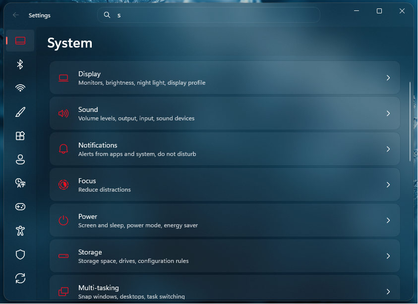

# Translucent Settings11 theme for Windows 11 Settings Styler

This theme makes the Settings app look Translucent. It lets you see through the app's background.

**Author**: [Link Vegas](https://github.com/linkvegas12)



## Installation

To import the theme styles:

* Open the Windows 11 Settings Styler mod in Windhawk.
* Go to the "Settings" tab and select "Textual mode".
* Copy the content below to the text box and click "Save settings".

<details>
<summary>Content to import (click to expand)</summary>

```yaml

theme: ''
styleConstants:
  - OutRadius=8
  - InRadius=12
controlStyles:
  - target: ContentPresenter#IconContentPresenter
    styles:
      - Foreground:=<SolidColorBrush Color="{ThemeResource SystemAccentColor}" />
  - target: SystemSettings.View.SettingsExpander > Grid > SystemSettings.View.ExpanderToggleButton#ContainerButton > ContentPresenter#ContentPresenter
    styles:
      - CornerRadius:=12,12,12,12
  - target: SystemSettings.View.SpacingStackPanel > ContentPresenter > SystemSettings.View.EntityItem > Grid
    styles:
      - CornerRadius:=12      
  - target: SystemSettings.View.SettingsExpander > Grid > ContentPresenter#RevealedContent
    styles:
      - CornerRadius:=12
  - target: Windows.UI.Xaml.Controls.Primitives.ListViewItemPresenter > SystemSettings.View.EntityItem > Grid
    styles:
      - CornerRadius:=$InRadius
  - target: SystemSettings.View.SettingsListViewItem > Windows.UI.Xaml.Controls.Primitives.ListViewItemPresenter > Border
    styles:
      - CornerRadius:=$InRadius
  - target: SystemSettings.View.ButtonEntityItem > Button#ContainerButton > ContentPresenter#ContentPresenter
    styles:
      - CornerRadius:=$InRadius
  - target: Border > Frame > ContentPresenter > SystemSettings.View.RootPage > Grid#RootPageGrid > Microsoft.UI.Xaml.Controls.NavigationView#PermanentNavigationView > Grid#RootGrid > Grid > SplitView#RootSplitView > Grid > Grid#ContentRoot > Border > Grid#ContentGrid > ContentPresenter#ContentPresenter
    styles:
      - Margin=2
  - target: Grid#ContentRoot > Border > Grid#ContentGrid > ContentControl#HeaderContent
    styles:
      - Margin=10,-38,0,5
  - target: SplitView#RootSplitView > Grid > Grid#PaneRoot > Border > Grid#PaneContentGrid > Grid#ItemsContainerGrid > Microsoft.UI.Xaml.Controls.ItemsRepeaterScrollHost > ScrollViewer#MenuItemsScrollViewer > Border#Root > Grid > ScrollContentPresenter#ScrollContentPresenter
    styles:
      - Margin=-12,8,0,0
  - target: TextBox#CommandSearchTextBox > Grid > Button#DeleteButton > Grid#ButtonLayoutGrid
    styles:
      - CornerRadius=$InRadius
      - MinHeight=32
  - target: TextBox#CommandSearchTextBox
    styles:
      - CornerRadius=$InRadius
      - MinHeight=32
  - target: StackPanel#SettingsCommandSearchBoxBackground
    styles:
      - CornerRadius=$InRadius
      - MinHeight=32
  - target: SplitView#RootSplitView > Grid > Grid#PaneRoot > Border > Grid#PaneContentGrid > Grid#ItemsContainerGrid > Microsoft.UI.Xaml.Controls.ItemsRepeaterScrollHost > ScrollViewer#MenuItemsScrollViewer > Border#Root > Grid > ScrollContentPresenter#ScrollContentPresenter > Microsoft.UI.Xaml.Controls.ItemsRepeater#MenuItemsHost > SystemSettings.View.SettingsNavigationViewItem > Grid#NVIRootGrid > Microsoft.UI.Xaml.Controls.Primitives.NavigationViewItemPresenter#NavigationViewItemPresenter > Grid#LayoutRoot > Grid#PresenterContentRootGrid > Grid#ContentGrid > ContentPresenter#ContentPresenter > TextBlock
    styles:
      - Grid.Column=0
      - Visibility=Hidden
  - target: SplitView#RootSplitView > Grid > Grid#PaneRoot > Border > Grid#PaneContentGrid > Grid#ItemsContainerGrid > Microsoft.UI.Xaml.Controls.ItemsRepeaterScrollHost > ScrollViewer#MenuItemsScrollViewer > Border#Root > Grid > ScrollContentPresenter#ScrollContentPresenter > Microsoft.UI.Xaml.Controls.ItemsRepeater#MenuItemsHost > SystemSettings.View.SettingsNavigationViewItem
    styles:
      - MinHeight=48
      - MinWidth=65
      - ToolTipService.Placement=5
      - MaxWidth=65
  - target: Microsoft.UI.Xaml.Controls.NavigationView#PermanentNavigationView > Grid#RootGrid > Grid > SplitView#RootSplitView > Grid@DisplayModeStates > Grid#PaneRoot
    styles:
      - MaxWidth@OpenInlineLeft=65
      - Grid.ColumnSpan@OpenInlineLeft=1
      - Grid.ColumnSpan=>Span
  - target: SplitView#RootSplitView > Grid > Grid#ContentRoot > Border > Grid#ContentGrid
    styles:
      - Background:=<AcrylicBrush BackgroundSource="HostBackdrop" TintColor="#00000000" FallbackColor="#00000000" TintOpacity="0.4" TintLuminosityOpacity="0.4" Opacity="0.4"/>
      - 'CornerRadius={{Span > 1 ? 0 : $OutRadius}},0,0,0'
      - 'Margin={{Span > 1 ? 0 : 65}},48,0,0'
      - BorderBrush:=$BgBorder
      - 'BorderThickness={{Span > 1 ? 0 : 1}},1,0,0'
  - target: Microsoft.UI.Xaml.Controls.NavigationView#PermanentNavigationView > Grid#RootGrid > Grid > SplitView#RootSplitView > Grid@DisplayModeStates > Grid#ContentRoot
    styles:
      - Grid.Column@OpenInlineLeft=0
      - Grid.ColumnSpan@OpenInlineLeft=3
  - target: Microsoft.UI.Xaml.Controls.NavigationView#PermanentNavigationView > Grid#RootGrid > Grid > Grid#ShadowCaster
    styles:
      - Grid.ColumnSpan=1
      - MaxWidth=65
  - target: SystemSettings.View.SettingsNavigationViewItem > Grid#NVIRootGrid > Microsoft.UI.Xaml.Controls.Primitives.NavigationViewItemPresenter#NavigationViewItemPresenter > Grid#LayoutRoot > Grid#PresenterContentRootGrid > Grid#ContentGrid > ContentPresenter#ContentPresenter > TextBlock
    styles:
      - Padding=3,0,0,0
  - target: SystemSettings.View.SettingsNavigationViewItem > Grid#NVIRootGrid > Microsoft.UI.Xaml.Controls.Primitives.NavigationViewItemPresenter#NavigationViewItemPresenter > Grid#LayoutRoot@PointerStates > Grid#PresenterContentRootGrid > Grid#ContentGrid > Border#IconColumn > Viewbox#IconBox > Border > ContentPresenter#Icon
    styles:
      - FontFamily=Segoe Fluent Icons
      - Foreground@Normal:=<SolidColorBrush Color="{ThemeResource TextFillColorSecondary}" />
      - Foreground@PointerOver:=<SolidColorBrush Color="{ThemeResource TextFillColorPrimary}" />
      - Foreground@Pressed:=<SolidColorBrush Color="{ThemeResource TextFillColorPrimary}" />
      - Foreground@Selected:=<SolidColorBrush Color="{ThemeResource Accent}" />
      - Foreground@PointerOverSelected:=<SolidColorBrush Color="{ThemeResource Accent}" />
      - Foreground@PressedSelected:=<SolidColorBrush Color="{ThemeResource Accent}" />
      - FontSize=20
      - Margin=15,0,-2,0
  - target: SystemSettings.View.SettingsNavigationViewItem[Content=Home] > Grid#NVIRootGrid > Microsoft.UI.Xaml.Controls.Primitives.NavigationViewItemPresenter#NavigationViewItemPresenter > Grid#LayoutRoot@PointerStates > Grid#PresenterContentRootGrid > Grid#ContentGrid > Border#IconColumn > Viewbox#IconBox > Border > ContentPresenter#Icon
    styles:
      - Content@Normal:=
      - Content@PointerOver:=
      - Content@Pressed:=
      - Content@Selected:=
      - Content@PointerOverSelected:=
      - Content@PressedSelected:=
      - Foreground@Selected:=<SolidColorBrush Color="{ThemeResource SystemAccentColor}" />
      - Foreground@PointerOverSelected:=<SolidColorBrush Color="{ThemeResource SystemAccentColor}" />
      - Foreground@PressedSelected:=<SolidColorBrush Color="{ThemeResource SystemAccentColor}" />
      - Foreground=#FFFFFF
  - target: SystemSettings.View.SettingsNavigationViewItem[Content=System] > Grid#NVIRootGrid > Microsoft.UI.Xaml.Controls.Primitives.NavigationViewItemPresenter#NavigationViewItemPresenter > Grid#LayoutRoot@PointerStates > Grid#PresenterContentRootGrid > Grid#ContentGrid > Border#IconColumn > Viewbox#IconBox > Border > ContentPresenter#Icon
    styles:
      - Content@Normal:=
      - Content@PointerOver:=
      - Content@Pressed:=
      - Content@Selected:=
      - Content@PointerOverSelected:=
      - Content@PressedSelected:=
      - Foreground@Selected:=<SolidColorBrush Color="{ThemeResource SystemAccentColor}" />
      - Foreground@PointerOverSelected:=<SolidColorBrush Color="{ThemeResource SystemAccentColor}" />
      - Foreground@PressedSelected:=<SolidColorBrush Color="{ThemeResource SystemAccentColor}" />
      - Foreground=#FFFFFF
  - target: SystemSettings.View.SettingsNavigationViewItem[Content=Bluetooth & devices] > Grid#NVIRootGrid > Microsoft.UI.Xaml.Controls.Primitives.NavigationViewItemPresenter#NavigationViewItemPresenter > Grid#LayoutRoot@PointerStates > Grid#PresenterContentRootGrid > Grid#ContentGrid > Border#IconColumn > Viewbox#IconBox > Border > ContentPresenter#Icon
    styles:
      - Content@Normal:=
      - Content@PointerOver:=
      - Content@Pressed:=
      - Content@Selected:=
      - Content@PointerOverSelected:=
      - Content@PressedSelected:=
      - Foreground@Selected:=<SolidColorBrush Color="{ThemeResource SystemAccentColor}" />
      - Foreground@PointerOverSelected:=<SolidColorBrush Color="{ThemeResource SystemAccentColor}" />
      - Foreground@PressedSelected:=<SolidColorBrush Color="{ThemeResource SystemAccentColor}" />
      - Foreground=#FFFFFF
  - target: SystemSettings.View.SettingsNavigationViewItem[3] > Grid#NVIRootGrid > Microsoft.UI.Xaml.Controls.Primitives.NavigationViewItemPresenter#NavigationViewItemPresenter > Grid#LayoutRoot@PointerStates > Grid#PresenterContentRootGrid > Grid#ContentGrid > Border#IconColumn > Viewbox#IconBox > Border > ContentPresenter#Icon
    styles:
      - Content@Normal:=
      - Content@PointerOver:=
      - Content@Pressed:=
      - Content@Selected:=
      - Content@PointerOverSelected:=
      - Content@PressedSelected:=
      - Foreground@Selected:=<SolidColorBrush Color="{ThemeResource SystemAccentColor}" />
      - Foreground@PointerOverSelected:=<SolidColorBrush Color="{ThemeResource SystemAccentColor}" />
      - Foreground@PressedSelected:=<SolidColorBrush Color="{ThemeResource SystemAccentColor}" />
      - Foreground=#FFFFFF
  - target: SystemSettings.View.SettingsNavigationViewItem[4] > Grid#NVIRootGrid > Microsoft.UI.Xaml.Controls.Primitives.NavigationViewItemPresenter#NavigationViewItemPresenter > Grid#LayoutRoot@PointerStates > Grid#PresenterContentRootGrid > Grid#ContentGrid > Border#IconColumn > Viewbox#IconBox > Border > ContentPresenter#Icon
    styles:
      - Content@Normal:=
      - Content@PointerOver:=
      - Content@Pressed:=
      - Content@Selected:=
      - Content@PointerOverSelected:=
      - Content@PressedSelected:=
      - Foreground@Selected:=<SolidColorBrush Color="{ThemeResource SystemAccentColor}" />
      - Foreground@PointerOverSelected:=<SolidColorBrush Color="{ThemeResource SystemAccentColor}" />
      - Foreground@PressedSelected:=<SolidColorBrush Color="{ThemeResource SystemAccentColor}" />
      - Foreground=#FFFFFF
  - target: SystemSettings.View.SettingsNavigationViewItem[5] > Grid#NVIRootGrid > Microsoft.UI.Xaml.Controls.Primitives.NavigationViewItemPresenter#NavigationViewItemPresenter > Grid#LayoutRoot@PointerStates > Grid#PresenterContentRootGrid > Grid#ContentGrid > Border#IconColumn > Viewbox#IconBox > Border > ContentPresenter#Icon
    styles:
      - Content@Normal:=
      - Content@PointerOver:=
      - Content@Pressed:=
      - Content@Selected:=
      - Content@PointerOverSelected:=
      - Content@PressedSelected:=
      - Foreground@Selected:=<SolidColorBrush Color="{ThemeResource SystemAccentColor}" />
      - Foreground@PointerOverSelected:=<SolidColorBrush Color="{ThemeResource SystemAccentColor}" />
      - Foreground@PressedSelected:=<SolidColorBrush Color="{ThemeResource SystemAccentColor}" />
      - Foreground=#FFFFFF
  - target: SystemSettings.View.SettingsNavigationViewItem[6] > Grid#NVIRootGrid > Microsoft.UI.Xaml.Controls.Primitives.NavigationViewItemPresenter#NavigationViewItemPresenter > Grid#LayoutRoot@PointerStates > Grid#PresenterContentRootGrid > Grid#ContentGrid > Border#IconColumn > Viewbox#IconBox > Border > ContentPresenter#Icon
    styles:
      - Content@Normal:=
      - Content@PointerOver:=
      - Content@Pressed:=
      - Content@Selected:=
      - Content@PointerOverSelected:=
      - Content@PressedSelected:=
      - Foreground@Selected:=<SolidColorBrush Color="{ThemeResource SystemAccentColor}" />
      - Foreground@PointerOverSelected:=<SolidColorBrush Color="{ThemeResource SystemAccentColor}" />
      - Foreground@PressedSelected:=<SolidColorBrush Color="{ThemeResource SystemAccentColor}" />
      - Foreground=#FFFFFF
  - target: SystemSettings.View.SettingsNavigationViewItem[7] > Grid#NVIRootGrid > Microsoft.UI.Xaml.Controls.Primitives.NavigationViewItemPresenter#NavigationViewItemPresenter > Grid#LayoutRoot@PointerStates > Grid#PresenterContentRootGrid > Grid#ContentGrid > Border#IconColumn > Viewbox#IconBox > Border > ContentPresenter#Icon
    styles:
      - Content@Normal:=
      - Content@PointerOver:=
      - Content@Pressed:=
      - Content@Selected:=
      - Content@PointerOverSelected:=
      - Content@PressedSelected:=
      - Foreground@Selected:=<SolidColorBrush Color="{ThemeResource SystemAccentColor}" />
      - Foreground@PointerOverSelected:=<SolidColorBrush Color="{ThemeResource SystemAccentColor}" />
      - Foreground@PressedSelected:=<SolidColorBrush Color="{ThemeResource SystemAccentColor}" />
      - Foreground=#FFFFFF
  - target: SystemSettings.View.SettingsNavigationViewItem[8] > Grid#NVIRootGrid > Microsoft.UI.Xaml.Controls.Primitives.NavigationViewItemPresenter#NavigationViewItemPresenter > Grid#LayoutRoot@PointerStates > Grid#PresenterContentRootGrid > Grid#ContentGrid > Border#IconColumn > Viewbox#IconBox > Border > ContentPresenter#Icon
    styles:
      - Content@Normal:=
      - Content@PointerOver:=
      - Content@Pressed:=
      - Content@Selected:=
      - Content@PointerOverSelected:=
      - Content@PressedSelected:=
      - Foreground@Selected:=<SolidColorBrush Color="{ThemeResource SystemAccentColor}" />
      - Foreground@PointerOverSelected:=<SolidColorBrush Color="{ThemeResource SystemAccentColor}" />
      - Foreground@PressedSelected:=<SolidColorBrush Color="{ThemeResource SystemAccentColor}" />
      - Foreground=#FFFFFF
  - target: SystemSettings.View.SettingsNavigationViewItem[9] > Grid#NVIRootGrid > Microsoft.UI.Xaml.Controls.Primitives.NavigationViewItemPresenter#NavigationViewItemPresenter > Grid#LayoutRoot@PointerStates > Grid#PresenterContentRootGrid > Grid#ContentGrid > Border#IconColumn > Viewbox#IconBox > Border > ContentPresenter#Icon
    styles:
      - Content@Normal:=
      - Content@PointerOver:=
      - Content@Pressed:=
      - Content@Selected:=
      - Content@PointerOverSelected:=
      - Content@PressedSelected:=
      - Foreground@Selected:=<SolidColorBrush Color="{ThemeResource SystemAccentColor}" />
      - Foreground@PointerOverSelected:=<SolidColorBrush Color="{ThemeResource SystemAccentColor}" />
      - Foreground@PressedSelected:=<SolidColorBrush Color="{ThemeResource SystemAccentColor}" />
      - Foreground=#FFFFFF
  - target: SystemSettings.View.SettingsNavigationViewItem[10] > Grid#NVIRootGrid > Microsoft.UI.Xaml.Controls.Primitives.NavigationViewItemPresenter#NavigationViewItemPresenter > Grid#LayoutRoot@PointerStates > Grid#PresenterContentRootGrid > Grid#ContentGrid > Border#IconColumn > Viewbox#IconBox > Border > ContentPresenter#Icon
    styles:
      - Content@Normal:=
      - Content@PointerOver:=
      - Content@Pressed:=
      - Content@Selected:=
      - Content@PointerOverSelected:=
      - Content@PressedSelected:=
      - Foreground@Selected:=<SolidColorBrush Color="{ThemeResource SystemAccentColor}" />
      - Foreground@PointerOverSelected:=<SolidColorBrush Color="{ThemeResource SystemAccentColor}" />
      - Foreground@PressedSelected:=<SolidColorBrush Color="{ThemeResource SystemAccentColor}" />
      - Foreground=#FFFFFF
  - target: SystemSettings.View.SettingsNavigationViewItem[11] > Grid#NVIRootGrid > Microsoft.UI.Xaml.Controls.Primitives.NavigationViewItemPresenter#NavigationViewItemPresenter > Grid#LayoutRoot@PointerStates > Grid#PresenterContentRootGrid > Grid#ContentGrid > Border#IconColumn > Viewbox#IconBox > Border > ContentPresenter#Icon
    styles:
      - Content@Normal:=
      - Content@PointerOver:=
      - Content@Pressed:=
      - Content@Selected:=
      - Content@PointerOverSelected:=
      - Content@PressedSelected:=
      - Foreground@Selected:=<SolidColorBrush Color="{ThemeResource SystemAccentColor}" />
      - Foreground@PointerOverSelected:=<SolidColorBrush Color="{ThemeResource SystemAccentColor}" />
      - Foreground@PressedSelected:=<SolidColorBrush Color="{ThemeResource SystemAccentColor}" />
      - Foreground=#FFFFFF
  - target: SystemSettings.View.SettingsNavigationViewItem[12] > Grid#NVIRootGrid > Microsoft.UI.Xaml.Controls.Primitives.NavigationViewItemPresenter#NavigationViewItemPresenter > Grid#LayoutRoot@PointerStates > Grid#PresenterContentRootGrid > Grid#ContentGrid > Border#IconColumn > Viewbox#IconBox > Border > ContentPresenter#Icon
    styles:
      - Content@Normal:=
      - Content@PointerOver:=
      - Content@Pressed:=
      - Content@Selected:=
      - Content@PointerOverSelected:=
      - Content@PressedSelected:=
      - Foreground@Selected:=<SolidColorBrush Color="{ThemeResource SystemAccentColor}" />
      - Foreground@PointerOverSelected:=<SolidColorBrush Color="{ThemeResource SystemAccentColor}" />
      - Foreground@PressedSelected:=<SolidColorBrush Color="{ThemeResource SystemAccentColor}" />
      - Foreground=#FFFFFF
  - target: SystemSettings.View.SettingsNavigationViewItem[1]
    styles:
      - Content=>t1
      - ToolTipService.ToolTip={{t1}}
  - target: SystemSettings.View.SettingsNavigationViewItem[2]
    styles:
      - Content=>t2
      - ToolTipService.ToolTip={{t2}}
  - target: SystemSettings.View.SettingsNavigationViewItem[3]
    styles:
      - Content=>t3
      - ToolTipService.ToolTip={{t3}}
  - target: SystemSettings.View.SettingsNavigationViewItem[4]
    styles:
      - Content=>t4
      - ToolTipService.ToolTip={{t4}}
  - target: SystemSettings.View.SettingsNavigationViewItem[5]
    styles:
      - Content=>t5
      - ToolTipService.ToolTip={{t5}}
  - target: SystemSettings.View.SettingsNavigationViewItem[6]
    styles:
      - Content=>t6
      - ToolTipService.ToolTip={{t6}}
  - target: SystemSettings.View.SettingsNavigationViewItem[7]
    styles:
      - Content=>t7
      - ToolTipService.ToolTip={{t7}}
  - target: SystemSettings.View.SettingsNavigationViewItem[8]
    styles:
      - Content=>t8
      - ToolTipService.ToolTip={{t8}}
  - target: SystemSettings.View.SettingsNavigationViewItem[9]
    styles:
      - Content=>t9
      - ToolTipService.ToolTip={{t9}}
  - target: SystemSettings.View.SettingsNavigationViewItem[10]
    styles:
      - Content=>t10
      - ToolTipService.ToolTip={{t10}}
  - target: SystemSettings.View.SettingsNavigationViewItem[11]
    styles:
      - Content=>t11
      - ToolTipService.ToolTip={{t11}}
  - target: SystemSettings.View.SettingsNavigationViewItem[12]
    styles:
      - Content=>t12
      - ToolTipService.ToolTip={{t12}}
  - target: SplitView#RootSplitView > Grid > Grid#PaneRoot > Border > Grid#PaneContentGrid > ContentControl#PaneCustomContentBorder > ContentPresenter > SystemSettings.View.SpacingStackPanel > SystemSettings.View.UserProfileControl#UserProfileControl > Button#UserProfileButton > ContentPresenter#ContentPresenter > Grid#UserProfileLayout > Grid[2]
    styles:
      - Visibility=1
      - Grid.Column=0
  - target: ContentControl#PaneCustomContentBorder > ContentPresenter > SystemSettings.View.SpacingStackPanel > SystemSettings.View.UserProfileControl#UserProfileControl > Button#UserProfileButton > ContentPresenter#ContentPresenter > Grid#UserProfileLayout > Grid[2] > TextBlock#UserName
    styles:
      - Text=>UserName
  - target: ContentControl#PaneCustomContentBorder > ContentPresenter > SystemSettings.View.SpacingStackPanel > SystemSettings.View.UserProfileControl#UserProfileControl > Button#UserProfileButton
    styles:
      - ToolTipService.ToolTip={{UserName}}
      - ToolTipService.Placement=10
      - Visibility=1
  - target: ContentControl#PaneCustomContentBorder > ContentPresenter > SystemSettings.View.SpacingStackPanel > SystemSettings.View.UserProfileControl#UserProfileControl > Button#UserProfileButton > ContentPresenter#ContentPresenter > Grid#UserProfileLayout > Grid#UserImageGrid > Image
    styles:
      - Width=30
      - Height=30
  - target: SplitView#RootSplitView > Grid > Grid#PaneRoot > Border > Grid#PaneContentGrid > ContentControl#PaneCustomContentBorder > ContentPresenter > SystemSettings.View.SpacingStackPanel
    styles:
      - MaxHeight=48
      - MaxWidth=65
      - MinHeight=48
      - MinWidth=65
      - Visibility=1
  - target: SplitView#RootSplitView > Grid > Grid#PaneRoot > Border > Grid#PaneContentGrid > ContentControl#PaneCustomContentBorder > ContentPresenter > SystemSettings.View.SpacingStackPanel > SystemSettings.View.UserProfileControl#UserProfileControl > Button#UserProfileButton
    styles:
      - MinHeight=48
      - MaxHeight=48
      - Margin=3,3,3,-3
  - target: Windows.UI.Xaml.Shapes.Rectangle#ProgressBarIndicator
    styles:
      - RadiusX=3
      - RadiusY=3
      - Height=6
      - Fill:=<SolidColorBrush Color="{ThemeResource Accent}"/>
  - target: Windows.UI.Xaml.Controls.Border#DeterminateRoot
    styles:
      - CornerRadius=3
      - Height=6
  - target: Windows.UI.Xaml.Controls.ProgressBar
    styles:
      - Height=6
  - target: Windows.UI.Xaml.Controls.StackPanel#TopBreakdownBar > Windows.UI.Xaml.Controls.ProgressBar > Windows.UI.Xaml.Controls.Grid > Windows.UI.Xaml.Controls.Border#DeterminateRoot > Windows.UI.Xaml.Shapes.Rectangle#ProgressBarIndicator
    styles:
      - Height=16
  - target: Windows.UI.Xaml.Controls.StackPanel#TopBreakdownBar > Windows.UI.Xaml.Controls.ProgressBar > Windows.UI.Xaml.Controls.Grid > Windows.UI.Xaml.Controls.Border#DeterminateRoot
    styles:
      - Height=16
  - target: Windows.UI.Xaml.Controls.StackPanel#TopBreakdownBar > Windows.UI.Xaml.Controls.ProgressBar
    styles:
      - Height=16
  - target: Microsoft.UI.Xaml.Controls.NavigationView#PermanentNavigationView > Grid#RootGrid > Grid > SplitView#RootSplitView > Grid@DisplayModeStates > Grid#PaneRoot
    styles:
      - Background:=<AcrylicBrush BackgroundSource="HostBackdrop" TintColor="#761E1E1E" FallbackColor="#00000000" TintOpacity="0.4" TintLuminosityOpacity="0.4" Opacity="0.4"/>
  - target: Grid#ContentRoot > Border > Grid#ContentGrid > ContentControl#HeaderContent
    styles:
      - Background:=<AcrylicBrush BackgroundSource="HostBackdrop" TintColor="#761E1E1E" FallbackColor="#00000000" TintOpacity="0.4" TintLuminosityOpacity="0.4" Opacity="0.4"/>
  - target: Frame#PermanentNavRootFrame
    styles:
      - Background:=<AcrylicBrush BackgroundSource="HostBackdrop" TintColor="#761E1E1E" FallbackColor="#00000000" TintOpacity="0.4" TintLuminosityOpacity="0.4" Opacity="0.4"/>
  - target: Border > Frame > ContentPresenter > SystemSettings.View.RootPage > Grid#RootPageGrid
    styles:
      - Background:=<AcrylicBrush BackgroundSource="HostBackdrop" TintColor="#761E1E1E" FallbackColor="#00000000" TintOpacity="0.4" TintLuminosityOpacity="0.4" Opacity="0.4"/>
  - target: SystemSettings.View.RootPage > Grid#RootPageGrid
    styles:
      - Background:=<AcrylicBrush BackgroundSource="HostBackdrop" TintColor="#761E1E1E" FallbackColor="#00000000" TintOpacity="0.4" TintLuminosityOpacity="0.4" Opacity="0.4"/>
  - target: Microsoft.UI.Xaml.Controls.NavigationView#PermanentNavigationView > Grid#RootGrid
    styles:
      - Background:=<AcrylicBrush BackgroundSource="HostBackdrop" TintColor="#761E1E1E" FallbackColor="#00000000" TintOpacity="0.4" TintLuminosityOpacity="0.4" Opacity="0.4"/>
  - target: Microsoft.UI.Xaml.Controls.NavigationView#PermanentNavigationView > Grid#RootGrid > Grid
    styles:
      - Background:=<AcrylicBrush BackgroundSource="HostBackdrop" TintColor="#761E1E1E" FallbackColor="#00000000" TintOpacity="0.4" TintLuminosityOpacity="0.4" Opacity="0.4"/>
  - target: Grid#ContentRoot
    styles:
      - Background:=<AcrylicBrush BackgroundSource="HostBackdrop" TintColor="#761E1E1E" FallbackColor="#00000000" TintOpacity="0.4" TintLuminosityOpacity="0.4" Opacity="0.4"/>
  - target: SplitView#RootSplitView > Grid > Grid#ContentRoot
    styles:
      - Background:=<AcrylicBrush BackgroundSource="HostBackdrop" TintColor="#761E1E1E" FallbackColor="#00000000" TintOpacity="0.4" TintLuminosityOpacity="0.4" Opacity="0.4"/>
  - target: Grid#RootGrid
    styles:
      - Background:=<AcrylicBrush BackgroundSource="HostBackdrop" TintColor="#761E1E1E" FallbackColor="#00000000" TintOpacity="0.4" TintLuminosityOpacity="0.4" Opacity="0.4"/>
  - target: Grid#AppTitleBar
    styles:
      - Background:=<AcrylicBrush BackgroundSource="HostBackdrop" TintColor="#761E1E1E" FallbackColor="#00000000" TintOpacity="0.4" TintLuminosityOpacity="0.4" Opacity="0.4"/>
  - target: Border#AppTitleBarBackground
    styles:
      - Background:=<AcrylicBrush BackgroundSource="HostBackdrop" TintColor="#761E1E1E" FallbackColor="#00000000" TintOpacity="0.4" TintLuminosityOpacity="0.4" Opacity="0.4"/>
  - target: Grid#TitleBar
    styles:
      - Background:=<AcrylicBrush BackgroundSource="HostBackdrop" TintColor="#761E1E1E" FallbackColor="#00000000" TintOpacity="0.4" TintLuminosityOpacity="0.4" Opacity="0.4"/>
  - target: Border#TitleBarBackground
    styles:
      - Background:=<AcrylicBrush BackgroundSource="HostBackdrop" TintColor="#761E1E1E" FallbackColor="#00000000" TintOpacity="0.4" TintLuminosityOpacity="0.4" Opacity="0.4"/>
  - target: TextBox#CommandSearchTextBox
    styles:
      - CornerRadius=$InRadius
      - MinHeight=32
      - Background:=<AcrylicBrush BackgroundSource="HostBackdrop" TintColor="#761E1E1E" FallbackColor="#00000000" TintOpacity="0.4" TintLuminosityOpacity="0.4" Opacity="0.4"/>
      - BorderBrush:=<SolidColorBrush Color="#22FFFFFF"/>
      - BorderThickness=1
themeResourceVariables:
  - Overlay@Light=#55FFFFFF
  - Overlay@Dark=#09FFFFFF
  - Border@Light=#0F000000
  - Border@Dark=#19000000
  - Accent@Dark={ThemeResource SystemAccentColorLight2}
  - Accent@Light={ThemeResource SystemAccentColorDark1}
  - WindowCaptionBackground@Dark=#00000000
  - WindowCaptionBackground@Light=#00000000
  - WindowCaptionBackgroundDisabled@Dark=#00000000
  - WindowCaptionBackgroundDisabled@Light=#00000000
  - SolidBackgroundFillColorBase@Dark=#00000000
  - SolidBackgroundFillColorBase@Light=#00000000
  - SolidBackgroundFillColorSecondary@Dark=#00000000
  - SolidBackgroundFillColorSecondary@Light=#00000000
  - LayerFillColorDefault@Dark=#00000000
  - LayerFillColorDefault@Light=#00000000
  - ApplicationPageBackgroundThemeBrush@Dark=#00000000
  - ApplicationPageBackgroundThemeBrush@Light=#00000000


```
</details>
